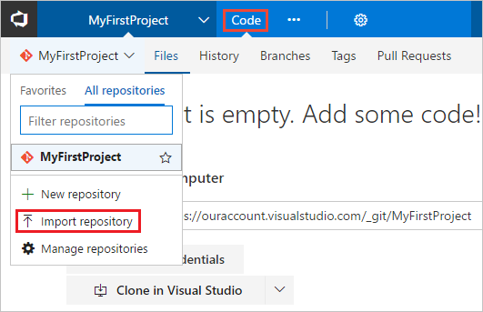

# Build your .NET desktop app for Windows

**VSTS | TFS 2017 Update 2**

Visual Studio Team Services (VSTS) and Team Foundation Server (TFS) provide a highly customizable continuous integration (CI) process to automatically build your .NET desktop app whenever your team pushes or checks in code. In this tutorial you learn how to define your CI process.

## Prerequisites

[!INCLUDE [include](../../_shared/ci-cd-prerequisites-vsts.md)]

[!INCLUDE [include](../../_shared/ci-cd-prerequisites-tfs.md)]

## Import sample app code

VSTS and TFS are full-featured Git servers for hosting your team's source code. You'll import code for a sample .NET app into VSTS/TFS Git repository. This is the app that you'll configure CI/CD for.

1. Open your team project in your web browser:

 * **VSTS:** `https://{your-account}.visualstudio.com/DefaultCollection/{your-team-project}`

 * **TFS:** `http://{your-server}:8080/tfs/DefaultCollection/{your-team-project}`

 [The TFS URL doesn't work for me. How can I get the correct URL?](../../../security/websitesettings.md)

1. On the **Code** hub for your team project, select the option to **Import repository**.

 

1. In the **Import a Git repository** dialog box, paste the following URL into the **Clone URL** text box.

 ```bash
https://github.com/adventworks/net-sample
```

1. Click **Import** to copy the sample code into your Git repo.

The sample app in this repository is a Visual Studio solution that has two projects - a .NET Class Library project targeting .NET Framework 4.5 and a Unit Test project. The instructions in this
quickstart work for applications targeting .NET Framework 4 and above.

## Set up continuous integration

[!INCLUDE [include](../../_shared/ci-quickstart-intro.md)]

[//]: # (TODO: Restore use of includes when we get support for using them in a list.)

1. On the **Files** tab of the **Code** hub, click **Set up build**.

 

 You are taken to the **Build & Release** hub and asked to **Choose a template**.

1. In the right panel, select **.NET Desktop**, and then click **Apply**.

 You now see all the tasks that were automatically added to the build definition by the template. These are the steps that will automatically run every time check in code.

1. For the **Default agent queue**:

 * **VSTS:** Select _Hosted VS2017_. This is how you can use our pool of agents that have the software you need to build a .NET Core app.

 * **TFS:** Select a queue that includes a [Windows build agent](../../actions/agents/v2-windows.md).

1. Click the **Triggers** tab in the build definition. Enable the **Continuous Integration** trigger. This will ensure that the build process is automatically triggered every time you commit a change to your repository.

1. Click **Save and queue** to kick off your first build. On the **Queue build** dialog box, click **Queue**.

1. A new build is started. You'll see a link to the new build on the top of the page. Click the link to watch the new build as it happens.

## View the build summary

[!INCLUDE [include](../_shared/view-build-summary.md)]

## Next steps

[!INCLUDE [include](../_shared/ci-web-app-next-steps.md)]
