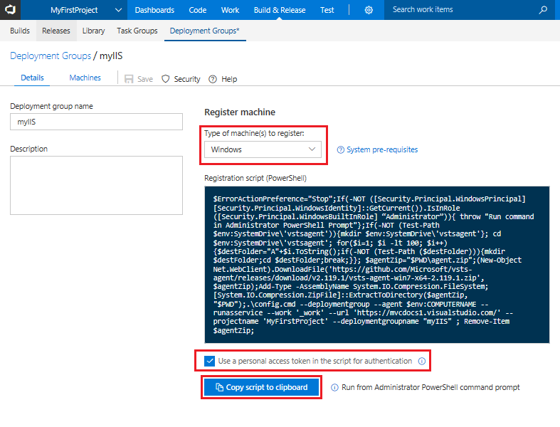
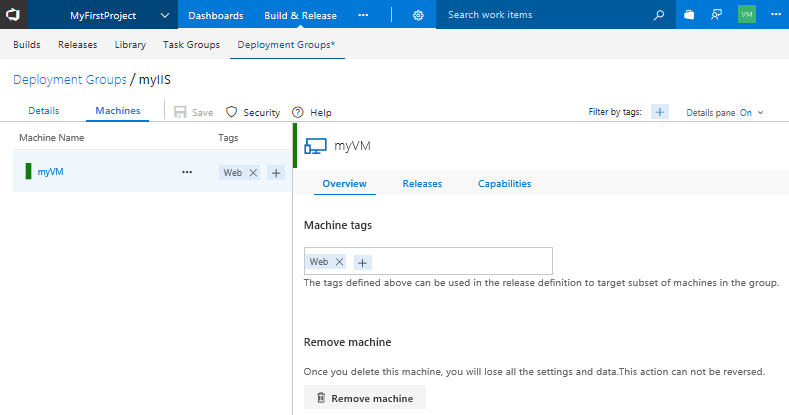

## Create a deployment group

Deployment groups in VSTS make it easier to organize the servers that you want to use to host your app. A deployment group is a collection of machines with a VSTS agent on each of them. Each machine interacts with VSTS to coordinate deployment of your app.

1. Open the VSTS web portal (`https://{your-account}.visualstudio.com`), navigate to the **Build and Release** hub, and then click **Deployment groups**.

1. Click **Add Deployment group** (or **New** if there are already deployment groups in place.

1. Enter a name for the group, such as *myIIS*, and then click **Create**.

1. In the **Register machine** section, make sure that **Windows** is selected, and that **Use a personal access token in the script for authentication** is also selected. Click **Copy script to clipboard**.

 

 The script that you've copied to your clipboard will download and configure an agent on the VM so that it can receive new web deployment packages and apply them to IIS.

1. On your VM, in an **Administrator PowerShell** console, paste and run the script.

1. When you're prompted to configure tags for the agent, press Enter (you don't need any tags).

1. When you're prompted for the user account, press Enter to accept the defaults.

1. When the script is done, it displays the message *Service vstsagent.account.computername started successfully*.

1. On the **Deployment groups** page of the **Build and Release** hub in VSTS, open the *myIIS* deployment group. On the **Machines** tab, verify that your VM is listed.

 
