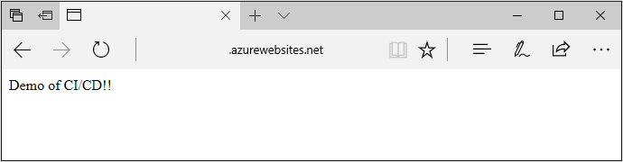
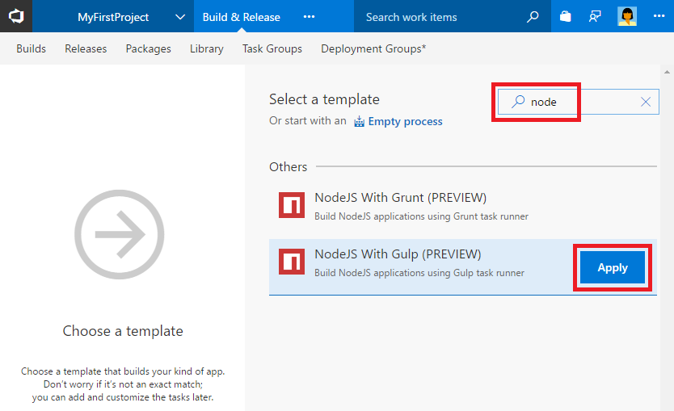
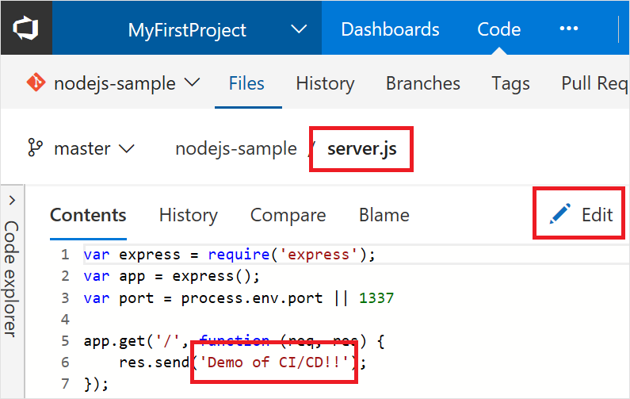

# Implement a CI/CD process to build and deploy your Node.js app to Azure

VSTS provides a highly customizable continuous integration (CI) and deployment (CD) automation system for your 
Node.js apps. 
This quickstart shows how to set up CI and CD to deploy
a Node.js app
to an Azure web app. 
You create the web app using the Azure CLI, then set up CI/CD in VSTS.
In the CI process, you use Gulp to run Mocha tests.



[!INCLUDE [temp](../_shared/vsts-and-azure-setup.md)]

[!INCLUDE [temp](../_shared/create-azure-web-app.md)]

[!INCLUDE [temp](../_shared/import-code-1.md)]

```bash
https://github.com/adventworks/nodejs-sample
```

[!INCLUDE [temp](../_shared/import-code-2.md)]

[!INCLUDE [temp](../_shared/set-up-ci-1.md)]

In the right panel, search for `node`, select **NodeJS with Gulp**, and then click **Apply**.

 

[!INCLUDE [temp](../_shared/set-up-ci-2.md)]

Select the **Run gulp task** from the tasks. On the right side, you see the parameters for the task. Under the section **JUnit Test Results**, select the option to **Publish to TFS/VSTS**.

[!INCLUDE [temp](../_shared/set-up-ci-3.md)]

[!INCLUDE [temp](../_shared/set-up-cd-1.md)]


[!INCLUDE [temp](../_shared/set-up-cd-2.md)]

[!INCLUDE [temp](../_shared/set-up-cd-3.md)]

## Update to redeploy the code

Navigate to the **Code** hub in the VSTS portal. Navigate to **server.js** file. Make the following simple change to that file by selecting the edit action.



Change the following line of text:
```
res.send('Hello World!');
```

to the following:
```
res.send('Demo of CI/CD!!');
```

Commit your changes in Git. This change triggers a CI build, and when the build completes, it triggers an automatic deployment to Azure web app.

[!INCLUDE [temp](../_shared/browse-to-web-app.md)]

[!INCLUDE [temp](../_shared/clean-up-resources.md)]
