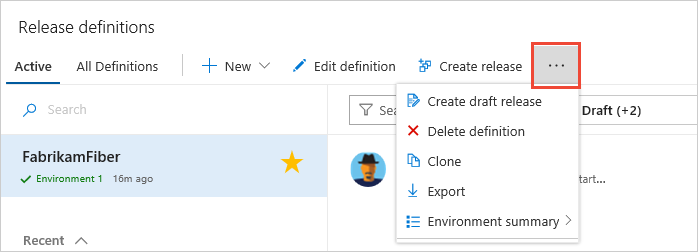
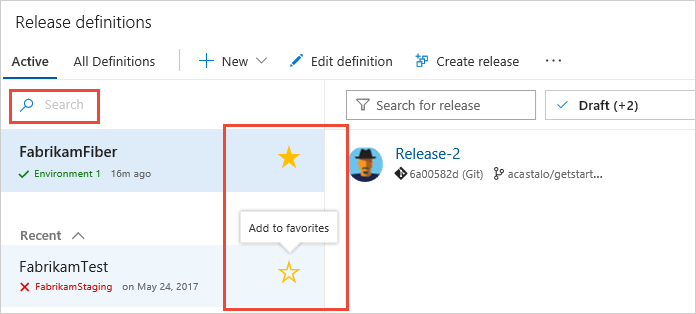
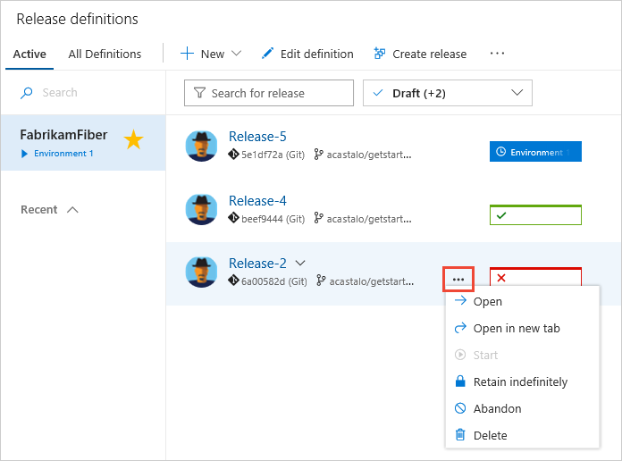
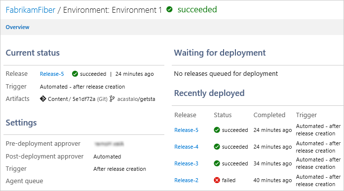

# New release landing page

A new and fully redesigned user experience is available for release landing page in VSTS.
To use this page, you simply need to switch it on using one of the on-screen prompts,
or from the [user profile **Previews** panel](../../../collaborate/preview-features.md#enable-features-for-your-use).

## Active tab

The **Active** tab shows a list of release definitions, and contains links to create or import a definition, edit the selected definition, and create a release. 

Use the drop-down menu to create a draft release, or to delete, clone, or export the selected release definition. 

Search for definitions if you have many in your list, or make it easy to select regularly used definitions by adding them to your list of favorites...

... or use the filter options to show the required subset of definitions. 

Use the drop-down menu to open, abandon, or delete a release, or to retain it indefinitely.

##All definitions tab

The **All definitions** tab shows all your release definitions as a folder tree. Use the drop-down menu to create a release or work with the selected definition.

Use the **Environment summary** link in the menu to see a more detailed view of the status and history of releases for any of the environments in the definition.

Because this is currently a preview, expect to see changes to the features and layout as development of the page continues. 

[!INCLUDE [rm-help-support-shared](../../_shared/rm-help-support-shared.md)]
