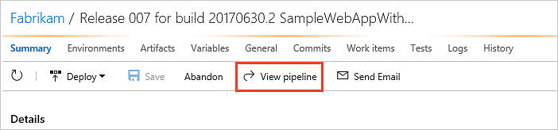
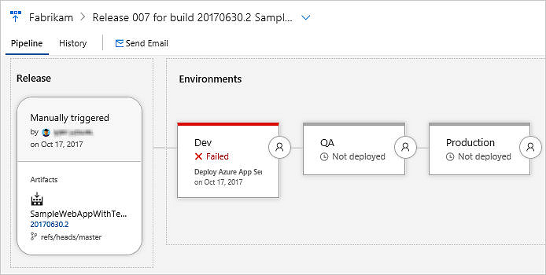
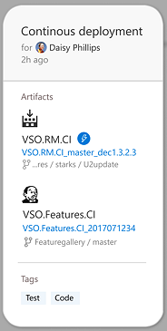
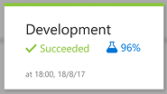
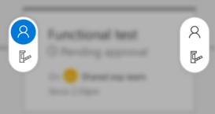
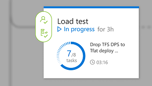
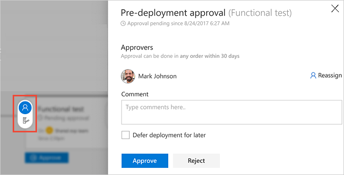
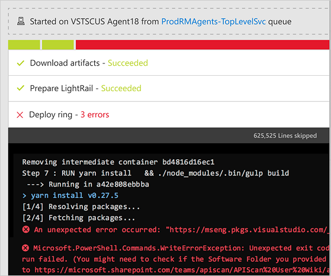
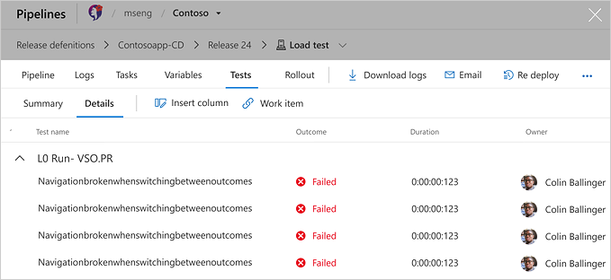

[//]: # (monikerRange: "vsts")

# New release progress views

A new and fully redesigned user experience is available for release progress in VSTS.
To use this page, you simply need to switch it on using one of the on-screen prompts,
or from the [user profile **Previews** panel](../../../collaborate/preview-features.md#enable-features-for-your-use).

Open the new pipeline view using the link in the toolbar.

The view shows information about the release and the deployment results. 

Use the links in the pipeline view to see more details.

## Pipeline, artifacts, and environments

| Feature | Details |
| --- | --- | 
|  | See your triggers, artifacts, tags, and who requested the release. |
|  | See your environments with details of deployment progress, outcome, test status, and more. |
|  | See details of the pre- and post-deployment conditions you defined. |
|  | See the status and details of the deployment to each environment. |

## Pre- and post-deployment gates and approvals

The deployment conditions links open the information panels for pre- and post-deployment conditions.

## Commits and workitems

Choose the environment in the pipeline to see a summary of commits and workitems related to this release.

## In-progress deployments and logs

Choose the progress indicator for an environment to see the live deployment logs.

## Test results and extensions

Choose the test results indicator for an environment to see a summary of test results.

[!INCLUDE [rm-help-support-shared](../../_shared/rm-help-support-shared.md)]
