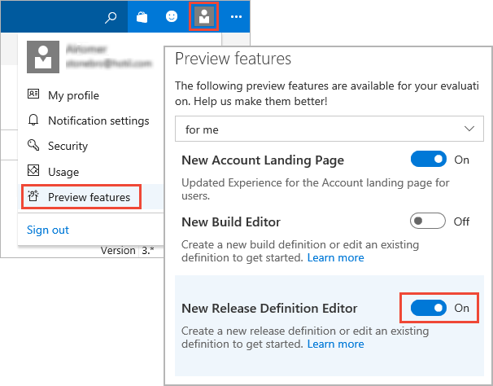

# Release Definition Editor Preview

VSTS contains a new release definition editor that makes creating release definitions much easier and more intuitive.
While it is in preview, you can turn the new editor on and off at any time. See
[Enable preview features](../../../collaborate/preview-features.md)
for more details.

For details of how to use the new editor, see [Work with release definitions](../../actions/work-with-release-definitions.md).

## Q: Can I edit release definitions with both the existing and the new editors interchangeably?

**A**: Yes, you can use the new editor to manage tasks and triggers,
and fall back to the existing editor for configuring options that are
not yet available in the new editor. Simply select **Releases** in the
**Build &amp; Release** menu, select the release definition, and choose **Edit**.

## Q: Is there any specific feedback you are looking for?

**A**: Yes, we're keen to hear your feedback about:

* Setting deployment triggers and approvals.
* Navigation from the Pipeline tab to the Tasks tab.
* The visual representation of the deployment workflow.

Please send your feedback to [RM_Customer_Queries@microsoft.com](mailto:RM_Customer_Queries@microsoft.com)

## Related topics

* [Artifacts](../../concepts/definitions/release/artifacts.md)
* [Environments](../../concepts/definitions/release/environments.md)
* [Triggers](../../concepts/definitions/release/triggers.md)
* [Variables](../../concepts/definitions/release/variables.md)
* [Release retention](../../concepts/policies/retention.md)
* [Release security](../../concepts/policies/permissions.md#release-permissions)

## See also

* [Work with release definitions](../../actions/work-with-release-definitions.md)

* [View and manage releases](../../actions/view-manage-releases.md)

* [Monitor releases and debug deployment issues](../../actions/debug-deployment-issues.md)

* [Configure your release pipelines for safe deployments](https://blogs.msdn.microsoft.com/visualstudioalm/2017/04/24/configuring-your-release-pipelines-for-safe-deployments/)

[!INCLUDE [rm-help-support-shared](../../_shared/rm-help-support-shared.md)]
