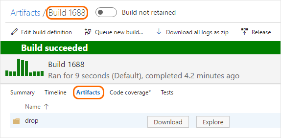

# Artifacts in Team Build

**VSTS | TFS 2015.3 and newer | TFS 2015 RTM ([see Q&A](#tfs-2015))**

Artifacts are the files that you want your build to produce. Artifacts can be nearly anything your team needs to test or deploy your app. For example, you've got a .DLL and .EXE executable files and .PDB symbols file of a C# or C++ .NET Windows app.

Release Management can pick up and use your build artifacts as part of of a continuous integration (CI)/ continuous deployment (CD) process. In this scenario, you're automatically building a web app with each commit using your CI build. Your CD release process picks up the .ZIP (ASP.NET or Node.js) or .WAR (Java) web deployment file. Your changes are automatically deployed to a test environment in Azure.

## Examples

Here are some examples of how to publish artifacts from the **Tasks** tab of your build definition.

### Publish a README.md file

> [!TIP]
> If you want to try this and you don't already have a Git repo with a README.md file at the root, you can quickly [create one](../../../../git/create-new-repo.md).

 **Utility: Publish Build Artifacts**

* Path to publish

 ```
$(Build.SourcesDirectory)/README.md
```
* Artifact name

 ```
drop
```

* Artifact publish location: Visual Studio Team Services/TFS (**TFS 2018 RTM and older**: Artifact type: Server)

### Two sets of artifacts

You can create multiple artifact items. For example:

 **Utility: Publish Build Artifacts**

* Path to publish

 ```
$(Build.SourcesDirectory)/README.md
```
* Artifact name

 ```
drop1
```

* Artifact publish location: Visual Studio Team Services/TFS (**TFS 2018 RTM and older**: Artifact type: Server)

 **Utility: Publish Build Artifacts**

* Path to publish

 ```
$(Build.SourcesDirectory)/README.md
```

* Artifact name

 ```
drop2
```

* Artifact publish location: Visual Studio Team Services/TFS (**TFS 2018 RTM and older**: Artifact type: Server)

The completed build delivers two sets of artifacts.


> You would probably never need to drop two copies of the same files. The point of this example is to show how you can drop multiple sets of artifacts that can be independently organized, explored, downloaded, and used by your deployment process.

### C++ app

 **Utility: Copy Files**

* Source folder

 ```
$(Build.ArtifactStagingDirectory)
```

* Contents

 ```
**/$(BuildConfiguration)/**/?(*.exe|*.dll|*.pdb)
```

* Target folder

 ```
$(Build.ArtifactStagingDirectory)
```

 **Utility: Publish Build Artifacts**

* Path to publish

 ```
$(Build.ArtifactStagingDirectory)
```

* Artifact name

 ```
drop
```

* Artifact publish location: Visual Studio Team Services/TFS (**TFS 2018 RTM and older**: Artifact type: Server)

## Tips

* **Artifact publish location** argument: **Visual Studio Team Services/TFS** (**TFS 2018 RTM and older**: Artifact type: Server) is the best and simplest choice in most cases. This choice causes the artifacts to be stored in VSTS or TFS. But if you're using a private Windows agent, you've got the option [drop to a UNC file share](#unc-file-share).

* **Artifact name** argument: Just enter a name that's meaningful to you.

* Use forward slashes in file path arguments so that they work for all agents. Backslashes don't work for macOS and Linux agents.

* On VSTS and some versions of TFS there are two different [variables](variables.md) that point to the staging directory: `Build.ArtifactStagingDirectory` and `Build.StagingDirectory`. These are interchangeable.

* The directory referenced by `Build.ArtifactStagingDirectory` is cleaned up after each build.

* You can [get build artifacts from the REST API](../../../../integrate/index.md).

<h2 id="unc-file-share">Publish from TFS to UNC file share</h2>

If you're using a private Windows agent, you can set the **artifact publish location** option (**TFS 2018 RTM and older**: artifact type) to publish your files to a UNC **file share**.

> [!NOTE]
>
> Use a Windows build agent. This option doesn't work for macOS and Linux agents.

Choose file share to copy the artifact to a file share. Some common reasons to do this:

* The size of your drop is large and consumes too much time and bandwidth to copy.

* You need to run some custom scripts or other tools against the artifact.

If you use a file share, specify the UNC file path to the folder. You can control how the folder is created for each build using [variables](variables.md). For example ```\\my\share\$(Build.DefinitionName)\$(Build.BuildNumber)```.

## Task reference

Use these tasks to publish artifacts:

*  [Utility: Copy Files](../../../tasks/utility/copy-files.md) By copying files to `$(Build.ArtifactStagingDirectory)` you can publish multiple files of different types from different places specified by your [matching patterns](../../../tasks/file-matching-patterns.md).
*  [Utility: Delete Files ](../../../tasks/utility/delete-files.md) Handy to prune unnecessary files that you copied to the staging directory.
*  [Utility: Publish Build Artifacts](../../../tasks/utility/publish-build-artifacts.md)

## Explore, download, and deploy your artifacts

When the build is done, if you watched it run, click the name of the completed build and then click the artifacts tab to see your artifact.



From here you can explore or download the artifacts.

You can also use Release Management to deploy your app using the artifacts that you've published. See [Artifacts in Release Management](../release/artifacts.md).

## Q&A
<!-- BEGINSECTION class="md-qanda" -->

<h3 id="tfs-2015">How do I publish artifacts from TFS 2015?</h3>

If you're using TFS 2015 RTM, then the steps in the above examples are not available. Instead, you copy and publish your artifacts using a single task: [Build: Publish Build Artifacts](../../../tasks/utility/publish-build-artifacts.md).

<!-- ENDSECTION -->
