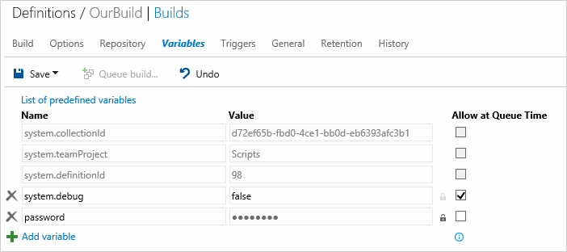

# Build variables

**VSTS | TFS 2018 | TFS 2017 | TFS 2015 | [Previous versions (XAML builds)](https://msdn.microsoft.com/library/hh850448%28v=vs.120%29.aspx)**

Variables give you a convenient way to get key bits of data into various parts of your build process.

| Use | User-defined  | Predefined, all scopes | Predefined, agent scope | Format | Examples and more information |
|---|---|---|---|---|---|
| As arguments to build steps | Yes | Yes | Yes | `$(Build.DefinitionName)` | [Command line](../../../tasks/utility/command-line.md), [Copy files](../../../tasks/utility/copy-files.md) |
| Apply a version control label during the build process | Yes | Yes | No | `$(Build.DefinitionName)` | [Repository tab](repository.md) (Git and Team Foundation version control **Label format**) |
| Customize the build number | Yes | Yes | No  | `$(Build.DefinitionName)` | [Build number format options](options.md) |
| Environment variable in Windows batch scripts| Yes | Yes | Yes | `%BUILD_DEFINITIONNAME%` | [Batch script ](../../../tasks/utility/batch-script.md#example) |
| Environment variable in PowerShell scripts | Yes | Yes | Yes | `$env:BUILD_DEFINITIONNAME` | [PowerShell script](../../../actions/scripts/powershell.md) |
| Environment variable in Shell scripts | Yes | Yes | Yes | `$BUILD_DEFINITIONNAME` | [Shell script](../../../tasks/utility/shell-script.md#example) |

## User-defined variables

Variables are a great way to store and share key bits of data in your build definition. Some build templates automatically define some variables for you.

For example, when you [create a new .NET app build](../../../apps/windows/dot-net.md), `BuildConfiguration` and `BuildPlatform` are automatically defined for you.

User-defined variables are formatted differently in different contexts. See above table.

### Secret Variables

We recommend that you make the variable 
**Secret** if it contains a password, keys, or some other kind of data that you need to avoid exposing.

**VSTS**

**Team Foundation Server (TFS) 2017.1 and older**

Secret variables are:

* Encrypted at rest with a 2048-bit RSA key.

* Not returned back to the client. They are automatically masked out of any log output from the build or release.  

* Not decrypted into environment variables. So scripts and programs run by your build steps are not given access by default.

* Decrypted for access by your build steps. So you can use them in password arguments and also pass them explicitly into a script or a program from your build step (for example as `$(password)`).

### Allow at queue time

Select this check box if you want to enable your team to modify the value when they manually queue a build.

[!INCLUDE [include](../../../concepts/definitions/_shared/set-variables-in-scripts.md)]

## Control variables

| Variable Name | Description |
| ------------- | ----------- |
| Build.Clean | Modifies how the build agent cleans things up. See [Source repositories](repository.md). |
| System.Debug | If you need more detailed logs to debug build problems, define and set it to `true`. |

## Environment variables

You can pass environment variables of the build machine into build steps. For example, on the [Build tab](../../../tasks/index.md) of a build definition, add this step:

| Task | Arguments |
| ---- | --------- |
|  **Utility: Command Line** | Tool: `echo` Arguments: `$(PATH)` |

> [!NOTE]
> If you have defined the a variable of the same name (for example `PATH`) on the [variables tab](variables.md), then your value overrides the environment variable when you use it as shown above.

## Predefined variables

<table>
    <thead>
        <tr>
            <th style="font-size:80%">Variable Name 
            Environment Variable Name</th>
            <th style="font-size:80%">Scope</th>
            <th style="font-size:80%">Notes</th>
        </tr>
    </thead>
    <tbody>
        <tr>
            <td>
                

                    Agent.BuildDirectory
                

                

                    AGENT_BUILDDIRECTORY
                

            </td>
            <td style="font-size:80%">Agent</td>
            <td>
                
The local path on the agent where all folders for a given build definition are created. For example: `c:\agent\_work\1`
                

            </td>
        </tr>
        <tr>
            <td>
                

                    Agent.HomeDirectory
                

                

                    AGENT_HOMEDIRECTORY
                

            </td>
            <td style="font-size:80%">Agent</td>
            <td>
                

                    The directory the agent is installed into. This contains the agent software. For example: `c:\agent`.
                

                
If you are using an on-premises agent, this directory is specified by you. See [Agents](../../../concepts/agents/agents.md).

            </td>
        </tr>
         <tr>
            <td>
                

                    Agent.Id
                

                

                    AGENT_ID
                

            </td>
            <td style="font-size:80%">Agent</td>
            <td>
                

                    The ID of the agent.  
                

            </td>
        </tr>
         <tr>
            <td>
                

                    Agent.JobStatus
                

                

                    AGENT_JOBSTATUS
                

            </td>
            <td style="font-size:80%">Agent</td>
            <td>
                

                    The status of the build.
                

                <ul>
                  <li style="font-size:80%">`Canceled`</li>
                  <li style="font-size:80%">`Failed`</li>
                  <li style="font-size:80%">`Succeeded`</li>
                  <li style="font-size:80%">`SucceededWithIssues` (partially successful)</li>
                </ul>
            </td>
        </tr>        <tr>
            <td>
                

                    Agent.MachineName
                

                

                    AGENT_MACHINENAME
                

            </td>
            <td style="font-size:80%">Agent</td>
            <td>
                

                    The name of the machine on which the agent is installed.
                

            </td>
        </tr>
        <tr>
            <td>
                

                    Agent.Name
                

                

                    AGENT_NAME
                

            </td>
            <td style="font-size:80%">Agent</td>
            <td>
                

                    The name of the agent that is registered with the pool.
                

                
If you are using an on-premises agent, this directory is specified by you. See agents(../concepts/agents/agents.md).

            </td>
        </tr>
        <tr>
            <td>
                

                    Agent.WorkFolder
                

                

                    AGENT_WORKFOLDER
                

            </td>
            <td style="font-size:80%">Agent</td>
            <td>
                

                    The working directory for this agent. For example: `c:\agent\_work`.
                

            </td>
        </tr>
        <tr>
            <td>
                

                    Build.ArtifactStagingDirectory
                

                

                    BUILD_ARTIFACTSTAGINGDIRECTORY
                

            </td>
            <td style="font-size:80%">Agent</td>
            <td>
                [!INCLUDE [include](_shared/variables-build-artifacts-directory.md)]
            </td>
        </tr>
        <tr>
            <td>
                

                    Build.BuildId
                

                

                    BUILD_BUILDID
                

            </td>
            <td style="font-size:80%">All</td>
            <td>
                

                    The ID of the record for the completed build.
                

            </td>
        </tr>
        <tr>
            <td>
                

                    Build.BuildNumber
                

                

                    BUILD_BUILDNUMBER
                

            </td>
            <td style="font-size:80%">Agent, label format (see Notes)</td>
            <td>
                

                    The name of the completed build. You can specify the build number format that generates this value in the [definition options](options.md).
                

                
A typical use of this variable is to make it part of the label format, which you specify on the [repository tab](repository.md).

                

                    [!INCLUDE [include](_shared/variables-invalid-label-characters.md)]
                

            </td>
        </tr>
        <tr>
            <td>
                

                    Build.BuildUri
                

                

                    BUILD_BUILDURI
                

            </td>
            <td style="font-size:80%">Agent</td>
            <td>
                

                    The URI for the build. For example: `vstfs:///Build/Build/1430`.
                

            </td>
        </tr>
        <tr>
            <td>
                

                    Build.BinariesDirectory
                

                

                    BUILD_BINARIESDIRECTORY
                

            </td>
            <td style="font-size:80%">Agent</td>
            <td>
                
The local path on the agent you can use as an output folder for compiled binaries. For example: `c:\agent\_work\1\b`.
                

                
By default, new build definitions are not set up to clean this directory. You can define your build to clean it up on the [Repository tab](repository.md).
                 

            </td>
        </tr>
        <tr>
            <td>
                

                    Build.DefinitionName
                

                

                    BUILD_DEFINITIONNAME
                

            </td>
            <td style="font-size:80%">All (see Notes)</td>
            <td>
                

                    The name of the build definition.
                

                

                    [!INCLUDE [include](_shared/variables-invalid-label-characters.md)]
                

            </td>
        </tr>
        <tr>
            <td>
                

                    Build.DefinitionVersion
                

                

                    BUILD_DEFINITIONVERSION
                

            </td>
            <td style="font-size:80%">All</td>
            <td>
                

                    The version of the build definition.
                

            </td>
        </tr>
        <tr>
            <td style="font-size:80%">
                

                    Build.QueuedBy
                

                

                    BUILD_QUEUEDBY
                

            </td>
            <td style="font-size:80%">All (see Notes)</td>
            <td>
                

                    [How are the identity variables set?](#identity_values)

                

                    [!INCLUDE [include](_shared/variables-invalid-label-characters.md)]
                

            </td>
        </tr>
        <tr>
        <td>
                

                    Build.QueuedById
                

                

                    BUILD_QUEUEDBYID
                

            </td>
            <td style="font-size:80%">All</td>
            <td>
                

                    [How are the identity variables set?](#identity_values)
                

            </td>
        </tr>
        <tr>
            <td>
                

                    Build.Reason
                

                

                    BUILD_REASON
                

            </td>
            <td style="font-size:80%">All</td>
            <td>
                <blockquote style="font-size:80%">
                    **VSTS Only**
                </blockquote>
                
The event that caused the build to run.
                

                <ul>
                    <li style="font-size:80%">`Manual`: A user manually queued the build.</li>
                    <li style="font-size:80%">`IndividualCI`: **Continuous integration (CI)** triggered by a Git push or a TFVC check-in.</li>
                    <li style="font-size:80%">`BatchedCI`: **Continuous integration (CI)** triggered by a Git push or a TFVC check-in, and the **Batch changes** was selected.</li>
                    <li style="font-size:80%">`Schedule`: **Scheduled** trigger.</li>
                    <li style="font-size:80%">`ValidateShelveset`: A user manually queued the build of a specific TFVC shelveset.</li>
                    <li style="font-size:80%">`CheckInShelveset`: **Gated check-in** trigger.</li>
                    <li style="font-size:80%">`PullRequest`: The build was triggered by a Git branch policy that requires a build.</li>
                </ul>
                
See [Build definition triggers](triggers.md), [Improve code quality with branch policies](../../../../git/branch-policies.md).

            </td>
        </tr>        
        <tr>
            <td>
                

                    Build.Repository.Clean
                

                

                    BUILD_REPOSITORY_CLEAN
                

            </td>
            <td style="font-size:80%">Agent</td>
            <td>
                
The value you've selected for **Clean** in the [source repository settings](repository.md).

            </td>
        </tr>
        <tr>
            <td>
                

                    Build.Repository.LocalPath
                

                

                    BUILD_REPOSITORY_LOCALPATH
                

            </td>
            <td style="font-size:80%">Agent</td>
            <td>
                [!INCLUDE [include](_shared/variables-build-sources-directory.md)]
            </td>
        </tr>
        <tr>
            <td>
                

                    Build.Repository.Name
                

                

                    BUILD_REPOSITORY_NAME
                

            </td>
            <td style="font-size:80%">Agent</td>
            <td>
                

                    The name of the [repository](repository.md).
                

            </td>
        </tr>
        <tr>
            <td>
                

                    Build.Repository.Provider
                

                

                    BUILD_REPOSITORY_PROVIDER
                

            </td>
            <td style="font-size:80%">Agent</td>
            <td>
                

                    The type of [repository you selected](repository.md).
                

                <ul>
                    <li style="font-size:80%">`TfsGit`: [TFS Git repository](../../../../git/overview.md)</li>
                    <li style="font-size:80%">`TfsVersionControl`: [Team Foundation Version Control](../../../../tfvc/overview.md)</li>
                    <li style="font-size:80%">`Git`: Git repository hosted on an external server</li>
                    <li style="font-size:80%">`GitHub`</li>
                    <li style="font-size:80%">`Svn`: Subversion</li>
                </ul>
            </td>
        </tr>
        <tr>
            <td>
                

                    Build.Repository.Tfvc.Workspace
                

                

                    BUILD_REPOSITORY_TFVC_WORKSPACE
                

            </td>
            <td style="font-size:80%">Agent</td>
            <td>
                

                    Defined if your [repository](repository.md) is Team Foundation Version Control. The name of the [TFVC workspace](../../../../tfvc/create-work-workspaces.md) used by the build agent.
                

                

                For example, if the Agent.BuildDirectory is `c:\agent\_work\12` and the Agent.Id is `8`, the workspace name could be: `ws_12_8`
                

            </td>
        </tr>
        <tr>
            <td>
                

                    Build.Repository.Uri
                

                

                    BUILD_REPOSITORY_URI
                

            </td>
            <td style="font-size:80%">Agent</td>
            <td>
                

                    The URL for the repository. For example:
                

                <ul>
                    <li style="font-size:80%">Git: `https://fabrikamfiber.visualstudio.com/_git/Scripts`</li>
                    <li style="font-size:80%">TFVC: `https://fabrikamfiber.visualstudio.com/`</li>
                </ul>
            </td>
        </tr>
        <tr>
            <td>
                

                    Build.RequestedFor
                

                

                    BUILD_REQUESTEDFOR
                

            </td>
            <td style="font-size:80%">All (see Notes)</td>
            <td>
                

                    [How are the identity variables set?](#identity_values)
                

                

                    [!INCLUDE [include](_shared/variables-invalid-label-characters.md)]
                

            </td>
        </tr>
		<tr>
            <td>
                

                    Build.RequestedForEmail
                

                

                    BUILD_REQUESTEDFOREMAIL
                

            </td>
            <td style="font-size:80%">All</td>
            <td>
                

                    [How are the identity variables set?](#identity_values)
                

            </td>
        </tr>
        <tr>
            <td>
                

                    Build.RequestedForId
                

                

                    BUILD_REQUESTEDFORID
                

            </td>
            <td style="font-size:80%">All</td>
            <td>
                

                    [How are the identity variables set?](#identity_values)
                

            </td>
        </tr>
        <tr>
            <td>
                

                    Build.SourceBranch
                

                

                    BUILD_SOURCEBRANCH
                

            </td>
            <td style="font-size:80%">All (see Notes)</td>
            <td>
                

                    The branch the build was queued for. Some examples:
                

                <ul>
                    <li style="font-size:80%">Git repo branch: `refs/heads/master`</li>
                    <li style="font-size:80%">Git repo pull request: `refs/pull/1/merge`</li>
                    <li style="font-size:80%">TFVC repo branch: `$/teamproject/main`</li>
                    <li style="font-size:80%">TFVC repo gated check-in: `Gated_2016-06-06_05.20.51.4369;username@live.com`</li>
                    <li style="font-size:80%">TFVC repo shelveset build: `myshelveset;username@live.com`</li>
                </ul>
                
When you use this variable in your build number format, the forward slash characters (`/`) are replaced with underscore characters <code>&#095;</code>).

                
Note: In TFVC, if you are running a gated check-in build or manually building a shelveset, you cannot use this variable in your build number format.

            </td>
        </tr>
        <tr>
            <td>
                

                    Build.SourceBranchName
                

                

                    BUILD_SOURCEBRANCHNAME
                

            </td>
            <td style="font-size:80%">All (see Notes)</td>
            <td>
                

                    The name of the branch the build was queued for.
                

                <ul>
                    <li style="font-size:80%">Git repo branch or pull request: The last path segment in the ref. For example, in `refs/heads/master` this value is `master`.</li>
                    <li style="font-size:80%">TFVC repo branch: The last path segment in the root server path for the workspace. For example in `$/teamproject/main` this value is `main`.</li>
                    <li style="font-size:80%">TFVC repo gated check-in or shelveset build is the name of the shelveset. For example, `Gated_2016-06-06_05.20.51.4369;username@live.com` or `myshelveset;username@live.com`.</li>
                </ul>
                
Note: In TFVC, if you are running a gated check-in build or manually building a shelveset, you cannot use this variable in your build number format.

            </td>
        </tr>
        <tr>
            <td>
                

                    Build.SourcesDirectory
                

                

                    BUILD_SOURCESDIRECTORY
                

            </td>
            <td style="font-size:80%">Agent</td>
            <td>
                [!INCLUDE [include](_shared/variables-build-sources-directory.md)]
            </td>
        </tr>
        <tr>
            <td>
                

                    Build.SourceVersion
                

                

                    BUILD_SOURCEVERSION
                

            </td>
            <td style="font-size:80%">Agent</td>
            <td>
                

                    The latest version control change that is included in this build.
                

                    <ul>
                        <li style="font-size:80%">Git: The [commit](../../../../git/tutorial/commits.md) ID.</li>
                        <li style="font-size:80%">TFVC: the [changeset](../../../../tfvc/find-view-changesets.md).</li>
                    </ul>
            </td>
        </tr>
        <tr>
            <td>
                

                    Build.StagingDirectory
                

                

                    BUILD_STAGINGDIRECTORY
                

            </td>
            <td style="font-size:80%">Agent</td>
            <td>
                [!INCLUDE [include](_shared/variables-build-artifacts-directory.md)]
            </td>
        </tr>
        <tr>
            <td>
                

                    Build.Repository.Git.SubmoduleCheckout
                

                

                    BUILD_REPOSITORY_GIT_SUBMODULECHECKOUT
                

            </td>
            <td style="font-size:80%">Agent</td>
            <td>
                
The value you've selected for **Checkout submodules** on the [repository tab](repository.md).

            </td>
        </tr>
        <tr>
            <td>
                

                    Build.SourceTfvcShelveset
                

                

                    BUILD_SOURCETFVCSHELVESET
                

            </td>
            <td style="font-size:80%">All (see Notes)</td>
            <td>
                

                Defined if your [repository](repository.md) is Team Foundation Version Control.
                

                

                    If you are running a [gated build](triggers.md#gated) or a [shelveset build](../../../actions/ci-cd-part-1.md#queueabuild), this is set to the name of the [shelveset](../../../../tfvc/suspend-your-work-manage-your-shelvesets.md) you are building.
                

                
Note: This variable yields a value that is invalid for build use in a build number format

            </td>
        </tr>
        <tr>
            <td>
                

                    Common.TestResultsDirectory
                

                

                    COMMON_TESTRESULTSDIRECTORY
                

            </td>
            <td style="font-size:80%">Agent</td>
            <td>
                
The local path on the agent where the test results are created. For example: `c:\agent\_work\1\TestResults`
                

            </td>
        </tr>
        <tr>
            <td>
                

                    System.AccessToken
                

                

                    SYSTEM_ACCESSTOKEN
                

            </td>
            <td style="font-size:80%">Agent</td>
            <td>
                

                    [Use the OAuth token to access the REST API](../../../actions/scripts/powershell.md#oauth).
                

            </td>
        </tr>
        <tr>
            <td>
                

                    System.CollectionId
                

                

                    SYSTEM_COLLECTIONID
                

            </td>
            <td style="font-size:80%">All</td>
            <td>
                

                    The GUID of the team foundation collection.
                

            </td>
        </tr>
        <tr>
            <td>
                

                    System.DefaultWorkingDirectory
                

                

                    SYSTEM_DEFAULTWORKINGDIRECTORY
                

            </td>
            <td style="font-size:80%">Agent</td>
            <td>
                [!INCLUDE [include](_shared/variables-build-sources-directory.md)]
            </td>
        </tr>
        <tr>
            <td>
                

                    System.DefinitionId
                

                

                    SYSTEM_DEFINITIONID
                

            </td>
            <td style="font-size:80%">All</td>
            <td>
                

                    The ID of the build definition.
                

            </td>
        </tr>
        <tr>
            <td>
                

                    System.PullRequest.IsFork
                

                

                    SYSTEM_PULLREQUEST_ISFORK
                

            </td>
            <td style="font-size:80%">All</td>
            <td>
                

                    If the pull request is from a fork of the repository, this variable is set to `True`.
                    Otherwise, it is set to `False`.
                

            </td>
        </tr>
        <tr>
            <td>
                

                    System.PullRequest.PullRequestId
                

                

                    SYSTEM_PULLREQUEST_PULLREQUESTID
                

            </td>
            <td style="font-size:80%">All</td>
            <td>
                

                    The ID of the pull request that caused this build. For example: `17`. (This variable is initialized only if the build ran because of a [Git PR affected by a branch policy](../../../../git/branch-policies.md#require-the-pull-request-to-build).)
                

            </td>
        </tr>
        <tr>
            <td>
                

                    System.PullRequest.SourceBranch
                

                

                    SYSTEM_PULLREQUEST_SOURCEBRANCH
                

            </td>
            <td style="font-size:80%">All</td>
            <td>
                

                    The branch that is being revewiewed in a pull request. For example: `refs/heads/users/raisa/new-feature`. (This variable is initialized only if the build ran because of a [Git PR affected by a branch policy](../../../../git/branch-policies.md#require-the-pull-request-to-build).)
                

            </td>
        </tr>        <tr>
            <td>
                

                    System.PullRequest.SourceRepositoryURI
                

                

                    SYSTEM_PULLREQUEST_SOURCEREPOSITORYURI
                

            </td>
            <td style="font-size:80%">All</td>
            <td>
                <blockquote style="font-size:80%">
                    **VSTS Only**
                </blockquote>
                

                    The URL to the repo that contains the pull request. For example: `https://ouraccount.visualstudio.com/_git/OurProject`. (This variable is initialized only if the build ran because of a [VSTS Git PR affected by a branch policy](../../../../git/branch-policies.md#require-the-pull-request-to-build). It is not initialized for GitHub PRs.)
                

            </td>
        </tr>
        <tr>
            <td>
                

                    System.PullRequest.TargetBranch
                

                

                    SYSTEM_PULLREQUEST_TARGETBRANCH
                

            </td>
            <td style="font-size:80%">All</td>
            <td>
                

                    The branch that is the target of a pull request. For example: `refs/heads/master`. (This variable is initialized only if the build ran because of a [Git PR affected by a branch policy](../../../../git/branch-policies.md#require-the-pull-request-to-build).)
                

            </td>
        </tr>
        <tr>
            <td>
                

                    System.TeamFoundationCollectionUri
                

                

                    SYSTEM_TEAMFOUNDATIONCOLLECTIONURI
                

            </td>
            <td style="font-size:80%">Agent</td>
            <td>
                

                    The URI of the team foundation collection. For example: `https://fabrikamfiber.visualstudio.com/`.
                

            </td>
        </tr>
        <tr>
            <td>
                

                    System.TeamProject
                

                

                    SYSTEM_TEAMPROJECT
                

            </td>
            <td style="font-size:80%">All</td>
            <td>
                

                    The name of the team project that contains this build.
                

            </td>
        </tr>
        <tr>
            <td>
                

                    System.TeamProjectId
                

                

                    SYSTEM_TEAMPROJECTID
                

            </td>
            <td style="font-size:80%">All</td>
            <td>
                

                    The ID of the team project that this build belongs to.
                

            </td>
        </tr>
        <tr>
            <td>
                

                    TF_BUILD
                

            </td>
            <td style="font-size:80%">Agent</td>
            <td>
                

                    Set to `True` if the script is being run by a build step.
                

            </td>
        </tr>
    </tbody>
</table>

## Q&A
<!-- BEGINSECTION class="md-qanda" -->

### What are the predefined Release Management variables?

[Default release management variables](../../../concepts/definitions/release/variables.md#default-variables)

### How are the identity variables set?

The value depends on what caused the build.

| If the build is triggered... | Then the Build.QueuedBy and Build.QueuedById values are based on... | Then the Build.RequestedFor and Build.RequestedForId values are based on... |
| --- | --- | ---|
| In Git or TFVC by the [Continuous integration (CI) triggers](triggers.md) | The system identity, for example: `[DefaultCollection]\Project Collection Service Accounts` | The person who pushed or checked in the changes. |
| In Git or by a [branch policy build](../../../../git/branch-policies.md#require-the-pull-request-to-build). | The system identity, for example: `[DefaultCollection]\Project Collection Service Accounts` | The person who checked in the changes. |
| In TFVC by a [gated check-in trigger](triggers.md) | The person who checked in the changes. | The person who checked in the changes. |
| In Git or TFVC by the [Scheduled triggers](triggers.md) | The system identity, for example: `[DefaultCollection]\Project Collection Service Accounts` | The system identity, for example: `[DefaultCollection]\Project Collection Service Accounts` |
| Because you clicked the **Queue build** button | You | You |

[!INCLUDE [temp](../../../_shared/qa-agents.md)]

[!INCLUDE [temp](../../../_shared/qa-versions.md)]

<!-- ENDSECTION -->
