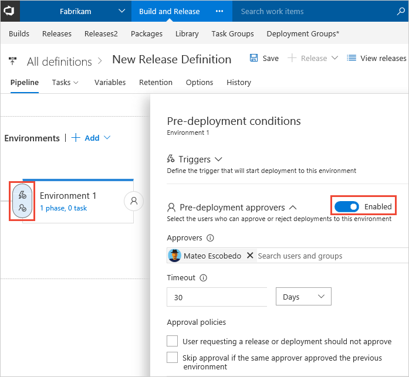
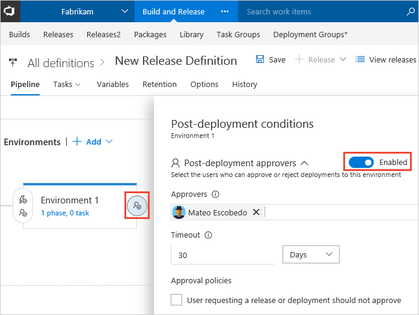
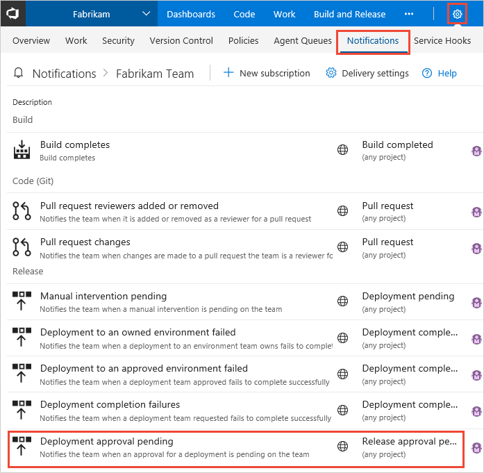
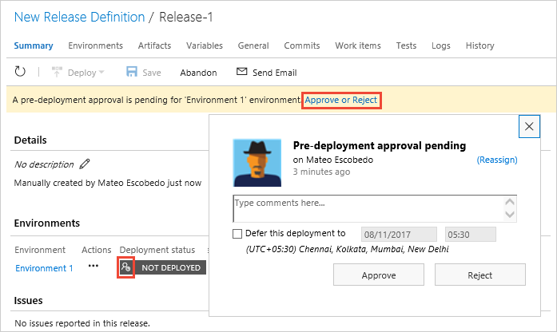

# Approvals

[!INCLUDE [version-rm-dev14](../../../../_shared/version-rm-dev14.md)]

When a release is created from a release definition that defines
approvals, the deployment stops at each point where approval is required
until the specified approver grants approval or rejects the release (or
re-assigns the approval to another user).
You can enable manual deployment approvals for each environment in a release definition.

## Define a deployment approval

1. Decide if you need pre-deployment approvers, post-deployment approvers, or both
   for an environment. Then open the appropriate conditions panel(s). 

   For a **pre-deployment** approval, choose the icon at the entry point of the environment
   and enable pre-deployment approvers.

   

   For a **post-deployment** approval, choose the icon at the exit point of the environment
   and enable post-deployment approvers.

   

1. Select one or more **Approvers** for the approval step. You can add multiple approvers for both pre-deployment
   and post-deployment settings. These approvers can be individual users or groups of users. 
   When a group is specified as an approver, only one of the users in that group needs to approve
   for the deployment to occur or the release to move forward.

   * If you are using **Visual Studio Team Services** (VSTS), you
     can use local groups managed in VSTS or
     Azure Active Directory (AAD) groups if they have been
     added into VSTS.
   * If you are using **Team Foundation Server** (TFS),
     you can use local groups managed in TFS or Active
     Directory (AD) groups if they have been added into TFS.

   The creator of a deployment is considered to be a separate user
   role for deployments. For more details,
   see [Release permissions](../../../policies/permissions.md#release-permissions).
   Either the release creator or the deployment creator can be restricted from approving deployments. 

1. Specify the **Timeout** for the approval. If no approval is granted within the timeout period you
   specify, the deployment is rejected.

1. Specify the **Approval policies** you require:

   * You can specify that the user who requested (initiated or created) the release cannot approve it.
     If you are experimenting with approvals, uncheck this option so that you can approve or reject your own deployments. 
   * You can force a revalidation of the user identity to take into account recently changed permissions. 
   * You can reduce user workload by automatically approving subsequent prompts if the specified
     user has already approved the deployment to a previous environment in the pipeline
     (applies to pre-deployment approvals only). Take care when using this option; for example, you may
     want to require a user to physically approve a deployment to production even though that user has
     previously approved a deployment to a QA environment in the same release pipeline.  

   

### Approval notifications

Release Management can send notifications such as an email message to the approver(s) defined for
each approval step. 

  
The link in the email message opens the **Summary** page for the release
where the user can approve or reject the release.

## Approve or reject a deployment

During a release, the deployment pipeline will stop at any stage that requires approval, and
will display an alert or indicator to the user. In the **Releases**, **Summary**, and **Logs** pages
and lists, it displays the 
icon when the deployment is waiting for approval by the current user, or the
 icon
when the deployment is waiting for approval by a different user.
This link or icon displays the approval dialog.
 

A notification bar is also shown in the release details page, with a link that displays the approval dialog.      

If there is more than one approval waiting for the same user, the reminder will
contain two links, **All** and **Selected environments**. This saves the user
from needing to interact with each approval request individually.

Use the approvers pop-up dialog to:

* Enter a comment
* Approve or reject the deployment
* Reassign the approval to somebody else
* Defer the deployment to a specified date and time

An administrator can approve a deployment step even
if the approval was originally defined for a different user.
In this case, the approvers pop-up dialog contains an
**Override** link instead of a **Reassign** link.
This enables the administrator to enter comments, approve,
reject, reassign, or defer the deployment.

You can also approve and reject pending deployments by accessing the
[Release Management REST API](../../../../../integrate/index.md).

## View and monitor manual approvals

During and after a deployment, the **Logs** page shows comprehensive information
about the progress and status of the release. Pre-deployment and post-deployment
items are included; choose the **Action** icon next to them to see the approval
action log entry.

For example, in this screenshot pre-deployment approval was granted, and the
**Action** link displays the name of the approver and the message entered by that user
when approving (or rejecting) the deployment.  

Notice that this release is now waiting for post-deployment approval.
Choosing the **Action** item for this will display the approval dialog where 
the deployment can be approved or rejected.

## Related topics

* [Approvals and gates overview](index.md)
* [Manual intervention](../../../../tasks/utility/manual-intervention.md)
* [Environments](../environments.md)
* [Triggers](../triggers.md)

## See also

* [Work with release definitions](../../../../actions/work-with-release-definitions.md)
* [View and manage releases](../../../../actions/view-manage-releases.md)
* [Configure your release pipelines for safe deployments](https://blogs.msdn.microsoft.com/visualstudioalm/2017/04/24/configuring-your-release-pipelines-for-safe-deployments/)

[!INCLUDE [rm-help-support-shared](../../../../_shared/rm-help-support-shared.md)]
