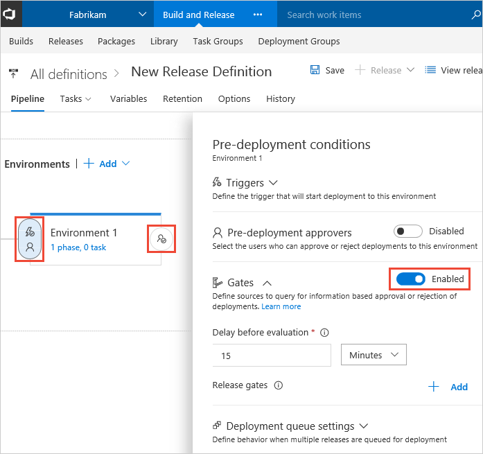
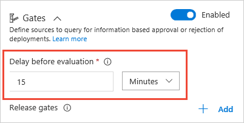
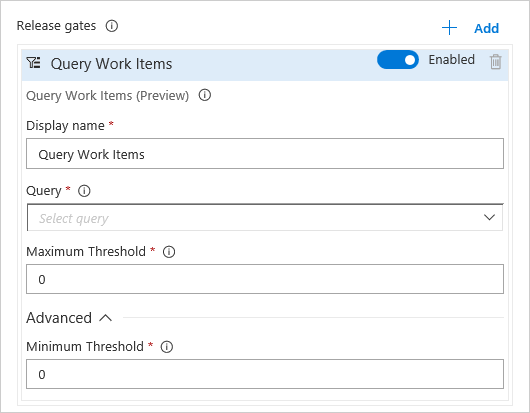
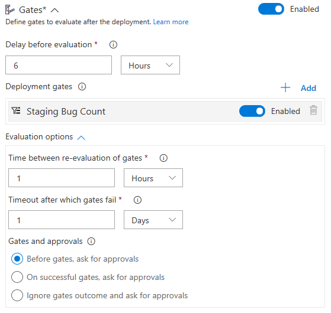
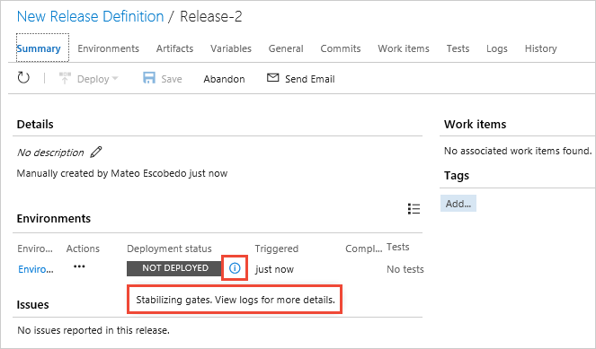
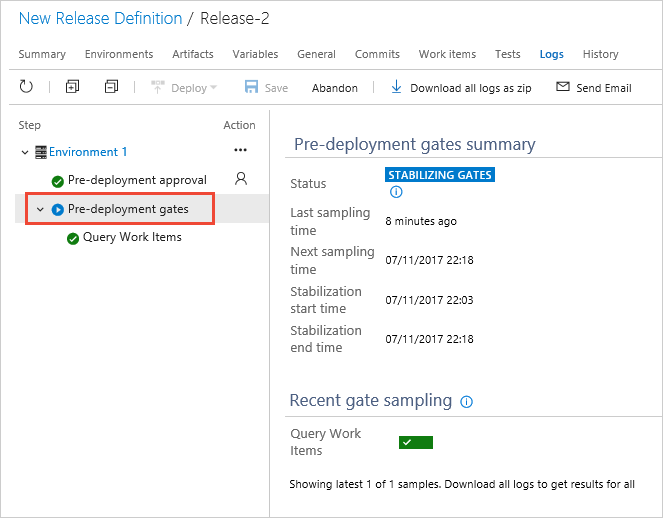

# Gates

**VSTS**

Gates allow you to query a range of external services, and wait for a positive input from all of
them before continuing with a deployment to an environment. When a release is created from a definition
that contains gates, the deployment stops until the health signals from all the configured services are successful.

>You may need to enable Gates in your profile [Preview features](../../../../../collaborate/preview-features.md) list. 

## Define a gate for an environment

1. Enable gates in the **Pre-deployment conditions** or **Post-deployment conditions** panel for an environment. 

   

1. Specify the **Delay before evaluation** for all the gates
   you intend to use. This is a time delay at the beginning of the initial gate evaluation 
   process that allows the gates to initialize, stabilize, and begin providing accurate results
   for the current deployment. See [Gate evaluation flows](#eval-examples).

   

   As an example:

   * For **pre-deployment gates**, the delay would be the time required for all bugs to be logged
     against the artifacts being deployed.  
   * For **post-deployment gates**, the delay would be the maximum time taken for the deployed app
     to reach a steady operational state, the time taken for execution of all the required tests on
     the deployed environment, and the least time it takes for incidents to be logged after the deployment.

1. Choose **+ Add**, and select the type of release gate you require.

   

   At present the available gates include:

   * **Azure function**: Trigger execution of an Azure function and ensure a successful completion.
     For more details, see [Azure function task](../../../../tasks/utility/azure-function.md).
   * **Azure monitor**: Observe the configured Azure monitor alert rules for active alerts.
     For more details, see [Azure monitor task](../../../../tasks/utility/azure-monitor.md).
   * **Invoke REST API**: Make a call to a REST API and continue if it returns a successful response.
     For more details, see [HTTP REST API task](../../../../tasks/utility/http-rest-api.md).
   * **Work item query**: Ensure the number of matching work items returned from a query is within a threshold.
     For more details, see [Work item query task](../../../../tasks/utility/work-item-query.md).

   > Also see the tutorial [Use approvals and gates to control your deployment](../../../../actions/deploy-using-approvals.md)
     and the blog post [Twitter sentiment as a release gate](https://blogs.msdn.microsoft.com/bharry/2017/12/15/twitter-sentiment-as-a-release-gate/), which includes an example of a gate that uses an Azure function.
     A [library with examples](https://github.com/Microsoft/vsts-rm-extensions/tree/master/ServerTaskHelper/DistributedTask.ServerTask.Remote.Common) is available to help you create your own custom gate tasks.

1. Select and enter the required gate arguments, depending on the type of gate you chose.

   

1.  Set the options that apply to all the gates you added:

   * **Timeout**. The maximum evaluation period for all gates. 
     The deployment will be rejected if the timeout is reached before
     all gates succeed during the same sampling interval. 

   * **Sampling interval**. The time interval between each evaluation of 
     all the gates. At each sampling interval, new requests are sent concurrently to each gate
     for fresh results. The sampling interval must be greater than the longest
     typical response time of any configured gate to allow time for all responses to be received.     

   * **Execution order**. Select the required order of execution for gates and approvals if you have configured both.
     For pre-deployment conditions, the default is to prompt for manual (user) approvals first, then evaluate gates afterwards.
     This saves the system from evaluating the gate functions if the release is rejected by the user. 
     For post-deployment conditions, the default is to evaluate gates and prompt for manual approvals only when all gates are successful.
     This ensures the approvers have all the information required for a sign-off. 

   
   
   > Watch [this video on Channel 9](https://channel9.msdn.com/Events/Connect/2017/T181) to see gates in action.

### Gate evaluation flow examples

The following diagram illustrates the flow of gate evaluation where, after the
initial stabilization delay period and three sampling intervals, the deployment is approved.

The following diagram illustrates the flow of gate evaluation where, after the
initial stabilization delay period, not all gates have succeeded at each sampling interval. In
this case, after the timeout period expires, the deployment is rejected.

## View and monitor gate results
 
1. Open the **Summary** page for your release. As the release executes, the pop-up message when you choose
   the  icon for an environment indicates the current status of your deployment to each environment.

   

1. Open the **Logs** page for your release. During and after a deployment, it shows comprehensive information
about the evaluation of all the gates you configured for the release.

   

## Related topics

* [Approvals and gates overview](index.md)
* [Manual intervention](../../../../tasks/utility/manual-intervention.md)
* [Use approvals and gates to control your deployment](../../../../actions/deploy-using-approvals.md)
* [Environments](../environments.md)
* [Triggers](../triggers.md)

## See also

* [Video: Deploy quicker and safer with gates in VSTS](https://channel9.msdn.com/Events/Connect/2017/T181)
* [Work with release definitions](../../../../actions/work-with-release-definitions.md)
* [View and manage releases](../../../../actions/view-manage-releases.md)
* [Configure your release pipelines for safe deployments](https://blogs.msdn.microsoft.com/visualstudioalm/2017/04/24/configuring-your-release-pipelines-for-safe-deployments/)

[!INCLUDE [rm-help-support-shared](../../../../_shared/rm-help-support-shared.md)]
