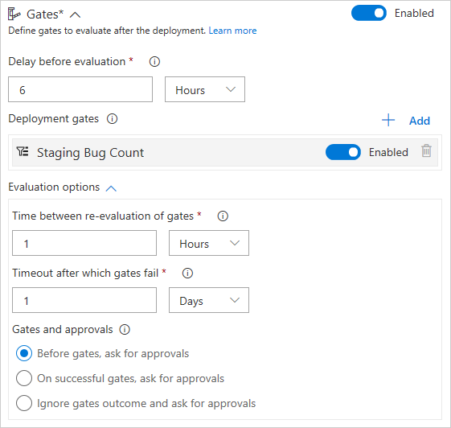

# Gates

**VSTS**

## Overview

Release gates allow you to configure information-driven approvals for deployments of a release
to an environment, based on the result of a query against a range of external services.

## Define a release gate for an environment

Enable release gates in the **Pre-deployment conditions** or 
**Post-deployment conditions** panel for an environment. 

Specify the **Delay before evaluation** for all the gates
you intend to use. This is a stabilization time delay at the beginning of the initial gate evaluation 
process that allows the gates to initialize and start providing results relevant
to the current release. 

>As an example, for **pre-deployment gates**, stabilization time would be the time
required for all bugs to be logged against the artifacts being deployed.  
>For **post-deployment gates**, stabilization time would be the
maximum time taken for the deployed app to reach a steady operational state,
the time taken for execution of all the required tests on the deployed
environment, and the least time it takes for incidents to be logged after the deployment.       

Choose **+ Add**, and select the type of release gate you require.

Select and enter the required parameters, depending on the type of gate you chose.
At present the gate types include:

[!INCLUDE [gate-task-list](_shared/gate-task-list.md)]

Set the options that apply to all the gates you added:

* **Timeout**. The maximum evaluation period for all gates. 
  The deployment will be rejected if the timeout is reached before
  all gates succeed during the same sampling interval. 

* **Sampling interval**. The time interval between each evaluation of 
  all the gates, effectively the frequency and duration of gate evaluation. 
  At each sampling interval, new requests are sent concurrently to each gate
  for fresh results. The sampling interval must be greater than the longest
  typical response time of any configured gate to allow time for all responses to be received.     

* **Execution order**. Select the required order of execution for gates and approvals if you have configured both.
  For pre-deployment conditions, the default is to prompt for manual (user) approvals first, then evaluate gates afterwards.
  This saves the system from evaluating the gate functions if the release is rejected by the user. 
  For post-deployment conditions, the default is to evaluate gates and prompt for manual approvals only when all gates are successful.
  This ensures the approvers have all the information required for a quality sign-off. 

The following diagram illustrates the flow of gate evaluation where, after the
initial stabilization delay period and three sampling intervals, the deployment is approved.

The following diagram illustrates the flow of gate evaluation where, after the
initial stabilization delay period, not all gates have succeeded at each sampling interval. In
this case, after the timeout period expires, the deployment is rejected.

## View and monitor gate results
 
As a release executes, the **Summary** page shows a pop-up message when you choose
the **(i)** icon for an environment. Use this to see the current status of your release.

During and after a deployment, the **Logs** page shows comprehensive information
about the evaluation of all the gates you configured for the release.

## Related topics

* [Approvals and gates overview](index.md)
* [Manual intervention](../../../../tasks/utility/manual-intervention.md)
* [Environments](../environments.md)
* [Triggers](../triggers.md)

## See also

* [Work with release definitions](../../../../actions/work-with-release-definitions.md)
* [View and manage releases](../../../../actions/view-manage-releases.md)
* [Monitor releases and debug deployment issues](../../../../actions/debug-deployment-issues.md)
* [Configure your release pipelines for safe deployments](https://blogs.msdn.microsoft.com/visualstudioalm/2017/04/24/configuring-your-release-pipelines-for-safe-deployments/)

[!INCLUDE [rm-help-support-shared](../../../../_shared/rm-help-support-shared.md)]
