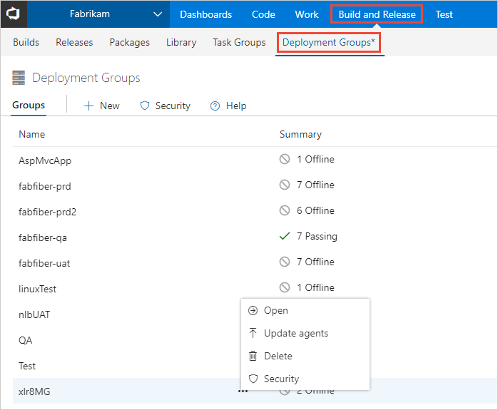
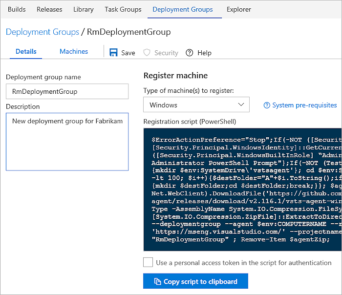
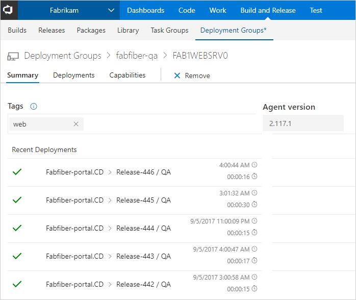
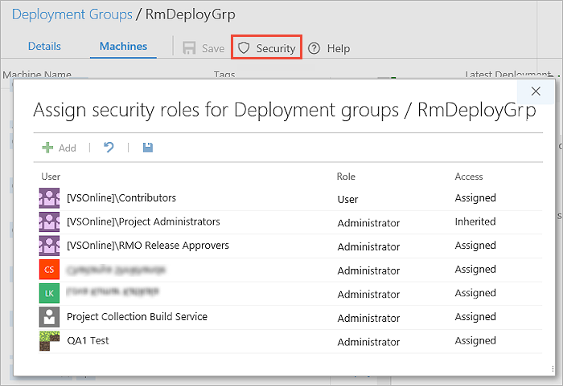

# How to: Use deployment groups

**VSTS | TFS 2018**

## View and manage deployment groups

You can view and manage groups on the **Deployment Groups** tab of the **Build &amp; Release** hub.

## Create a deployment group

When you create a new deployment group, you specify the name and description.
The **Details** page generates a script that you must execute on each of your target servers
to install and prepare the agent.

## Manage machines in a deployment group

After you prepare your target servers, select and open the deployment group.
The servers appear in the **Summary** tab, along with a list of tags and the agent version installed.
The **Deployments** and **Capabilities** tabs provide more information about individual servers in the list. 

Manage the security for a deployment group by assigning security roles.
 

## Related topics

* [Run on machine group phase](../../../process/phases.md#deployment-group-phase)
* [View and manage releases](../../../../actions/view-manage-releases.md)
* [Monitor releases and debug deployment issues](../../../../actions/debug-deployment-issues.md)

[!INCLUDE [rm-help-support-shared](../../../../_shared/rm-help-support-shared.md)]

