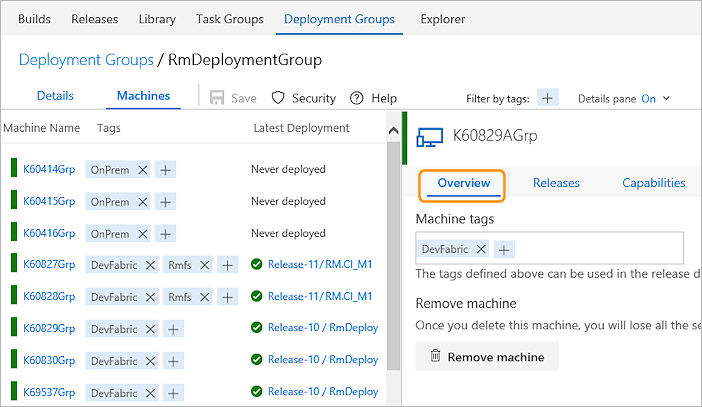
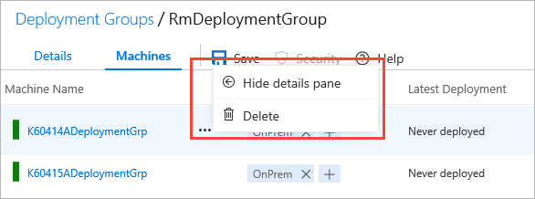
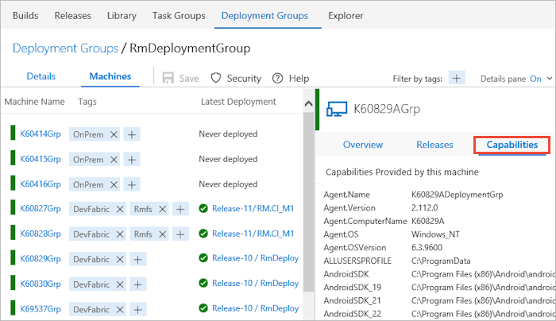
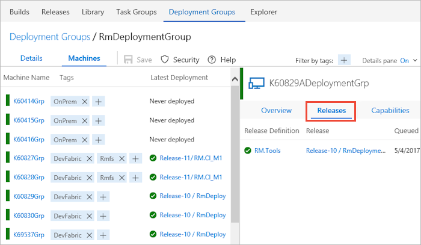

# How to: Use deployment groups

>**VSTS:** Deployment groups are not yet available to all VSTS accounts.  
>**TFS:** At present, deployment groups are not available in Team Foundation Server.

## Create a deployment group

You define groups on the **Deployment Groups** tab of the **Build &amp; Release** hub.
When you create a new deployment group, you specify the name and description.
The **Details** page generates a script that you must execute on each of your target servers
to install and prepare the agent.

## Manage deployment groups

After you prepare your target servers, they appear in the **Machines** tab.
The list indicates if a server is available, the tags you assigned to each server,
and the latest deployment. Select a server to see an overview, manage the
machine tags, or remove the server from the deployment group.

> Notice how the tags assigned in the example above will allow deployment to
  on-premises servers, cloud-hosted servers, or specific servers when 
  the deployment group is used in a [**Run on machine group** phase](../../../process/phases.md#deployment-group-phase).

Use the **...** icon for a server to perform actions such as displaying
details, or deleting the machine. 

Manage the security for a deployment group by assigning security roles.
 

View the capabilities for the agent installed on each server.

## Monitor releases for deployment groups

When release is executing, you see an entry in the
[live logs page](../../../../actions/debug-deployment-issues.md)
for each server in the deployment group. After a release has completed,
you can download the log files for every server to examine the deployments
and resolve issues. To navigate quickly to a release definition or a release,
use the links in the **Releases** tab. 

## Related topics

* [Run on machine group phase](../../../process/phases.md#deployment-group-phase)
* [View and manage releases](../../../../actions/view-manage-releases.md)
* [Monitor releases and debug deployment issues](../../../../actions/debug-deployment-issues.md)

[!INCLUDE [rm-help-support-shared](../../../../_shared/rm-help-support-shared.md)]

