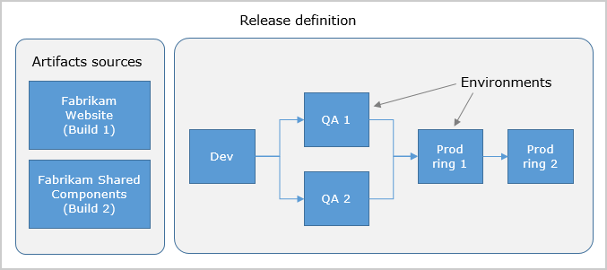
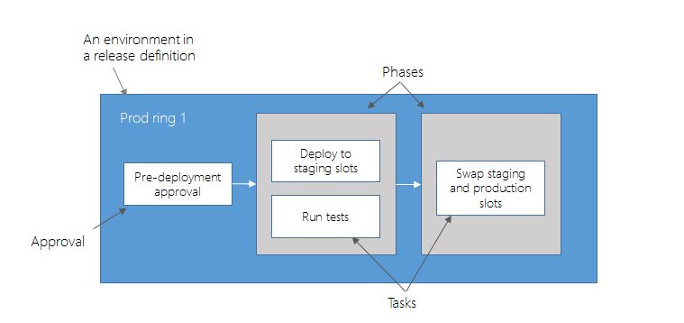

# Release definitions in Release Management

[!INCLUDE [version-rm-dev14](../../../_shared/version-rm-dev14.md)]

A **release definition** is one of the fundamental concepts in Release Management for VSTS and TFS.
It defines the end-to-end release process for an application to be deployed across various environments.

You start using Release Management by authoring a release definition for your application. To author a release definition, you must specify the [artifacts](artifacts.md) that make up the application and the **release process**.

An **artifact** is a deployable component of your application. It is typically produced through a Continuous Integration or a build process. Release Management can deploy artifacts that are produced by a [wide range of artifact sources](artifacts.md#sources) such as Team Build, Jenkins, or Team City.

You define the **release process** using [environments](environments.md), and restrict deployments into or out of an environment using [approvals](approvals/index.md). You define the automation in each environment using [phases](../../process/phases.md) and [tasks](../../process/tasks.md). You use [variables](variables.md) to generalize your automation and [triggers](triggers.md) to control when the deployments should be kicked off automatically.

An example of a release process that can be modeled through a release definition in shown below:

[What's the difference between a release definition and a release?](../../releases/index.md)

In this example, a release of a website is created by collecting specific versions of two builds (artifacts), each from a different build definition. The release is first deployed to a Dev environment and then forked in parallel to two QA environments in parallel. If the deployment succeeds in both the QA environments, the release is deployed to Prod ring 1 and then to Prod ring 2. Each production ring represents multiple instances of the same website deployed at various locations around the globe.

An example of how deployment automation can be modeled within an environment is shown below:

In this example, a [phase](../../process/phases.md) is used to deploy the web and database tiers to websites across the globe in parallel within production ring 1. Once all of those deployments are successful, a second phase is used to switch traffic from the previous version to the newer version.

> **TFS 2015**: Phases, and fork and join deployments, are not available in TFS 2015.

Besides the release process, release definitions have a few options that can be customized: 
[release names](#numbering) and [retention policies](../../policies/retention.md).

<h2 id="numbering">Release names</h2>

The names of releases for a release definition are, by default, sequentially numbered.
The first release is named **Release-1**, the next release is
**Release-2**, and so on. You can change this naming scheme by editing the
release name format mask. In the **Options** tab of a release definition,
edit the **Release name format** property.

When specifying the format mask, you can use the following pre-defined variables.

| Variable | Description |
|----------|-------------|
| **Rev:rr** | An auto-incremented number with at least the specified number of digits. |
| **Date / Date:MMddyy** | The current date, with the default format **MMddyy**. Any combinations of M/MM/MMM/MMMM, d/dd/ddd/dddd, y/yy/yyyy/yyyy, h/hh/H/HH, m/mm, s/ss are supported. |
| **System.TeamProject** | The name of the team project to which this build belongs. |
| **Release.ReleaseId** | The ID of the release, which is unique across all releases in the project. |
| **Release.DefinitionName** | The name of the release definition to which the current release belongs. |
| **Build.BuildNumber** | The number of the build contained in the release. If a release has multiple builds, this is the number of the [primary build](artifacts.md#primary-source). |
| **Build.DefinitionName** | The definition name of the build contained in the release. If a release has multiple builds, this is the definition name of the [primary build](artifacts.md#primary-source). |
| **Artifact.ArtifactType** | The type of the artifact source linked with the release. For example, this can be **Team Build** or **Jenkins**. |
| **Build.SourceBranch** | The branch of the [primary artifact source](artifacts.md#primary-source). For Git, this is of the form **master** if the branch is **refs/heads/master**. For Team Foundation Version Control, this is of the form **branch** if the root server path for the workspace is **$/teamproject/branch**. This variable is not set for Jenkins or other artifact sources. |
| *Custom variable* | The value of a global configuration property defined in the release definition. |

For example, the release name format `Release $(Rev:rrr) for build $(Build.BuildNumber) $(Build.DefinitionName)` will create releases with names such as **Release 002 for build 20170213.2 MySampleAppBuild**.

## Release retention

You can customize how long releases of this definition must be retained. For more information, see [release retention](../../policies/retention.md).

## Release history

Every time you save a release definition, Release Management keeps a copy of the changes. This allows you to compare the changes at a later point, especially when you are debugging a deployment failure.

## Related topics

* [Artifacts](artifacts.md)
* [Environments](environments.md)
* [Triggers](triggers.md)
* [Variables](variables.md)
* [Release retention](../../policies/retention.md)
* [Release security](../../policies/permissions.md#release-permissions)

## See also

* [Work with release definitions](../../../actions/work-with-release-definitions.md)

* [View and manage releases](../../../actions/view-manage-releases.md)

* [Configure your release pipelines for safe deployments](https://blogs.msdn.microsoft.com/visualstudioalm/2017/04/24/configuring-your-release-pipelines-for-safe-deployments/)

[!INCLUDE [rm-help-support-shared](../../../_shared/rm-help-support-shared.md)]
