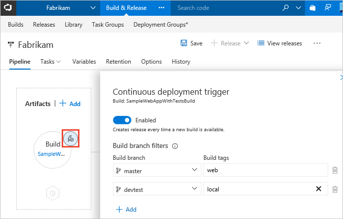
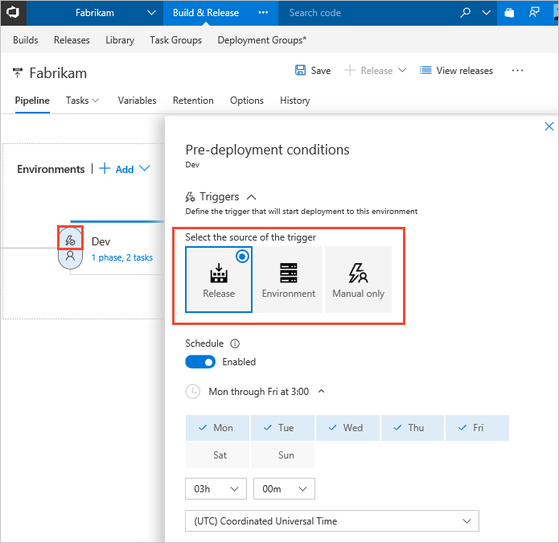
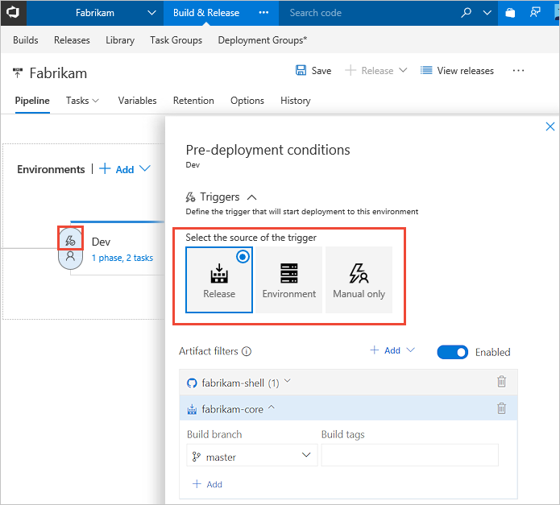
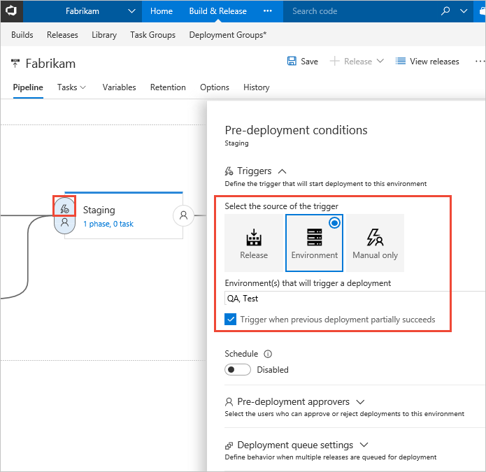
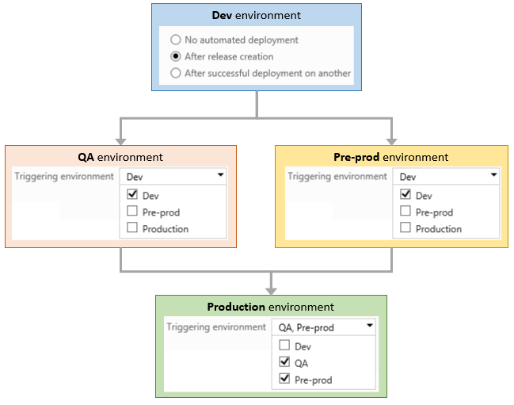

# Triggers in Release Management

[!INCLUDE [version-rm-dev14](../../../_shared/version-rm-dev14.md)]

You can configure when releases should be created, and when those releases should be deployed to environments.
The former is configured through [release triggers](#release-triggers),
and the latter through [environment triggers](#env-triggers) - both in a release definition.

<h2 id="release-triggers">Release (continuous deployment) triggers</h2>

If you specify [certain types](artifacts.md#sources) of
artifacts in a release definition, you can enable continuous deployment.
This instructs Release Management to create
new releases automatically when it detects new artifacts
are available. At present this option is available only for Team Foundation Build artifacts
and Git-based sources such as Team Foundation Git, GitHub, and other Git repositories.

If you have linked multiple Team Foundation Build artifacts to a release definition,
you can configure continuous deployment for each of them.
In other words, you can choose to have a release created automatically when a new build
of any of those artifacts is produced.

You add build branch filters if you want to create the release only
when the build is produced by compiling code from certain branches
(only applicable when the code is in a TFVC, Git, or GitHub repository)
or when the build has certain tags. These can be both include and exclude filters.
For example, use **features/\*** to include all builds under the **features** branch.
You can also include [custom variables](variables.md) in a filter value.

Alternatively, you can specify a filter to use the default branch specified
in the build definition. This is useful when, for example, the default build branch
changes in every development sprint. It means you don't need to update the trigger
filter across all release definitions for every change - instead you just change the
default branch in the build definition.

>Note that, even though a release is automatically created, it
might not be deployed automatically to any environments. The
[environment triggers](#env-triggers) govern when and if a release should be deployed to an environment.

<h2 id="env-triggers">Environment triggers</h2>

You can choose to have the deployment to each environment triggered automatically
when a release is created by a continuous deployment trigger, based on:

* **A predefined schedule**. When you select this option,
  you can select the days of the week and the time of day that
  Release Management will automatically create a new release. You can configure multiple schedules as required.
  Note that, with scheduled triggers, a new release is created even if a newer version of artifact is not available since the last release.

  

* **Filters based on the artifacts**. You can add one or more filters for each artifact linked to the release definition,
  and specify if you want to include or exclude particular branches of the code.
  Deployment will be triggered to this environment only if all the artifact conditions are successfully met.

  

* **The result of deploying to a previous environment in the pipeline**.
  Use this setting if you want the release to be first deployed and validated in
  another environment(s) before it is deployed to this environment.
  Triggers are configured for each environment,
  but the combination of these allows you to orchestrate
  the overall deployment - such as the sequence in which automated
  deployments occur across all the environments in a release
  definition. For example, you can set up a linear pipeline where
  a release is deployed first to the **Test** and **QA** environments.
  Then, if these two deployments succeed, it will be deployed to a **Staging**
  environment. In addition, you can configure the trigger to fire
  for partially succeeded (but not failed) deployments.

  

* **Manually by a user**. Releases are
  not automatically deployed to the environment. To
  deploy a release to this environment, you must manually
  start a release and deployment from the release definition
  or from a build summary.

You can combine the automated settings to have releases created
automatically either when a new build is available or according to
a schedule.

> **TFS 2015**: The following features are not available in TFS 2015 -
continuous deployment triggers for multiple artifact sources,
multiple scheduled triggers, combining scheduled and continuous deployment triggers in the same definition,
continuous deployment based on the branch or tag of a build.

### Parallel forked and joined deployments

The **Triggering environment** list lets you select
more than one environment. This allows you to
configure parallel (_forked_ and _joined_) deployment
pipelines where the deployment to an environment occurs
only when deployment to **all** the selected
environments succeeds.

For example, the following schematic shows a pipeline
where deployment occurs in parallel to the **QA** and
**Pre-prod** environments after deployment to the **Dev**
environment succeeds. However, deployment to the
**Production** environment occurs only after successful
deployment to both the **QA** and **Pre-prod** environments.

In combination with the ability to define
[pre- and post-deployment approvals](approvals/approvals.md),
this capability enables the configuration of complex
and fully managed deployment pipelines to suit
almost any release scenario.  

Note that you can always deploy a release directly to any of the
environments in your release definition by selecting the
**Deploy** action when you create a new release. In this case, the
environment triggers you configure, such as a trigger
on successful deployment to another environment, do not
apply. The deployment occurs irrespective of these settings.
This gives you the ability to override the release
process. Performing such direct deployments requires
the **Manage deployments** permission, which should
only be given to selected and approved users.

> **TFS 2015**: Parallel fork and joined deployments are not available in TFS 2015

[!INCLUDE [rm-help-support-shared](../../../_shared/rm-help-support-shared.md)]
