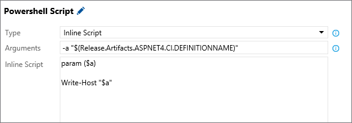
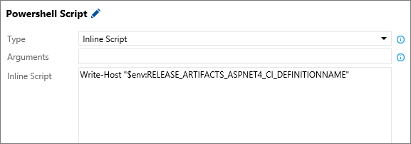

# Variables in Release Management

[!INCLUDE [version-rm-dev14](../../../_shared/version-rm-dev14.md)]

As you compose the tasks for deploying your application into each environment, variables will help you to:

* Define a more generic deployment process once, and then
customize it easily for each environment. For example, a variable
can be used to represent the connection string for web deployment,
and the value of this variable can be changed from one environment
to another. These are **custom variables**.

* Use information about the context of the particular release,
[environment](environments.md), [artifacts](artifacts.md), or
[agent](../../agents/agents.md) in which the deployment process is
being run. For example, your script may need access to the location
of the build to download it, or to the working directory on the
agent to create temporary files. These are **default variables**.

>You can also use a default variable to [run a release in debug mode](#debug-mode).

## Custom variables

Custom variables can be defined at various scopes.

* Share values across all of the definitions
  in a project by using [variable groups](../../library/variable-groups.md). Choose a variable
  group when you need to use the same values across all
  the definitions, environments,
  and tasks in a project, and you want to be able to change
  the values in a single place. You define and manage variable groups in the **Library** tab.

* Share values across all of the environments by using
  **release definition variables**. Choose a release definition
  variable when you need to use the same value across all
  the environments and tasks in the release definition, and you
  want to be able to change the value in a single place. You define and manage these variables in the **Variables** tab in a release definition.

* Share values across all of the tasks within one specific environment by using
  **environment variables**.
  Use an environment-level variable for values that vary
  from environment to environment (and are the same for
  all the tasks in an environment). You define and manage these variables in the **Variables** tab of an environment in a release definition.

Using custom variables at project, release definition, and environment scope helps you to:

* Avoid duplication of values, making it easier to update
  all occurrences as one operation.

* Store sensitive values in a way that they cannot be seen
  or changed by users of the release definitions. Designate a  configuration property to be a secure (secret) variable by selecting the  (padlock) icon next to the variable.

  >The values of hidden (secret) variables are stored securely on
  the server and cannot be viewed by users after they are saved.
  During a deployment, the Release Management service
  decrypts these values when referenced by the tasks and passes them
  to the agent over a secure HTTPS channel.

To use custom variables in your build and release tasks, simply enclose the 
variable name in parentheses and precede it with a **$** character. For example,
if you have a variable named **adminUserName**, you can insert the current
value of that variable into a parameter of a task as `$(adminUserName)`.

You can use custom variables to prompt for values during the execution of a release.
For more details, see [Approvals](approvals/index.md#scenarios).
 
[!INCLUDE [set-variables-in-scripts](../_shared/set-variables-in-scripts.md)]

## Default variables

Information about the execution context is made available to running tasks through default variables. Your tasks and scripts can use these variables to find information about the system, release, environment, or agent they are running in.
With the exception of **System.Debug**, these variables are read-only and their values are automatically set by the system.

### System variables

> [!div class="mx-tdBreakAll"]
> | Variable name | Description | Example | Not available in |
> |---------------|-------------|---------|--------------|
> | System.TeamFoundationServerUri | The URL of the Release Management service endpoint in the TFS or VSTS account. Use this from your scripts or tasks to call REST APIs on the Release Management service. | https:&#47;/fabrikam.vsrm.visualstudio.com/ | |
> | System.TeamFoundationCollectionUri | The URL of the Team Foundation collection or VSTS account. Use this from your scripts or tasks to call REST APIs on other services such as Build and Version control. | https:&#47;/fabrikam.visualstudio.com/ | |
> | System.CollectionId | The ID of the collection to which this build or release belongs. | 6c6f3423-1c84-4625-995a-f7f143a1e43d | TFS 2015 |
> | System.TeamProject | The name of the team project to which this build or release belongs. | Fabrikam | |
> | System.TeamProjectId | The ID of the team project to which this build or release belongs. | 79f5c12e-3337-4151-be41-a268d2c73344 | TFS 2015 |
> | System.ArtifactsDirectory | The directory to which artifacts are downloaded during deployment of a release. The directory is cleared before every deployment if it requires artifacts to be downloaded to the agent. Same as Agent.ReleaseDirectory and System.DefaultWorkingDirectory. | C:\agent\_work\r1\a |  |
> | System.DefaultWorkingDirectory | The directory to which artifacts are downloaded during deployment of a release. The directory is cleared before every deployment if it requires artifacts to be downloaded to the agent. Same as Agent.ReleaseDirectory and System.ArtifactsDirectory. | C:\agent\_work\r1\a | |
> | System.WorkFolder | The working directory for this agent, where subfolders are created for every build or release. Same as Agent.RootDirectory and Agent.WorkFolder. | C:\agent\_work |  |
> | System.Debug | This is the only system variable that can be _set_ by the users. Set this to true to [run the release in debug mode](#debug-mode) to assist in fault-finding. | true | &nbsp; |

<!-- Other hidden system variables
[SYSTEM] -> [release]
[SYSTEM_PLANID] -> [9d8b6571-8a09-468c-9ca7-69b4768e0c4e]
[SYSTEM_CULTURE] -> [en-US]
[SYSTEM_PARALLELEXECUTIONTYPE] -> [MultiConfiguration]
[SYSTEM_TASKDEFINITIONSURI] -> [https://adventwrks.visualstudio.com/]
[SYSTEM_TIMELINEID] -> [885d77a9-1452-4e4c-8666-df15cd011b6e]
[SYSTEM_JOBID] -> [09ebba6f-89ed-4f55-bad9-db561b40ec8c]
[SYSTEM_HOSTTYPE] -> [release]
[SYSTEM_TOTALJOBSINPHASE] -> [1]
[SYSTEM_JOBPOSITIONINPHASE] -> [1]
[SYSTEM_ENABLEACCESSTOKEN] -> [False]
[AZURE_HTTP_USER_AGENT] -> [VSTS_6c6f3423-1c84-4625-995a-f7f143a1e43d_release_1_118_276_1]
[DATABASENAME] -> []
[SERVERNAME] -> []
[RELEASECONFIGURATION] -> [Release]
[RELEASEPLATFORM] -> [Any CPU]
[ADMINISTRATORLOGIN] -> []
[CONNECTIONSTRINGNAME] -> []
[REQUESTEDFORID] -> [2f435d07-769f-4e46-849d-10d1ab9ba6ab]
[MSDEPLOY_HTTP_USER_AGENT] -> [VSTS_6c6f3423-1c84-4625-995a-f7f143a1e43d_release_1_118_276_1]
-->

### Release variables

> [!div class="mx-tdBreakAll"]
> | Variable name | Description | Example | Not available in |
> |---------------|-------------|---------|------------------|
> | Release.DefinitionName | The name of the release definition to which the current release belongs. | fabrikam-cd | |
> | Release.DefinitionId | The ID of the release definition to which the current release belongs. | 1 | TFS 2015 |
> | Release.ReleaseName | The name of the current release. | Release-47 | |
> | Release.ReleaseId | The identifier of the current release record. | 118 | |
> | Release.ReleaseUri | The URI of current release. | vstfs:///ReleaseManagement/Release/118 | |
> | Release.ReleaseDescription | The text description provided at the time of the release. | Critical security patch | |
> | Release.RequestedFor | The display name of identity that triggered the release. | Mateo Escobedo | |
> | Release.RequestedForId | The ID of identity that triggered the release. | 2f435d07-769f-4e46-849d-10d1ab9ba6ab | |
> | Release.EnvironmentName | The name of environment to which deployment is currently in progress. | Dev | |
> | Release.EnvironmentId | The ID of the environment instance in a release to which the deployment is currently in progress. | 276 | |
> | Release.EnvironmentUri | The URI of environment instance in a release to which deployment is currently in progress. | vstfs:///ReleaseManagement/Environment/276 | |
> | Release.DefinitionEnvironmentId | The ID of the environment in the corresponding release definition. | 1 | TFS 2015 |
> | Release.AttemptNumber | The number of times this release is deployed in this environment. | 1 | TFS 2015 |
> | Release.Deployment.RequestedFor | The display name of the identity that triggered (started) the deployment currently in progress. | Mateo Escobedo | TFS 2015 |
> | Release.Deployment.RequestedForId | The ID of the identity that triggered (started) the deployment currently in progress. | 2f435d07-769f-4e46-849d-10d1ab9ba6ab | TFS 2015 |

<!-- Other hidden variables
[RELEASE_DEPLOYMENTID] -> [276]
[RELEASE_RELEASEWEBURL] -> [https://adventwrks.visualstudio.com/79f5c12e-3337-4151-be41-a268d2c73344/_apps/hub/ms.vss-releaseManagement-web.hub-explorer?releaseId=118&_a=release-summary]
[RELEASE_SKIPARTIFACTSDOWNLOAD] -> [False]
[RELEASE_DEPLOYPHASEID] -> [276]
[RELEASE_DEPLOYMENT_REQUESTEDFOREMAIL] -> [mateoe@microsoft.com]
-->

### Release environment variables

> [!div class="mx-tdBreakAll"]
> | Variable name | Description | Example | Not available in |
> |---------------|-------------|---------|------------------|
> | Release.Environments.{Environment name}.Status | The status of deployment of this release within a specified environment. | NotStarted | TFS 2015 |

### Agent variables

> [!div class="mx-tdBreakAll"]
> | Variable name | Description | Example | Not available in |
> | ------------- | ----------- |---------|------------------|
> | Agent.Name | The name of the agent as registered with the [agent pool](../../agents/pools-queues.md). This is likely to be different from the computer name. | fabrikam-agent | |
> | Agent.MachineName | The name of the computer on which the agent is configured. | fabrikam-agent | |
> | Agent.Version | The version of the agent software. | 2.109.1 | |
> | Agent.JobName | The name of the job that is running, such as Release or Build. | Release | |
> | Agent.HomeDirectory | The folder where the agent is installed. This folder contains the code and resources for the agent. | C:\agent | |
> | Agent.ReleaseDirectory | The directory to which artifacts are downloaded during deployment of a release. The directory is cleared before every deployment if it requires artifacts to be downloaded to the agent. Same as System.ArtifactsDirectory and System.DefaultWorkingDirectory. | C:\agent\_work\r1\a | |
> | Agent.RootDirectory | The working directory for this agent, where subfolders are created for every build or release. Same as Agent.WorkFolder and System.WorkFolder. | C:\agent\_work | |
> | Agent.WorkFolder | The working directory for this agent, where subfolders are created for every build or release. Same as Agent.RootDirectory and System.WorkFolder. | C:\agent\_work | |
> | Agent.DeploymentGroupId | The ID of the deployment group the agent is registered with. This is available only in deployment group phases. | 1 | TFS 2018 U1 |

<!--
[AGENT_SERVEROMDIRECTORY] -> [C:\agent\externals\vstsom]
[AGENT_JOBSTATUS] -> [Succeeded]
[AGENT_ID] -> [2]
-->

<h3 id="artifact-variables">Artifact variables</h3>

For each artifact that is referenced in a release, you can use the following artifact variables. Not all variables are meaningful for each artifact type. The table below lists the default artifact variables and provides examples of the values that they have depending on the artifact type. If an example is empty, it implies that the variable is not populated for that artifact type.

> [!div class="mx-tdBreakAll"]
> | Variable name | Description | Team Build example | Jenkins/ TeamCity example  | TFVC/Git example | GitHub example|
> |---------------|-------------|--------------------|---------------------------|------------------|---------------|
> | Release.Artifacts.{Artifact alias}.DefinitionId | The identifier of the build definition or repository. | 1 |  |  | fabrikam/asp |
> | Release.Artifacts.{Artifact alias}.DefinitionName | The name of the build definition or repository. | fabrikam-ci |  | TFVC: $/fabrikam, Git: fabrikam | fabrikam/asp (master) |
> | Release.Artifacts.{Artifact alias}.BuildNumber | The build number or the commit identifier. | 20170112.1 | 20170112.1 | TFVC: Changeset 3, Git: 38629c964 | 38629c964 |
> | Release.Artifacts.{Artifact alias}.BuildId | The build identifier. | 130 | 130 |  | 38629c964d21fe405ef830b7d0220966b82c9e11 |
> | Release.Artifacts.{Artifact alias}.BuildURI | The URL for the build. | vstfs:///build-release /Build/130 |  |  |  | https://github.com/fabrikam/asp |
> | Release.Artifacts.{Artifact alias}.SourceBranch | The path of the branch from which the source was built. | refs/heads/master |  |  | |
> | Release.Artifacts.{Artifact alias}.SourceBranchName | The name of the branch from which the source was built. | master |  |  |  |
> | Release.Artifacts.{Artifact alias}.SourceVersion | The commit that was built. | bc0044458ba1d9298 cdc649cb5dcf013180706f7 |  |  |  |
> | Release.Artifacts.{Artifact alias}.Repository.Provider | The type of repository from which the source was built | Git |  |  |  |
> | Release.Artifacts.{Artifact alias}.RequestedForID | The identifier of the account that triggered the build. | 2f435d07-769f-4e46 -849d-10d1ab9ba6ab | | | |
> | Release.Artifacts.{Artifact alias}.RequestedFor | The name of the account that requested the build. | Mateo Escobedo | | | |
> | Release.Artifacts.{Artifact alias}.Type | The type of artifact source, such as Build. | Build | Jenkins: Jenkins, TeamCity:TeamCity | TFVC: TFVC, Git: Git | GitHub |

See also [Artifact source alias](artifacts.md#source-alias)

### Primary artifact variables

You designate one of the artifacts as a primary artifact in a release definition. For the designated primary artifact, Release Management populates the following variables.

> [!div class="mx-tdBreakAll"]
> | Variable name | Same as |
> |---------------|---------|
> | Build.DefinitionId | Release.Artifacts.{Primary artifact alias}.DefinitionId |
> | Build.DefinitionName | Release.Artifacts.{Primary artifact alias}.DefinitionName |
> | Build.BuildNumber | Release.Artifacts.{Primary artifact alias}.BuildNumber |
> | Build.BuildID | Release.Artifacts.{Primary artifact alias}.BuildId |
> | Build.BuildURI | Release.Artifacts.{Primary artifact alias}.BuildURI |
> | Build.SourceBranch | Release.Artifacts.{Primary artifact alias}.SourceBranch |
> | Build.SourceBranchName | Release.Artifacts.{Primary artifact alias}.SourceBranchName |
> | Build.SourceVersion | Release.Artifacts.{Primary artifact alias}.SourceVersion |
> | Build.Repository.Provider | Release.Artifacts.{Primary artifact alias}.Repository.Provider |
> | Build.RequestedForID | Release.Artifacts.{Primary artifact alias}.RequestedForID |
> | Build.RequestedFor | Release.Artifacts.{Primary artifact alias}.RequestedFor |
> | Build.Type | Release.Artifacts.{Primary artifact alias}.Type |

### Using default variables

You can use the default variables in two ways - as parameters to tasks in a release definition or in your scripts.

You can directly use a default variable as an input to a task.
For example, to pass `Release.Artifacts.{Artifact alias}.DefinitionName` for the artifact source whose alias is **ASPNET4.CI** to a task,
you would use `$(Release.Artifacts.ASPNET4.CI.DefinitionName)`.

To use a default variable in your script, you must first replace the `.` in the default variable names with `_`.
For example, to print the value of artifact variable `Release.Artifacts.{Artifact alias}.DefinitionName` for the artifact source whose alias is **ASPNET4.CI** in a Powershell script,
you would use `$env:RELEASE_ARTIFACTS_ASPNET4_CI_DEFINITIONNAME`.

Note that the original name of the artifact source alias, `ASPNET4.CI`, is replaced by `ASPNET4_CI`.

### Run a release in debug mode

Show additional information as a release executes and in the log files
by running the entire release, or just the tasks in an individual
release environment, in debug mode. This can help you resolve issues and failures.

* To initiate debug mode for an entire release, add a variable
  named `System.Debug` with the value `true` to the **Variables**
  tab of a release definition.

* To initiate debug mode for a single environment, open the
  **Configure environment** dialog from the shortcut menu
  of the environment and add a variable named `System.Debug`
  with the value `true` to the **Variables** tab.

* Alternatively, create a [variable group](../../library/variable-groups.md)
  containing a variable named `System.Debug` with the value `true`
  and link this variable group to a release definition.

>If you get an error related to an Azure RM service endpoint,
see [How to: Troubleshoot Azure Resource Manager service endpoints](../../../actions/azure-rm-endpoint.md).

[!INCLUDE [rm-help-support-shared](../../../_shared/rm-help-support-shared.md)]
