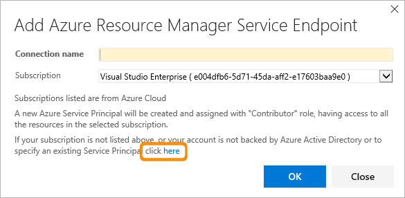

# Deployments to Azure Government Cloud

**VSTS | TFS 2017**

[Azure Government Clouds](https://azure.microsoft.com/en-us/overview/clouds/government/)
provide private and semi-isolated locations for specific Government or other services, separate from the normal
Azure services. Highest levels of privacy have been adopted for these clouds, including restricted data access policies.

Visual Studio Team Services (VSTS) is not available in Azure Government Clouds, so there are some special considerations when you
want to deploy apps to Government Clouds because artifact storage, build,
and deployment orchestration must execute outside the Government Cloud.

To enable connection to an Azure Government Cloud, you specify
it as the **Environment** parameter when you create a [service endpoint](service-endpoints.md)
connection using either the [Azure Classic service endpoint](#gsep-azure-classic) or the
[Azure Resource Manager service endpoint](#gsep-azure-rm).

**Before you configure a service endpoint, you must ensure you meet all relevant compliance requirements for your application.**

<h3 id="gsep-azure-classic">Azure Classic service endpoint</h3>

Defines and secures a connection to a Microsoft Azure subscription
using Azure credentials or an Azure management certificate.

| Parameter | Description |
| --------- | ----------- |
| \[authentication type\] | Required. Select **Credentials** or **Certificate based**. |
| Connection Name | Required. The name you will use to refer to this endpoint in task properties. This is not the name of your Azure account or subscription. |
| Environment | Required. Select the Azure Government Cloud where your target Azure subscription is defined. |
| Subscription ID | Required. The GUID-like identifier for your Azure subscription (not the subscription name). You can copy this from the Azure portal. |
| Subscription Name | Required. The name of your Microsoft Azure subscription (account). |
| User name | Required for Credentials authentication. User name of a work or school account (for example @fabrikam.com). Microsoft accounts (for example @live or @hotmail) are not supported. |
| Password | Required for Credentials authentication. Password for the user specified above. |
| Management Certificate | Required for Certificate based authentication. Copy the value of the management certificate key from your [publish settings XML file](https://go.microsoft.com/fwlink/?LinkID=312990) or the Azure portal. |

<h3 id="gsep-azure-rm">Azure Resource Manager service endpoint</h3>

Defines and secures a connection to a Microsoft Azure subscription
using Service Principal Authentication (SPA). You must use the full
version of the dialog when connecting to an Azure Government Cloud.
Choose the link near the bottom of the dialog.

| Parameter | Description |
| --------- | ----------- |
| Connection Name | Required. The name you will use to refer to this endpoint in task properties. This is not the name of your Azure account or subscription. |
| Environment | Required. Select the Azure Government Cloud where your target Azure subscription is defined. |
| Subscription ID | Required only if you want to use an existing service principal. The GUID-like identifier for your Azure subscription (not the subscription name). |
| Subscription Name | Required only if you want to use an existing service principal. The name of your Microsoft Azure subscription (account). |
| Service Principal ID | Required only if you want to use an existing service principal. The Azure Active Directory client ID of the account. |
| Service Principal Key | Required only if you want to use an existing service principal. The Azure Active Directory client key of the account. |
| Tenant ID | Required only if you want to use an existing service principal. The ID of the client tenant in Azure Active Directory. |

Follow these steps to configure the service endpoint parameters:

1. Download and run [this PowerShell script](https://github.com/Microsoft/vsts-rm-documentation/blob/master/Azure/SPNCreation.ps1) in an Azure PowerShell window.
   When prompted, enter your subscription name, password, role (optional), and the Azure Government Cloud name.
1. Switch from the simplified version of the dialog to the full version using the link in the dialog.
1. Enter a user-friendly name to use when referring to this service endpoint connection.
1. Select the Environment name (such as Azure Cloud or an Azure Government Cloud).
1. Copy these fields from the output of the PowerShell script into the Azure subscription dialog textboxes:
   - Subscription ID
   - Subscription Name
   - Service Principal ID
   - Service Principal Key
   - Tenant ID

See
[this blog post](http://blogs.msdn.com/b/visualstudioalm/archive/2015/10/04/automating-azure-resource-group-deployment-using-a-service-principal-in-visual-studio-online-build-release-management.aspx)
for details about using service principal authentication.

See also [Troubleshoot Azure Resource Manager service endpoints](../../actions/azure-rm-endpoint.md).

### Next

* [Deploy an Azure web app](../../apps/cd/deploy-webdeploy-webapps.md)

* [Deploy an Azure cloud service](../../apps/cd/deploy-cloudservice-cloudservice.md)

* [Examples index](../../apps/index.md)

[!INCLUDE [rm-help-support-shared](../../_shared/rm-help-support-shared.md)]
