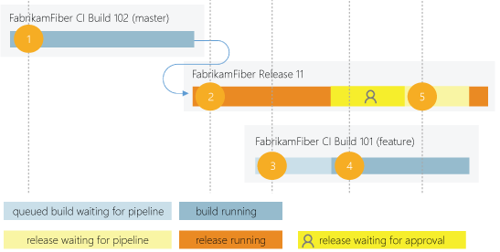
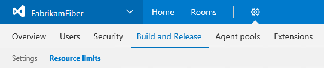

# Concurrent build and release pipelines in VSTS

**VSTS | [TFS 2018](concurrent-pipelines-tfs.md) | [TFS 2017](concurrent-pipelines-tfs.md)**

> [!NOTE]
> October 2017 update: We're temporarily providing unlimited private pipelines while we work on fixing an issue. We estimate that we'll fix the issue and return to providing only the private pipelines you have sometime in November 2017.

A VSTS _concurrent pipeline_ gives you the ability to run a single build or a single release at a time in your account. There are two types of concurrent pipelines in VSTS.

## Private pipelines

If you want to run builds and releases on your own machines ([private agents](../agents/agents.md)), then you need _private pipelines_. We provide one free private pipeline in each VSTS account. In addition, every active Visual Studio Enterprise subscriber in your account contributes a free private pipeline. You can buy [additional private pipelines](https://marketplace.visualstudio.com/items?itemName=ms.build-release-private-pipelines) from the Visual Studio Marketplace. After you've done this, you can deploy your own [private agents](../../concepts/agents/agents.md) and use them with these private pipelines. You can register any number of private agents with your account for no additional charge.

## Hosted pipelines

If you want to run builds and releases on machines managed by Microsoft ([hosted agents](../../concepts/agents/hosted.md)), then you need hosted pipelines. We provide 240 minutes of free total compute time per month from a [hosted agent](../../concepts/agents/hosted.md) to run a build or a release. Each build or release job within this free allocation cannot run for more than 30 minutes. To run more builds or releases concurrently, you can buy [additional hosted pipelines](https://marketplace.visualstudio.com/items?itemName=ms.build-release-hosted-pipelines) from the Visual Studio Marketplace. With the first purchase of a hosted pipeline, the 240 minute limit on total build and release time as well as the 30 minute limit on a single job are waived. Each additional purchase of a hosted pipeline adds another hosted agent for running your builds and releases.

## How a concurrent pipeline is consumed

For example, consider a VSTS account that has only one concurrent pipeline. This allows users in that account to run only one build or release at a time. When additional builds and releases are triggered, they are queued and will wait for the previous one to complete.

A release requires a concurrent pipeline only when it is being actively deployed to an environment. Waiting for an approval or a manual intervention does not consume a concurrent pipeline.

0. FabrikamFiber CI Build 102 (master branch) is first to be started.
0. Deployment of FabrikamFiber Release 11 is triggered by completion of FabrikamFiber CI Build 102.
0. FabrikamFiber CI Build 101 (feature branch) is triggered. The build can't start yet because Release 11's deployment is active. So the build stays queued.
0. Release 11 waits for approvals. Fabrikam CI Build 101 starts because a release waiting for approvals does not consume a concurrent pipeline.
0. Release 11 is approved. It resumes only after Fabrikam CI Build 101 is completed.

## Concurrent processing within a single build or release

Concurrent processing within a single build or release does not require additional concurrent pipelines. So long as you have enough agents, you can

* In a build process, run multiple build configurations at the same time.

* In a release process, deploy to multiple environments at the same time.

For example, suppose your VSTS account has three concurrent pipelines. You can have more than three agents running at the same time to perform parallel operations within builds and releases. For instance, notice below at 9 a.m. that five agents are actively running jobs from three concurrent pipelines.

## Determine how many concurrent pipelines you need

You can begin by seeing if your teams can get by with the concurrent pipelines you've got by default. As the number of queued builds and releases exceeds the number of concurrent pipelines you have, your build and release queues will grow longer. When you find the queue delays are too long, you can purchase additional concurrent pipelines as needed from Visual Studio Marketplace.

### Simple estimate

A simple rule of thumb: Estimate that you'll need one concurrent pipeline for every 10 users in your account.

### Detailed estimate

In the following scenarios you might need multiple concurrent pipelines:

* If you have multiple teams, and if each of them require a CI build, then you'll likely need a  concurrent pipeline for each team.

* If your CI build trigger applies to multiple branches, then you'll likely need a concurrent pipeline for each branch.

* If you develop multiple applications using one account or server, then you'll likely need additional concurrent pipelines: one to deploy each application at the same time.

## View available pipelines

0. Browse to **Account settings**, **Build and Release**, **Resource limits**.

 

 URL example: `https://{your_account}/_admin/_buildQueue?_a=resourceLimits`

0. View the maximum number of concurrent pipelines that are available in your account.

0. Select **Pipelines queue...** to display all the builds and releases that are actively consuming an available pipeline or that are queued waiting for a pipeline to be available.

## Sharing of pipelines across projects in a collection

Pipelines are purchased at the account level, and they are shared amongst all projects in an account. We don't yet offer a way to partition or dedicate certain pipelines to a specific project or agent pool. For example:

0. You purchase two pipelines in your account.

0. You queue two builds in the first project, and both the pipelines are consumed.

0. You queue a build in the second project. That build will not start until one of the builds in your first project is completed.

In the future, we plan to support finer control on allocation of pipelines.

## Q&A

### Who can use the Build and Release Management features?

VSTS users with [basic access](https://www.visualstudio.com/products/visual-studio-team-services-feature-matrix-vs) can author as many builds and releases as they want.

To approve releases, basic access is not necessary. Any user with [stakeholder access](../../../security/get-started-stakeholder.md) can approve or reject releases.

### Are there any limits on the number of builds and release definitions that I can create?

No. You can create hundreds or even thousands of definitions for no charge. You can register any number of private agents for no charge.

### I use XAML build controllers with my account. How am I charged for those?

You can register one XAML build controller for each private pipeline in your account. Your account gets at least one free private pipeline, so you can register one XAML build controller for no additional charge. For each additional XAML build controller, you'll need an additional private pipeline.

### As a Visual Studio Enterprise subscriber, do I get additional pipelines for TFS and VSTS?

Yes. Visual Studio Enterprise subscribers get [one concurrent private pipeline in Team Foundation Server 2017 or later](concurrent-pipelines-tfs.md) and one concurrent private pipeline in each VSTS account of which they are a member.