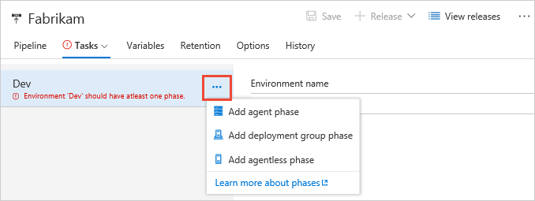
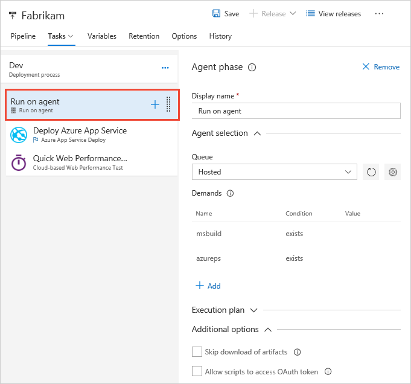
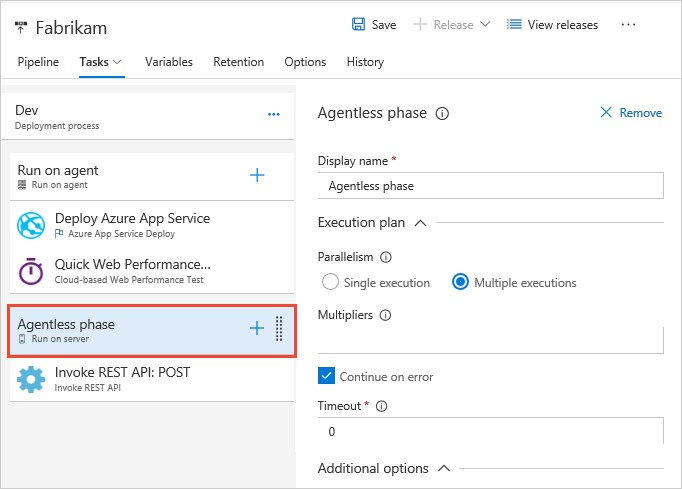
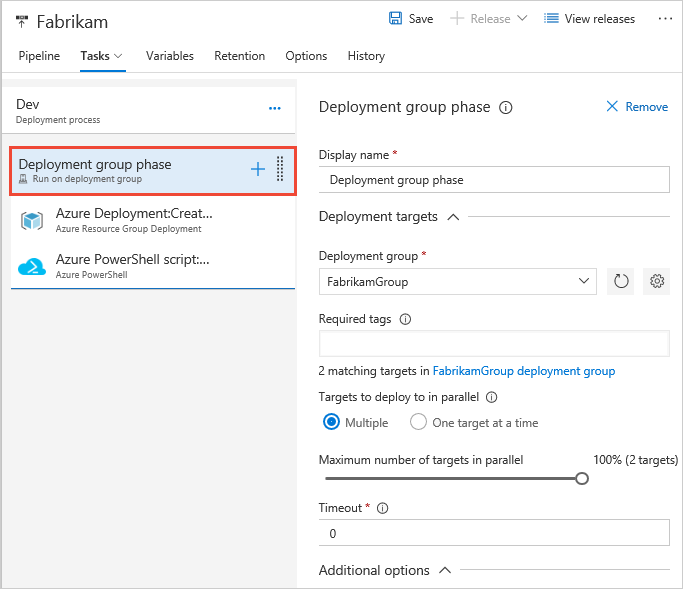
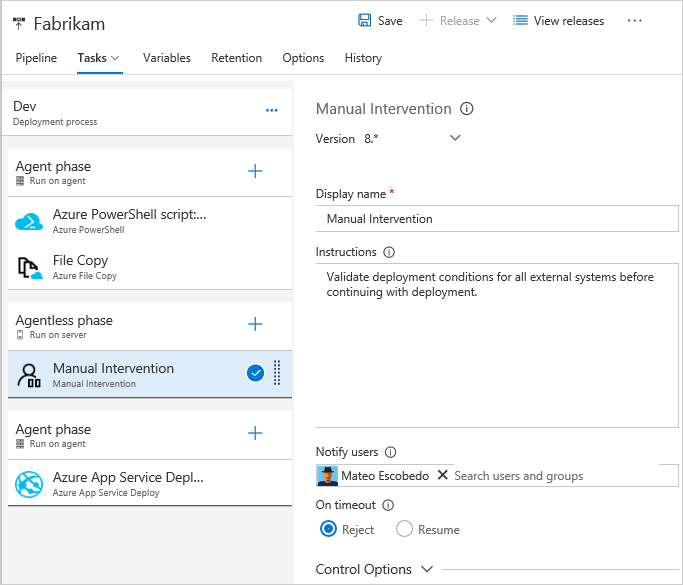

# Phases in Build and Release Management

**VSTS | TFS 2018 | TFS 2017**

> [!NOTE]
> Some of the features described below are not yet available in Build. Some features are not yet available in Release Management. Wherever appropriate, each feature below is tagged to indicate whether it is presently available in Build or Release Management, and whether it is planned to be made available in one or the other.

Tasks can run in different **phases**, which effectively represent different execution locations.

By using different task phases in a build or release definition, you can:

| Activity | Release in VSTS | Release in TFS 2017 | Release in TFS 2018 | Build in VSTS |
| --- | --- | --- | --- | --- |
| Partition your deployment process into sections that run on agents and sections that run without an agent | Yes | Yes | Yes | Yes |
| Partition your build or deployment process into sections where tasks in each section can target a different set of private agents using different demands | Yes | Yes | Yes | Yes |
| Partition your deployment process into sections where tasks in each section can target a different agent queue | Yes | Yes | Yes | Planned |
| Introduce a manual intervention task where deployment pauses while an operator carries out manual processes or validates the state of the system before continuing the deployment | Yes | Yes | Yes | No |
| Switch off downloading of artifacts for sets of tasks that include their own logic for accessing source artifacts, or that do not require access to artifacts, which can reduce execution time and improve deployment efficiency | Yes | Yes | Yes | No |
| Switch off checking out code for sets of tasks that include their own logic for accessing sources, or that do not require sources, which can reduce build time | No | No | No | Planned |
| Publish build artifacts in one phase and consume those in subsequent phases | No | No | No | Yes |
| Run multiple phases in parallel | Planned | Planned | Planned | Planned |
| Permit access to OAuth tokens for only the tasks that need to interact with VSTS or TFS | Yes | Yes | Yes | Yes |
| Specify different execution timeouts for different sets of tasks to maximize deployment performance and control | Yes | Yes | Yes | Yes |
| Specify the conditions under which the tasks in the phase will execute; for example, when a previous phase has failed or when a [custom condition](conditions.md) defined by an expression is true | Yes | No | Yes | Planned |

The task phases you can use are:

* **[Agent phase](#agent-phase)**. In this phase, tasks are executed on the computer(s) that host the build and release agent.

* **[Agentless phase](#server-phase)**. In this phase, tasks are orchestrated by and executed on VSTS
  or TFS. An agentless phase does not require an agent
  or any target computers.

* **[Deployment group phase](#deployment-group-phase)**. In this phase, tasks are executed on the computer(s) defined in a
  [deployment group](../definitions/release/deployment-groups/index.md),
  each of which hosts the build and release agent. This phase is only applicable to release definitions.

By default, tasks you add to a build definition or release definition run in a single default agent phase.
To add tasks to a specific phase when you have more than one phase in the definition, select the target phase
and then choose **+**.

## Agent phase

An **agent phase** is a way of defining a sequence of tasks that will run on one or more agents.
At run time, one or more jobs are created to be run on agents that match the demands specified in the phase properties.

You can configure the following properties for an agent phase:

* **Display name:** The name displayed in the agent phase item in the task list.

* **Queue [Release (VSTS, TFS 2017 and newer), Build (Planned)]:** Use this option to specify the agent queue
  in which the jobs will run. In the case where multiple jobs are created, all the jobs run on agents within the same agent queue.

* **Demands:** Use these settings to specify how an agent for
  executing the tasks will be selected. In the case where multiple jobs are created, all the agents must have capabilities that satisfy the demands.
  For more details, see [Capabilities](../agents/agents.md#capabilities).

* **Skip download of artifacts [Release (VSTS, TFS 2017 and newer)]:** When used in a release definition, you may choose to skip the
  [download of artifacts](../definitions/release/artifacts.md#download)
  during the job execution. Use this option if you want to implement
  your own custom logic for downloading artifacts by using tasks, or if the tasks in a particular phase do not rely on the artifacts.

* **Allow scripts to access OAuth token [Release (VSTS, TFS 2017 and newer), Build (Planned)]** Use this option if you
  want to allow tasks running in this phase access to the
  current VSTS or TFS OAuth security token.
  This is useful in many scenarios, such as when you need to
  run a custom PowerShell script that invokes the REST APIs
  on VSTS - perhaps to create a work item or query a build for information.

* **Run this phase [Release (VSTS, TFS 2018 Update 2 onwards), Build (Planned)]:** Use this option to run the tasks
  in the phase only when specific [conditions](conditions.md) are met. Select a predefined
  condition, or select "custom" and enter an [expression](conditions.md) that evaluates
  to **true** or **false**. Nested expressions can be used, and the
  expressions can access variables available in the release definition.

  

* **Timeout:** Use this option if you
  want to specify the timeout in minutes for jobs in this phase. A zero
  value for this option means that the timeout is effectively
  infinite and so, by default, jobs run until they complete or fail.
  You can also set the timeout for each task individually -
  see [task control options](tasks.md#controloptions).

### Parallel and multiple execution using agent phases

You can use multiple agents to run parallel jobs if you configure an agent phase to be **Multi-configuration** or **Multi-agent**.

Here are some examples where **multi-configuration** is appropriate:

> [!NOTE]
> These options are available in Release (VSTS, TFS 2017 and newer) and Build (VSTS)

* **Multiple execution builds:** An agent phase can be used in a
  build definition to build multiple configurations in parallel. For
  example, you could build a C++ app for both debug and release
  configurations on both x86 and x64 platforms. To run multiple jobs,
  you identify a variable named a **multiplier**, and specify a list
  of values for that multiplier. A separate job is run for each value
  in the list. For example, you can run two parallel jobs if you
  define a variable named **BuildConfiguration** with the value
  `Debug,Release` and specify that variable to be used as a
  multiplier in the build definition. When you identify two variables
  to act as a multiplier, each with two values, you effectively
  create four jobs, one for each combination of values of the two
  variables. For more details and an example of multi-configuration
  build, see [Visual Studio Build](../../tasks/build/visual-studio-build.md).

* **Multiple execution deployments:** An agent phase can be used
  in an environment of a release definition to run multiple deployment
  jobs in parallel. For example, to configure your application to be
  load balanced across a site in US and a site in Europe, you can
  define a variable named **Location** with the value `US,Europe`,
  and specify that variable to be used as a multiplier in the agent
  phase of the environment. If two agents are available, both the
  jobs will be run simultaneously - one with **Location = US**, and
  another with **Location = Europe**. If only one agent is available,
  the first job is run, followed by the second job. When a multiplier
  results in many jobs being created in parallel, you can also specify
  the maximum number of agents that can be used for parallelism. For
  example, if **Location** has ten values, you can restrict to five
  sites being deployed in parallel by specifying **5** for the
  maximum number of agents.

* **Multiple execution testing:** An agent phase can be used in a build definition or in an
  environment of a release definition to run a set of tests in
  parallel - once for each test configuration. For example, to run a
  suite of web tests, once for each browser, you can define a variable
  named **Browser** with the value `IE,Chrome,Edge,Firefox` and
  specify that variable to be used as a multiplier.
  As the [agent demands](../agents/agents.md#capabilities) are specified only once for an agent phase, all agents
  should be pre-installed with all the browsers. As with multiple executions
  deployment, you can specify the maximum number of agents that can
  be used at the same time for multi-configuration testing.

With multi-configuration you can run multiple jobs, each with a different value for one or more variables (multipliers). If you want to run the same job on multiple agents, then you can use **multi-agent** option of parallelism. Here is an example of when you need multi-agent parallelism.

* **Test slicing [Release (TFS2018, VSTS), Build (Planned)]:** An agent phase can be used to run a suite of tests in parallel. For example, you can run a large suite of 1000 tests on a single agent. Or, you can use two agents and run 500 tests on each one in parallel. To leverage multi-agent parallelism, the tasks in the phase should be smart enough to understand the slice they belong to. The Visual Studio Test task is one such task that supports test slicing. If you have installed multiple agents, you can specify how the Visual Studio Test task will run in parallel on these agents. Select **Multi-agent** and specify the number of agents to use.

To use **Multipliers** for build or deployment, you must:

* Define one or more [variables](../definitions/release/variables.md)
  on the **Variables** tab of the definition or in a [variable group](../library/variable-groups.md).
  Each variable, known in this context as a _multiplier_ variable,
  must be defined as a comma-delimited list of the values you want
  to pass individualy to the agents.

* Enter the name of the multiplier variable, without the **$** and parentheses, as the
  value of the **Multipliers** parameter.

* If you want to execute the phase for more than one multiplier variable, enter
  the variable names as a comma-delimited list - omitting the **$** and parentheses
  for each one.

* If you want to limit the number of agents used during the deployment to a
  number less than you have configured for your account, enter that value as the
  **Maximum number of agents** parameter.

For example, you might define two variables named **Location** and **Browser** as follows::

* **Location** = `US,Europe`
* **Browser** = `IE,Chrome,Edge,Firefox`

The following configuration will execute the deployment eight times using
a maximum of four agents at any one time:

* **Multipliers** = `Location,Browser`
* **Maximum number of agents** = `4`

## Agentless phase

Use an agentless phase in a build or release definition to run tasks that do
not require an agent, and execute entirely on the VSTS or TFS.
Only a few tasks, such as the [Manual Intervention](#maninterv) and [Invoke REST API](#invokeapi) tasks,
are supported in an agentless phase at present. The properties of
an agentless phase are similar to those of the [agent phase](#agent-props).

### The Manual Intervention task

>[!NOTE]
> The manual intervention task is only available in release definitions. It cannot be used in build definitions.

The **Manual Intervention** task does not perform deployment actions directly.
Instead, it allows you to pause an active deployment within an environment, typically to perform some
manual steps or actions, and then continue the automated deployment steps.

The **Manual Intervention** task configuration includes an **Instructions** parameter that
can be used to provide related information, or to specify the manual steps
the user should execute during the Agentless phase. You can configure the task to
send email notifications to users and user groups when it is awaiting intervention,
and specify the automatic response (reject or resume the deployment) after a configurable
timeout occurs.

> You can use built-in and custom variables to generate portions of your instructions.

When the Manual Intervention task is activated during a deployment, it sets
the deployment state to **IN PROGRESS** and displays
a message bar containing  a link that opens the
Manual Intervention dialog containing the instructions.
After carrying out the manual steps, the administrator
or user can choose to resume the deployment, or reject it. Users with **Manage deployment** permission on the environment can resume or reject the manual intervention.

### The Invoke REST API task

The **Invoke REST API task** task does not perform deployment actions directly.
Instead, it allows you to invoke any generic HTTP REST API as part of the automated
pipeline and, optionally, wait for it to be completed. For example,
it can be used to invoke specific processing with an Azure function.

## Deployment group phase

>[!NOTE]
> Deployment group phases can only be used in release definitions. They cannot be used in build definitions.

Deployment groups make it easy to define groups of target servers for deployment,
and install the required agent on each one. Tasks that you define in a
deployment group phase run on some or all of the target servers, depending on
the arguments you specify for the tasks and the phase itself.

You can select specific sets of servers from a deployment group to receive
the deployment by specifying the machine tags that you have defined for each
server in the deployment group. For more details, see [Deployment groups](../definitions/release/deployment-groups/index.md).
You can also use the slider control to specify the proportion of the target servers that the process should
deploy to at the same time. This ensures that the app running on these servers is
capable of handling requests while the deployment is taking place.

The timeout and additional options of a deployment group phase are the same as those of the [agent phase](#agent-props).

## Multiple phases

You can add multiple phases to a build or release definition, and then add
tasks to each one by selecting the target phase for the new tasks.

> Multiple phases can only be used in Release Management in VSTS and TFS 2017 and newer, and in Build in VSTS.

For example, the definition shown below divides the overall release
execution into separate execution phases by using two agent phases
and an agentless phase.

In the example above:

1. The tasks in the first phase of the release run on an agent
   and, after this phase is complete, the agent is released.

1. The agentless phase contains a Manual Intervention task
   that runs on the VSTS or TFS.
   It does not execute on, or require, an agent or any target servers.
   The Manual Intervention task displays its message and waits for a
   "resume" or "reject" response from the user. In this example, if
   the configured timeout is reached, the task will
   automatically reject the deployment (set the timeout in the control options section to zero if
   you do not want an automated response to be generated).   

1. If the release is resumed, tasks in the third phase run -
   possibly on a different agent. If the release is rejected,
   this phase does not run and the release is marked as failed.

It's important to understand some of the consequences of
phased execution:

* Each phase may use different
  agents. You should not assume that the state from an earlier
  phase is available during subsequent phases.

* The **Continue on Error** and **Always run** options for
  tasks in each phase do not have any effect on tasks in
  subsequent phases of the build or release. For example, setting
  **Always run** on a task at the end of the first phase will
  not guarantee that tasks in subsequent phases will run.

## Related topics

* [Tasks](tasks.md)
* [Task groups](../library/task-groups.md)
* [Specify conditions for running a task](conditions.md)
