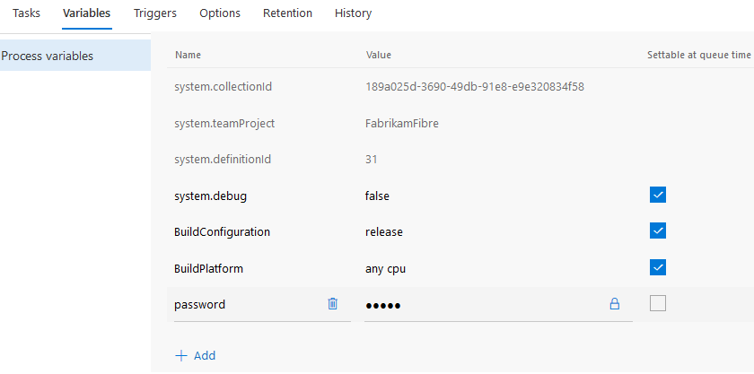

# Build variables

**VSTS | TFS 2017 | TFS 2015 | [Previous versions (XAML builds)](https://msdn.microsoft.com/library/hh850448%28v=vs.120%29.aspx)**

[!INCLUDE [temp](../_shared/ci-cd-newbies.md)]

<!--

 

[Build](build.md)&nbsp;&nbsp;&nbsp;&nbsp;&nbsp; [Options](options.md)&nbsp;&nbsp;&nbsp;&nbsp;&nbsp; [Repository](repository.md)&nbsp;&nbsp;&nbsp;&nbsp;&nbsp; **[Variables](#)**&nbsp;&nbsp;&nbsp;&nbsp;&nbsp; [Triggers](triggers.md)&nbsp;&nbsp;&nbsp;&nbsp;&nbsp; [General](general.md)&nbsp;&nbsp;&nbsp;&nbsp;&nbsp; [Retention](retention.md)&nbsp;&nbsp;&nbsp;&nbsp;&nbsp; [History](history.md)

-->

Variables give you a convenient way to get key bits of data into various parts of your build process.

| Use | User-defined  | Predefined, all scopes | Predefined, agent scope | Format | Examples and more information |
|---|---|---|---|---|---|
| As arguments to build steps | Yes | Yes | Yes | `$(Build.DefinitionName)` | [Command line](../steps/utility/command-line.md), [Copy files](../steps/utility/copy-files.md) |
| Apply a version control label during the build process | Yes | Yes | No | `$(Build.DefinitionName)` | [Repository tab](repository.md) (Git and Team Foundation version control **Label format**) |
| Customize the build number | Yes | Yes | No  | `$(Build.DefinitionName)` | [Build number format options](options.md) |
| Environment variable in Windows batch scripts| Yes | Yes | Yes | `%BUILD_DEFINITIONNAME%` | [Batch script ](../steps/utility/batch-script.md#example) |
| Environment variable in PowerShell scripts | Yes | Yes | Yes | `$env:BUILD_DEFINITIONNAME` | [PowerShell script](../scripts/index.md) |
| Environment variable in Shell scripts | Yes | Yes | Yes | `$BUILD_DEFINITIONNAME` | [Shell script](../steps/utility/shell-script.md#example) |

## User-defined variables

Variables are a great way to store and share key bits of data in your build definition. Some build templates automatically define some variables for you.

For example, when you [create a new .NET app build](../get-started/dot-net.md), `BuildConfiguration` and `BuildPlatform` are automatically defined for you.

User-defined variables are formatted differently in different contexts. See above table.

### Secret Variables

We recommend that you make the variable 
**Secret** if it contains a password, keys, or some other kind of data that you need to avoid exposing.

**VSTS**

**Team Foundation Server (TFS) 2017 Update 1 and older**

Secret variables are:

* Encrypted at rest with a 2048-bit RSA key.

* Not returned back to the client. They are automatically masked out of any log output from the build or release.  

* Not decrypted into environment variables. So scripts and programs run by your build steps are not given access by default.

* Decrypted for access by your build steps. So you can use them in password arguments (for example [Build and Deploy your Java application to an Azure web app](../apps/java/maven-to-azure.md) and also pass them explicitly into a script or a program from your build step (for example as `$(password)`).

### Allow at queue time

Select this check box if you want to enable your team to modify the value when they manually queue a build.

[!INCLUDE [include](../concepts/definitions/_shared/set-variables-in-scripts.md)]

## Control variables

| Variable Name | Description |
| ------------- | ----------- |
| Build.Clean | Modifies how the build agent cleans things up. See [Repository tab](repository.md). |
| System.Debug | If you need more detailed logs to debug build problems, define and set it to `true`. |

## Environment variables

You can pass environment variables of the build machine into build steps. For example, on the [Build tab](build.md) of a build definition, add this step:

| Task | Arguments |
| ---- | --------- |
|  **Utility: Command Line** | Tool: `echo` Arguments: `$(PATH)` |

> [!NOTE]
> If you have defined the a variable of the same name (for example `PATH`) on the [variables tab](variables.md), then your value overrides the environment variable when you use it as shown above.

## Predefined variables

| Variable Name Environment variable name | Scope | Notes |
| -------------------------------------------- | ----- | ----- |
| Agent.BuildDirectory AGENT_BUILDDIRECTORY | Agent | The local path on the agent where all folders for a given build definition are created. For example: `c:\agent\_work\1` |
| Agent.HomeDirectory AGENT_HOMEDIRECTORY | Agent | The directory the agent is installed into. This contains the agent software. For example: `c:\agent\`  If you are using an on-premises agent, this directory is specified by you. See [Agents](../concepts/agents/agents.md). |
| Agent.Id AGENT_ID | Agent | The ID of the agent. |
| Agent.JobStatus AGENT_JOBSTATUS | Agent | The status of the build:  `Canceled`  `Failed`  `Succeeded`  `SucceededWithIssues` (partially successful) |
| Agent.MachineName AGENT_MACHINENAME | Agent | The name of the machine on which the agent is installed.|
| Agent.Name AGENT_NAME | Agent | The name of the agent that is registered with the pool.  If you are using an on-premises agent, this directory is specified by you. See agents(../concepts/agents/agents.md).|
| Agent.WorkFolder AGENT_WORKFOLDER | Agent | The working directory for this agent. For example: `c:\agent\_work` |
| Build.ArtifactStagingDirectory BUILD_ARTIFACTSTAGINGDIRECTORY | Agent | [!INCLUDE [include](_shared/variables-build-artifacts-directory.md)]|
| Build.BuildId BUILD_BUILDID | All | The ID of the record for the completed build.|
| Build.BuildNumber BUILD_BUILDNUMBER | Agent, label format (see Notes) | The name of the completed build. You can specify the build number format that generates this value in the [definition options](options.md).  A typical use of this variable is to make it part of the label format, which you specify on the [repository tab](repository.md).  [!INCLUDE [include](_shared/variables-invalid-label-characters.md)]|
| Build.BuildUri BUILD_BUILDURI | Agent | The URI for the build. For example: `vstfs:///build-release/Build/1430` |
| Build.BinariesDirectory BUILD_BINARIESDIRECTORY | Agent | The local path on the agent you can use as an output folder for compiled binaries. For example: `c:\agent\_work\1\b`  By default, new build definitions are not set up to clean this directory. You can define your build to clean it up on the [Repository tab](repository.md).|
| Build.DefinitionName BUILD_DEFINITIONNAME | All (see Notes) | The name of the build definition.  [!INCLUDE [include](_shared/variables-invalid-label-characters.md)]|
| Build.DefinitionVersion BUILD_DEFINITIONVERSION | All | The version of the build definition.|
| Build.QueuedBy BUILD_QUEUEDBY | All (see Notes) | [How are the identity variables set?](#identity_values)  [!INCLUDE [include](_shared/variables-invalid-label-characters.md)]|
| Build.QueuedById BUILD_QUEUEDBYID | All | [How are the identity variables set?](#identity_values)|
| Build.Reason BUILD_REASON | All | **VSTS Only**  The event that caused the build to run:  `Manual`: A user manually queued the build.  `IndividualCI`: **Continuous integration (CI)** triggered by a Git push or a TFVC check-in.  `BatchedCI`: **Continuous integration (CI)** triggered by a Git push or a TFVC check-in, and the **Batch changes** was selected.  `Schedule`: **Scheduled** trigger.  `ValidateShelveset`: **Gated check-in** trigger.  `CheckInShelveset`: A user manually queued the build of a specific TFVC shelveset.  `PullRequest`: The build was triggered by a Git branch policy that requires a build.  See [Build definition triggers](../define/triggers.md), [Improve code quality with branch policies](../../git/branch-policies.md).|
| Build.Repository.Clean BUILD_REPOSITORY_CLEAN | Agent | The value you've selected for **Clean** on the [repository tab](repository.md).|
| Build.Repository.LocalPath BUILD_REPOSITORY_LOCALPATH | Agent | [!INCLUDE [include](_shared/variables-build-sources-directory.md)]|
| Build.Repository.Name BUILD_REPOSITORY_NAME | Agent | The name of the [repository](repository.md).|
| Build.Repository.Provider BUILD_REPOSITORY_PROVIDER | Agent | The type of [repository you selected](repository.md):  `TfsGit`: [TFS Git repository](../../git/overview.md)  `TfsVersionControl`: [Team Foundation Version Control](../../tfvc/overview.md)  `Git`: Git repository hosted on an external server  `GitHub`  `Svn`: Subversion |
| Build.Repository.Tfvc.Workspace BUILD_REPOSITORY_TFVC_WORKSPACE | Agent | Defined if your [repository](repository.md) is Team Foundation Version Control. The name of the [TFVC workspace](../../tfvc/create-work-workspaces.md) used by the build agent.  For example, if the Agent.BuildDirectory is `c:\agent\_work\12` and the Agent.Id is `8`, the workspace name could be: `ws_12_8`|
| Build.Repository.Uri BUILD_REPOSITORY_URI | Agent | The URL for the repository. For example:  Git: `https://fabrikamfiber.visualstudio.com/_git/Scripts`  TFVC: `https://fabrikamfiber.visualstudio.com/`|
| Build.RequestedFor BUILD_REQUESTEDFOR | All (see Notes) | [How are the identity variables set?](#identity_values)  [!INCLUDE [include](_shared/variables-invalid-label-characters.md)]|
| Build.RequestedForEmail BUILD_REQUESTEDFOREMAIL | All | [How are the identity variables set?](#identity_values)|
| Build.RequestedForId BUILD_REQUESTEDFORID | All | [How are the identity variables set?](#identity_values)|
| Build.SourceBranch BUILD_SOURCEBRANCH | All (see Notes) | The branch the build was queued for. Some examples:  Git repo branch: `refs/heads/master`  Git repo pull request: `refs/pull/1/merge`  TFVC repo branch: `$/teamproject/main`  TFVC repo gated check-in: `Gated_2016-06-06_05.20.51.4369;username@live.com`  TFVC repo shelveset build: `myshelveset;username@live.com`  When you use this variable in your build number format, the forward slash characters (`/`) are replaced with underscore characters <code>&#095;</code>).  Note: In TFVC, if you are running a gated check-in build or manually building a shelveset, you cannot use this variable in your build number format.|
| Build.SourceBranchName BUILD_SOURCEBRANCHNAME | All (see Notes) | The name of the branch the build was queued for.  Git repo branch or pull request: The last path segment in the ref. For example, in `refs/heads/master` this value is `master`.  TFVC repo branch: The last path segment in the root server path for the workspace. For example in `$/teamproject/main` this value is `main`.  TFVC repo gated check-in or shelveset build is the name of the shelveset. For example:  `Gated_2016-06-06_05.20.51.4369;username@live.com`  or  `myshelveset;username@live.com`.  Note: In TFVC, if you are running a gated check-in build or manually building a shelveset, you cannot use this variable in your build number format.|
| Build.SourcesDirectory BUILD_SOURCESDIRECTORY | Agent | [!INCLUDE [include](_shared/variables-build-sources-directory.md)]|
| Build.SourceVersion BUILD_SOURCEVERSION | Agent | The latest version control change that is included in this build.  Git: The [commit](../../git/tutorial/commits.md) ID. TFVC: the [changeset](../../tfvc/find-view-changesets.md).|
| Build.StagingDirectory BUILD_STAGINGDIRECTORY | Agent | [!INCLUDE [include](_shared/variables-build-artifacts-directory.md)]|
| Build.Repository.Git.SubmoduleCheckout BUILD_REPOSITORY_GIT_SUBMODULECHECKOUT | Agent | The value you've selected for **Checkout submodules** on the [repository tab](repository.md).|
| Build.SourceTfvcShelveset BUILD_SOURCETFVCSHELVESET | All (see Notes) | Defined if your [repository](repository.md) is Team Foundation Version Control.  If you are running a [gated build](triggers.md#gated) or a [shelveset build](../get-started/ci-cd-part-1.md#queueabuild), this is set to the name of the [shelveset](../../tfvc/suspend-your-work-manage-your-shelvesets.md) you are building.  Note: This variable yields a value that is invalid for build use in a build number format.|
| Common.TestResultsDirectory COMMON_TESTRESULTSDIRECTORY | Agent | The local path on the agent where the test results are created. For example: `c:\agent\_work\1\TestResults`|
| System.AccessToken SYSTEM_ACCESSTOKEN | Agent | [Use the OAuth token to access the REST API](../scripts/index.md#oauth).|
| System.CollectionId SYSTEM_COLLECTIONID | All | The GUID of the team foundation collection.|
| System.DefaultWorkingDirectory SYSTEM_DEFAULTWORKINGDIRECTORY | Agent | [!INCLUDE [include](_shared/variables-build-sources-directory.md)]|
| System.DefinitionId SYSTEM_DEFINITIONID | All | The ID of the build definition.|
| System.PullRequest.PullRequestId SYSTEM_PULLREQUEST_PULLREQUESTID | All | The ID of the pull request that caused this build. For example: `17`. (This variable is initialized only if the build ran because of a [Git PR affected by a branch policy](../../git/branch-policies.md#require-the-pull-request-to-build).)|
| System.PullRequest.SourceBranch SYSTEM_PULLREQUEST_SOURCEBRANCH | All | The branch that is being revewiewed in a pull request. For example: `refs/heads/users/raisa/new-feature`  This variable is initialized only if the build ran because of a [Git PR affected by a branch policy](../../git/branch-policies.md#require-the-pull-request-to-build).|
| System.PullRequest.TargetBranch SYSTEM_PULLREQUEST_TARGETBRANCH | All | The branch that is the target of a pull request. For example: `refs/heads/master`  This variable is initialized only if the build ran because of a [Git PR affected by a branch policy](../../git/branch-policies.md#require-the-pull-request-to-build).|
| System.TeamFoundationCollectionUri SYSTEM_TEAMFOUNDATIONCOLLECTIONURI | Agent | The URI of the team foundation collection. For example: `https://fabrikamfiber.visualstudio.com/` |
| System.TeamProject SYSTEM_TEAMPROJECT | All | The name of the team project that contains this build.|
| System.TeamProjectId SYSTEM_TEAMPROJECTID | All | The ID of the team project that this build belongs to.|
| TF_BUILD | Agent | Set to `True` if the script is being run by a build step. |

## Q&A
<!-- BEGINSECTION class="md-qanda" -->

### What are the predefined Release Management variables?

[Default release management variables](../concepts/definitions/release/variables.md#default-variables)

### How are the identity variables set?

The value depends on what caused the build.

| If the build is triggered... | Then the Build.QueuedBy and Build.QueuedById values are based on... | Then the Build.RequestedFor and Build.RequestedForId values are based on... |
| --- | --- | ---|
| In Git or TFVC by the [Continuous integration (CI) triggers](triggers.md) | The system identity, for example: `[DefaultCollection]\Project Collection Service Accounts` | The person who pushed or checked in the changes. |
| In Git or by a [branch policy build](../../git/branch-policies.md#require-the-pull-request-to-build). | The system identity, for example: `[DefaultCollection]\Project Collection Service Accounts` | The person who checked in the changes. |
| In TFVC by a [gated check-in trigger](triggers.md) | The person who checked in the changes. | The person who checked in the changes. |
| In Git or TFVC by the [Scheduled triggers](triggers.md) | The system identity, for example: `[DefaultCollection]\Project Collection Service Accounts` | The system identity, for example: `[DefaultCollection]\Project Collection Service Accounts` |
| Because you clicked the **Queue build** button | You | You |

[!INCLUDE [temp](../_shared/qa-agents.md)]

[!INCLUDE [temp](../_shared/qa-versions.md)]

<!-- ENDSECTION -->
