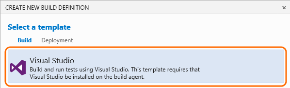
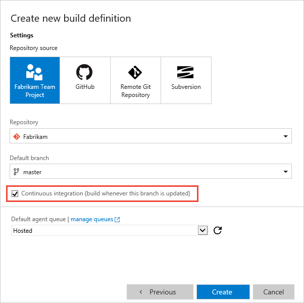
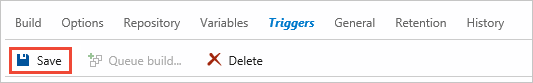
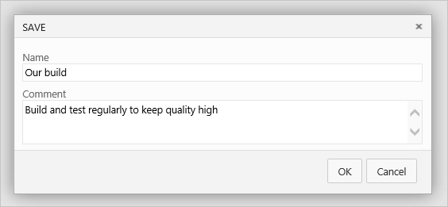
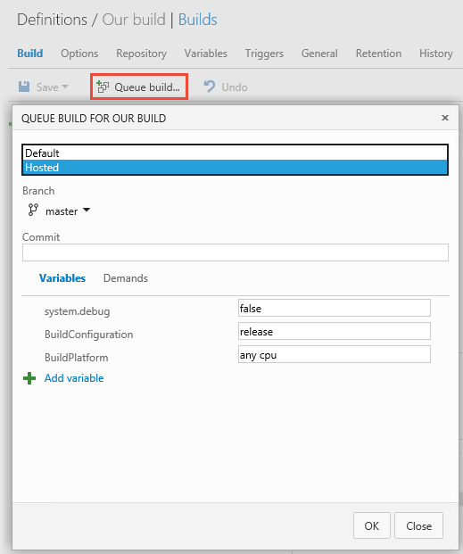
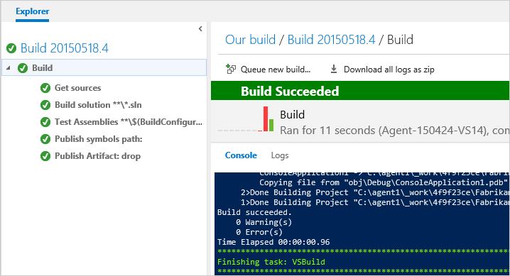

# Build your .NET app for Windows

**Team Services | TFS 2017 | TFS 2015 | [Previous versions (XAML builds)](https://msdn.microsoft.com/library/bb558973%28v=vs.120%29.aspx)**

[!INCLUDE [temp](../_shared/ci-cd-newbies.md)]

After you have [a Windows build agent](../actions/agents/v2-windows.md), in just a few steps you can define a CI build process that compiles and tests your .NET app whenever your team checks in code.

## Define your process

0. If you haven't already, upload your code to [GIT](../../git/share-your-code-in-git-vs.md) or [TFVC](../../tfvc/share-your-code-in-tfvc-vs.md).

0. Create the build definition.

 

 

0. Specify the code you want to build and select the continuous integration (CI) trigger.

 

0. Save the definition.

 

 

0. Queue your new definition to make sure it works.

 

 

Your team now has a CI build to validate every change chcked into your codebase!

## Q&A

<!-- BEGINSECTION class="md-qanda" -->

[!INCLUDE [temp](../steps/_shared/msbuild_qa.md)]

[!INCLUDE [temp](../_shared/qa-definition-common-all-platforms.md)]

[!INCLUDE [temp](../_shared/qa-agents.md)]

[!INCLUDE [temp](../_shared/qa-versions.md)]

<!-- ENDSECTION -->