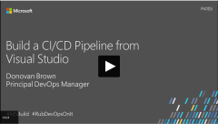

# Build and Release

Visual Studio Team Services and Team Foundation Server help you implement a highly customizable continuous integration (CI) and deployment (CD) pipeline for your .NET, Java, Node, PHP, or Python apps. Tutorials, references, and other documentation show you how to configure and manage CI/CD for the app and platform of your choice.

## 5-Minute Quickstarts

Learn how to build your app.

<table>
<tr valign="middle" align="center">
<!--
<td> [ASP.NET Core](apps/aspnet/build-aspnet-core.md)</td>
<td> [ASP.NET](apps/aspnet/ci/build-aspnet-4.md)</td>
<td> [Node.js](apps/nodejs/quick-to-azure.md)</td>
<td> [Java](apps/java/quick-to-azure.md)</td>
-->
<td>[ASP.NET Core](apps/aspnet/build-aspnet-core.md)</td>
<td>[ASP.NET](apps/aspnet/ci/build-aspnet-4.md)</td>
<td>[Node.js](apps/nodejs/quick-to-azure.md)</td>
<td>[Java](apps/java/quick-to-azure.md)</td>
</tr>
</table>    

Learn how to deploy your app.

<table>
<tr valign="middle" align="center">
<td> [Azure web app](apps/cd/deploy-webdeploy-webapps.md)</td>
<td> [Windows VM](apps/cd/azure/deploy-provision-azure-vm.md)</td>
</tr>
</table>    

## Step-by-Step Tutorials  

* [CI builds for Git in VSTS](actions/ci-build-git.md)
* [CI builds for GitHub](actions/ci-build-github.md)
* [Set up multi-stage release](actions/define-multistage-release-process.md)
* [Extend CI/CD](actions/extend-release-management.md)

## Videos

      

## Concepts  

- [Release definitions](concepts/definitions/release/index.md)
- [Build and release agents](concepts/agents/agents.md)
- [Build and release tasks](concepts/process/tasks.md)  
- [Licensing and build and release pipelines](concepts/licensing/concurrent-pipelines-ts.md)

## Resources

- [What is Continuous Integration?](https://www.visualstudio.com/learn/what-is-continuous-integration/)  
- [What is Continuous Delivery?](https://www.visualstudio.com/learn/what-is-continuous-delivery/)  
- [What is DevOps?](https://www.visualstudio.com/learn/what-is-devops/)   
- [Build and release Marketplace extensions](https://marketplace.visualstudio.com/search?target=VSTS&category=Build%20and%20release&sortBy=Downloads)
