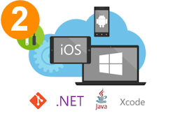

# Continuous integration and Continuous Delivery

**Team Services | TFS 2017 | TFS 2015 | Previous versions: [XAML Build](https://msdn.microsoft.com/library/ms181709%28v=vs.120%29.aspx), [Release](../release/previous-version/release-management-overview.md)**

    
    

Continuous Integration (CI) is the practice used by development teams to automate the merging and testing of code.  Implementing CI helps to catch bugs early in the development cycle, which makes them less expensive to fix.  Automated tests execute as part of the CI process to ensure quality.  Artifacts are produced from CI systems and fed to release pipelines to drive frequent deployments.    

Continuous Delivery (CD) is a process by which code is built, tested, and eventually deployed to a production environment.  Multiple testing or so-called staging environments drive quality.  CI systems produce the deployable artifacts including infrastructure and apps.  Automated release pipelines consume these artifacts to release new versions and fixes to existing systems.  Monitoring and alerting systems run continually to drive visibility into the entire CD process. 

[What's new?](news/2017.md)

[!INCLUDE [temp](_shared/ci-cd-newbies.md)]

<!--

Get started

Take this [15 minute tutorial](get-started/dot-net.md) to understand the basic concepts.
Then quickly set up a build and release definition for your ASP.NET application from the
[Azure portal](get-started/aspnet-4-ci-cd-azure-automatic.md) or from
[Visual Studio](get-started/aspnet-4-ci-cd-vs-automatic.md).

&nbsp;

Build and deploy your app

Set up CI/CD for your application. Build and Release Management can build applications
written in any language, and deploy to any platform. Select your application type above
and get going.

&nbsp;

Learn concepts

Now that you have the basic flow for your application, learn how to scale the DevOps
process for your entire team. Setup an [agent pool](concepts/agents/pools-queues.md)
to run several builds and deployments in parallel. Configure
[security](concepts/policies/permissions.md) and [retention policies](concepts/policies/retention.md)
for your entire team. Organize shared assets such as [service endpoints](concepts/library/service-endpoints.md),
[variable groups](concepts/library/variable-groups.md), and [task groups](concepts/library/task-groups.md).

&nbsp;

-->

Build

<ul style="padding-left:30px">
 <li>[ASP.NET](apps/aspnet/ci/build-aspnet-4.md) and [ASP.NET Core](apps/aspnet/ci/build-aspnet-core.md)</li>
 <li>[Java](apps/java/maven-to-azure.md) and [Node](apps/nodejs/nodejs-to-azure.md)</li>
 <li>[UWP](apps/windows/universal.md) and [C++](apps/windows/cpp.md)
 <li>[Xamarin](apps/mobile/xamarin.md) and [XCode](apps/mobile/xcode-ios.md)</li>
 <li>[Cordova](apps/mobile/cordova-build.md)</li>
 <li>[More...](apps/index.md)</li>
</ul>

Deploy

<ul style="padding-left:30px">
  <li>[To an Azure web site](apps/cd/deploy-webdeploy-webapps.md)</li>
  <li>[Database to Azure](apps/aspnet/cd/deploy-dacpac-sqlpackage.md)</li>
  <li>[Web Deploy package to IIS servers](apps/cd/deploy-webdeploy-iis-deploygroups.md)</li>
  <li>[Provision an Azure virtual machine](apps/cd/azure/deploy-provision-azure-vm.md)</li>
  <li>[More...](apps/index.md)</li>
</ul>

CI/CD get started

<ul style="padding-left:30px">
 <!-- This needs to be changed to create-your-first-build-and-release.md after the merger of the other branch
 <li>[Tutorial on basic concepts](get-started/create-your-first-release.md)</li>-->
 <li>[CI/CD Hello world](get-started/ci-cd-part-1.md)</li>
 <li>[ASP.NET from the Azure portal](get-started/aspnet-4-ci-cd-azure-automatic.md)</li>
 <li>[ASP.NET from Visual Studio](get-started/aspnet-4-ci-cd-vs-automatic.md)</li>
 <li>[ASP.NET do it yourself](apps/aspnet/aspnet4-to-azure.md)</li>
 <li>[ASP.NET Core to Azure from Visual Studio](apps/aspnet/aspnetcore-docker-to-azure.md)</li>
 <li>[ASP.NET Core do it yourself](apps/aspnet/aspnetcore-to-azure.md)</li>
</ul>

Concepts

<ul style="padding-left:30px">
 <li>[Build definitions](get-started/ci-cd-part-1.md)</li>
 <li>[Release definitions](concepts/definitions/release/index.md)</li>
 <li>[Agents](concepts/agents/agents.md)</li>
 <li>[Tasks](concepts/process/tasks.md)</li>
 <li>[Library](concepts/library/index.md)</li>
</ul>

Set up

<ul style="padding-left:30px">
 <li>[How to sign up](https://go.microsoft.com/fwlink/?LinkId=307137)</li>
 <li>[Understand licensing](concepts/licensing/concurrent-pipelines-ts.md)</li>
 <li>[Get support](support.md)</li>
</ul>

Extend

<ul style="padding-left:30px">
<!--li>Service hooks</li>
 <li>Alerts</li>
 <li>Tasks</li>
 <li>Extensions</li-->
 <li>[Agent repo](https://github.com/Microsoft/vsts-agent)</li>
 <li>[Tasks repo](https://github.com/Microsoft/vsts-tasks)</li>
 <li>[REST APIs](../integrate/index.md)</li>
</ul>

Articles

<ul style="padding-left:30px">
<li>[What is Continuous Integration?](https://www.visualstudio.com/learn/what-is-continuous-integration/)
<li>[What is Continuous Delivery?](https://www.visualstudio.com/learn/what-is-continuous-delivery/)</li>
<li>[What is DevOps?](https://www.visualstudio.com/learn/what-is-devops/)</li></ul>

