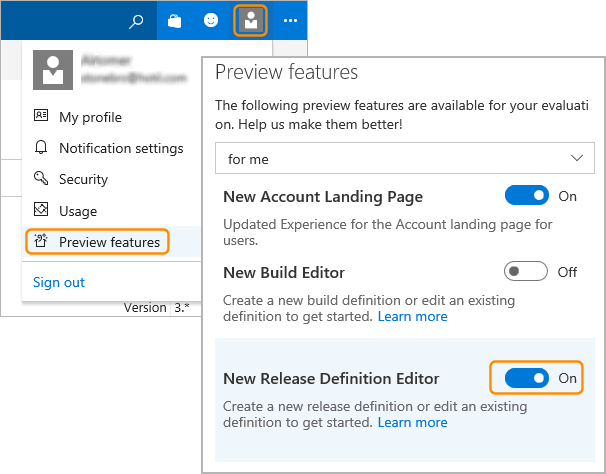
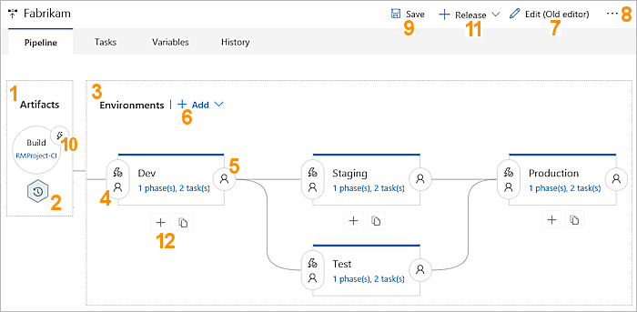
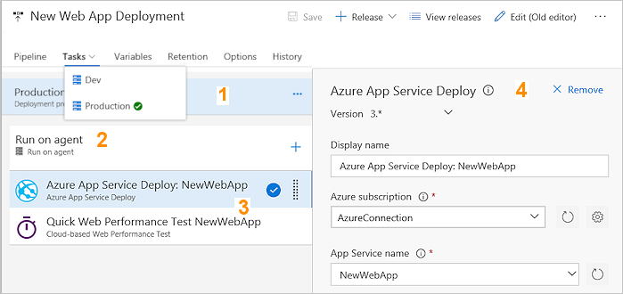
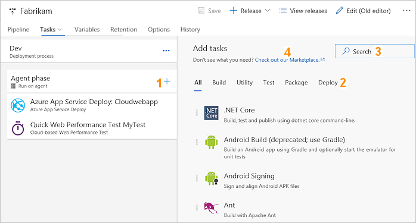
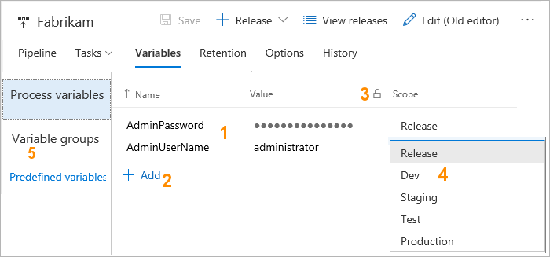

# Release Definition Editor Preview

This topic describes the preview of the release definition editor. Turn on this
editor by choosing the **Try it** link in the **Releases** page. 
You can also turn the new editor on and off at any time. See
[Enable preview features](../../collaborate/preview-features.md)
for more details.

The editor contains four tabs: **[Pipeline](#pipeline)**, **[Tasks](#tasks)**,
**[Variables](#variables)**, **[Retention](#retention)**, **[Options](#options)**, and **[History](#history)**.

## Pipeline tab 

This tab displays a graphical view of the pipeline of environments in your definition.
The layout and linking of the environments reflects the settings specified for the
[triggers](../concepts/definitions/release/triggers.md#parallel-forked-and-joined-deployments) defined for each environment.

The features of the pipeline editor include:

1. The **Artifacts** details. This shows the [artifacts](../concepts/definitions/release/artifacts.md) linked to the definition.

1. An icon that opens the **Release schedule** editor panel. Here you can specify a
   [scheduled trigger](../concepts/definitions/release/triggers.md#release-triggers) that will initiate a release.

1. The **Environments** panel. This shows the pipeline of environments with links to indicate
   the triggers that will initiate deployment to each environment. It clearly illustrates
   whether you have a direct (straight line) deployment pipeline, or a
   [parallel (forked and joined) deployment](../concepts/definitions/release/triggers.md#parallel-forked-and-joined-deployments).

1. Each environment has an icon that opens the **Pre-deployment conditions** editor panel.
   Here you can specify the [triggers](../concepts/definitions/release/triggers.md),
   [pre-deployment approvers](../concepts/definitions/release/environments.md#approvals),
   and [deployment queue](../concepts/definitions/release/environments.md#queuing-policies) settings for just that environment.

1. Each environment has an icon that opens the **Post-deployment conditions** editor panel.
   Here you can specify the [post-deployment approvers](../concepts/definitions/release/environments.md#approvals)
   for just that environment.
   
1. A drop-down list where you can add a new environment to the definition, or
   [clone an existing environment](../actions/work-with-release-definitions.md#replicate-a-definition).
   
1. A link that makes it easy to switch back to the non-preview definition editor.

1. A drop-down list opened from the **...** icon where you can 
   [configure security permissions](../concepts/policies/permissions.md) for the definition.
   
1. An icon to save your changes to the release definition.

1. An icon that opens the **Continuous deployment trigger** editor panel where you can
   configure [continuous integration and deployment](../concepts/definitions/release/triggers.md#release-triggers) (CI/CD).  

1. A drop-down list where you can create a [new release or a draft release](../concepts/releases/index.md) from this release definition.

1. Icons to add a new environment to the definition, and to clone the selected environment.
   These icons are visible only when the mouse pointer is over the environment.

1. A link to the page that displays a list and status of releases for just this definition.

As you change the triggers for each environment in the **Pre-deployment conditions** editor panel,
the layout and links to the environments is updated to show the new deployment pipeline. Notice
that you can change the type of trigger for the environment here; it can be when a release is created,
when deployment to a previous environment succeeds, or manual. The automated triggers can be set to a
schedule if required.

## Tasks tab

This tab makes it easy to edit the tasks defined for each environment.

The environments you have defined are shown in the drop-down selector, and the features of the tasks editor include:

1. The environment selector bar showing the environment name. Select this bar to edit the name.
   Use the **...** to open a shortcut menu where you add [phases](../concepts/process/phases.md) to the environment.

2. A selector bar for each [phase](../concepts/process/phases.md) defined in the environment. 
   Select this bar to edit the name and properties of the phase.

3. A selector bar for each task in each phase. Select this bar to edit the name and
   properties of the task. Drag and drop the task bars to reorder the tasks.

4. The property (or argument) editor panel for the selected environment, phase, or task.
   See [Define processes in an environment](../actions/work-with-release-definitions.md#define-processes)
   and the individual [build and release tasks](../define/build.md) for more details about the available
   tasks and their arguments.

To add [tasks](../concepts/process/tasks.md) to a phase, select it and use the **+** icon to
open the **Add tasks** panel.

  
1. The icon to open the **Add tasks** panel.

1. Select the type of task you need, or view all tasks.

1. Search for tasks by name.

1. Get additional tasks from the Marketplace.

1. A link to open the page containing a list of variable groups you can link to, as well as a link to manage variable groups.  

## Variables tab 

Use this tab to define the variables that you will use in your tasks and definition settings.

 
The features of the variables editor include:

1. The list of variables, and the scope of each one.

2. A link to add new variables.

3. Use the "padlock" icon when you define a variable to secure and hide the value.

4. A drop-down list where you can specify the scope of the variable to the entire
   definition or to a specific environment.

For more information, see [Variables in Release Management](../concepts/definitions/release/variables.md).

## Retention tab 

Use this tab to specify how long yuo want to retain information about releases. 
You can specify the details for each environment individually, or manage the default
retention policy. See [Release retention](../concepts/policies/retention.md#release) for more details.

## Options tab 

Use this tab to define the settings for the general options such as the description of the release definition
and the format for release numbering. See [Environment general options](../concepts/definitions/release/environments.md#options) for more details.

## History tab

For information about using the **History** tab, see [Release history](../actions/view-manage-releases.md#release-history).

## FAQs

#### Q: Can I edit release definitions with both the existing and the new editors interchangeably?

**A**: Yes, you can use the new editor to manage tasks and triggers,
and fall back to the existing editor for configuring options that are
not yet available in the new editor. Simply select **Releases** in the
**Build &amp; Release** menu, select the release definition, and choose **Edit**.

#### Q: Is there any specific feedback you are looking for?

**A**: Yes, we're keen to hear your feedback about:

* Setting deployment triggers and approvals.
* Navigation from the Pipeline tab to the Tasks tab.
* The visual representation of the deployment workflow.

Please send your feedback to [RM_Customer_Queries@microsoft.com](mailto:RM_Customer_Queries@microsoft.com)

## Related topics

* [Artifacts](../concepts/definitions/release/artifacts.md)
* [Environments](../concepts/definitions/release/environments.md)
* [Triggers](../concepts/definitions/release/triggers.md)
* [Variables](../concepts/definitions/release/variables.md)
* [Release retention](../concepts/policies/retention.md)
* [Release security](../concepts/policies/permissions.md#release-permissions)

## See also

* [Work with release definitions](../actions/work-with-release-definitions.md)

* [View and manage releases](../actions/view-manage-releases.md)

* [Monitor releases and debug deployment issues](../actions/debug-deployment-issues.md)

* [Configure your release pipelines for safe deployments](https://blogs.msdn.microsoft.com/visualstudioalm/2017/04/24/configuring-your-release-pipelines-for-safe-deployments/)

[!INCLUDE [rm-help-support-shared](../_shared/rm-help-support-shared.md)]
