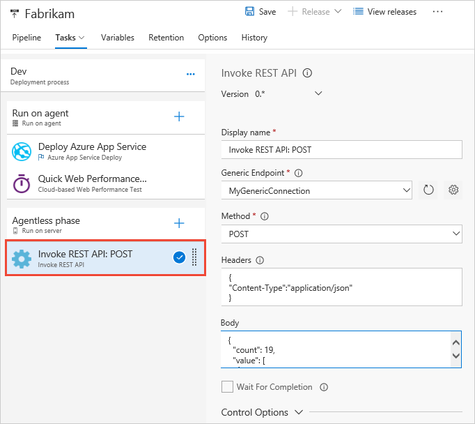

# Utility: Invoke HTTP REST API

**VSTS**

 &nbsp; Invoke an HTTP API and parse the response.

## Demands

Can be used in only an [agentless phase](../../concepts/process/phases.md#agentless-phase) of a release definition.

## Arguments

| Parameter | Comments |
| --- | --- | --- |
| **Generic endpoint** | Required. Select a Generic service endpoint. |
| **Method** | Required. For example, **GET**, **PUT**, or **UPDATE**. |
| **Headers** | Optional. The header in JSON format to be attached to the request sent to the function. |
| **Body** | Optional. The request body for the function call. |
| **Execution mode** | Required. **Synchronous mode** (the default), or **Asynchronous call** where the function calls back to update the timeline record. |
| **Response parse expression** | Optional. How to parse the response body for success. |
| **Control options** | See [Control options](../../concepts/process/tasks.md#controloptions) |

Succeeds if the function returns success and the response body parsing is successful.

The **Invoke REST API task** does not perform deployment actions directly.
Instead, it allows you to invoke any generic HTTP REST API as part of the automated
pipeline and, optionally, wait for it to be completed. 



For more information about using this task, see [Approvals and gates overview](../../concepts/definitions/release/approvals/index.md).

Also see this task on [GitHub](https://github.com/Microsoft/vsts-tasks/tree/master/Tasks/InvokeRestApi).

::: moniker range="vsts"

## YAML snippet

(VSTS-only)

```YAML
- task: InvokeRESTAPI@1
  inputs:
    serviceConnection:
#   method: POST # OPTIONS, GET, HEAD, POST (default), PUT, DELETE, TRACE, PATCH
#   headers: {Content-Type:application/json, PlanUrl: $(system.CollectionUri), ProjectId: $(system.TeamProjectId), HubName: $(system.HostType), PlanId: $(system.PlanId), JobId: $(system.JobId), TimelineId: $(system.TimelineId), TaskInstanceId: $(system.TaskInstanceId), AuthToken: $(system.AccessToken)}
    body:
    urlSuffix:
#   waitForCompletion: false # true, false (default)
    successCriteria:
```

::: moniker-end
