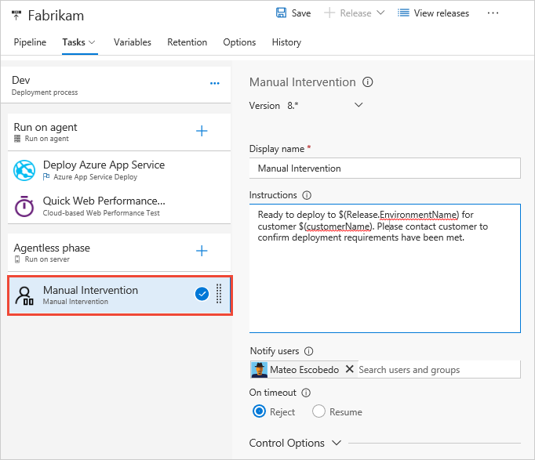

# Utility: Manual intervention

[!INCLUDE [temp](../../_shared/version-tfs-2015-update.md)]

 &nbsp; Pause an active deployment within an environment, typically to perform some manual steps or actions, and then continue the automated deployment steps.

## Demands

Can be used in only an [agentless phase](../../concepts/process/phases.md#agentless-phase) of a release definition.

## Arguments

| Parameter | Comments |
| --- | --- |
| **Display name** | Required. The name to display for this task. |
| **Instructions** | Optional. The instruction text to display to the user when the task is activated. |
| **Notify users** | Optional. The list of users that will be notified that the task has been activated. |
| **On timeout** | Required. The action to take (reject or resume) if the task times out with no manual intervention. The default is to reject the deployment. |
| **Control options** | See [Control options](../../concepts/process/tasks.md#controloptions) |

The **Manual Intervention** task does not perform deployment actions directly.
Instead, it allows you to pause an active deployment within an environment, typically to perform some
manual steps or actions, and then continue the automated deployment steps. For example, the user may
need to edit the details of the current release before continuing; perhaps by entering the values for
custom variables used by the tasks in the release.

The **Manual Intervention** task configuration includes an **Instructions** parameter that
can be used to provide related information, or to specify the manual steps
the user should execute during the Agentless phase. You can configure the task to
send email notifications to users and user groups when it is awaiting intervention,
and specify the automatic response (reject or resume the deployment) after a configurable
timeout occurs.

> You can use built-in and custom variables to generate portions of your instructions.

When the Manual Intervention task is activated during a deployment, it sets
the deployment state to **IN PROGRESS** and displays
a message bar containing  a link that opens the Manual Intervention dialog containing the instructions.
After carrying out the manual steps, the administrator or user can choose to resume the deployment, or reject it.
Users with **Manage deployment** permission on the environment can resume or reject the manual intervention.

For more information about using this task, see [Approvals and gates overview](../../concepts/definitions/release/approvals/index.md).

Also see this task on [GitHub](https://github.com/Microsoft/vsts-tasks/tree/master/Tasks/ManualIntervention).

## Q & A

<!-- BEGINSECTION class="md-qanda" -->

[!INCLUDE [temp](../../_shared/qa-versions.md)]

<!-- ENDSECTION -->

