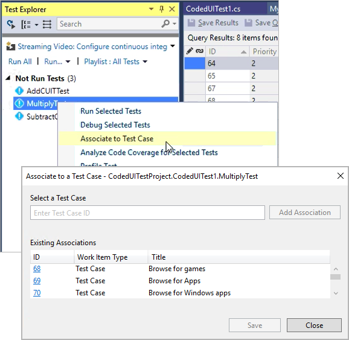

# Associate automated tests with test cases

**Visual Studio 2017 | [Previous version](https://msdn.microsoft.com/en-us/library/dd380741%28v=vs.110%29.aspx)**

Consider using Visual Studio to associate automated tests with a test case when:

* You created a manual test case that you later decide is a good test
  to automate, but you still want to be able to run that test as part of a test plan.
  Tests can be run in the CI/CD pipeline by choosing the test plan or test suite.
  Automated tests can also be run on demand from Microsoft Test Manager.
  We plan to enable test to be run from the Test hub in the future.

* You want to enable end-to-end traceability of requirements.
  If your test cases are linked to requirements or user stories,
  the results of the test execution can be used to establish the quality of those requirements. 

The process to associate an automated test with a test case is:

1. Create a test project containing your automated test.
   [What types of tests are supported?](reference-qa.md#test-types)

1. Check your test project into a VSTS or Team
   Foundation Server (TFS) repository.

1. Create a build definition for your project, ensuring that it
   contains the automated test.
   [What are the differences if I am still using a XAML build?](reference-qa.md#xaml-build)

1. Use Visual Studio Enterprise, Visual Studio Professional,
   or Visual Studio Test Professional to associate the automated
   test with a test case as shown [below](#add-test). The test case must have
   been added to a test plan that uses the build you just defined. 

If you are using Team Foundation Build and Release Management in
VSTS or TFS (not a [XAML build](reference-qa.md#xaml-build)), you can run associated tests in the 
Build and Release pipeline by using the
[Visual Studio Test Agent Deployment](../../build-release/tasks/test/visual-studio-test-agent-deployment.md) and
[Run Functional Tests](../../build-release/tasks/test/run-functional-tests.md) tasks.
You must configure the [Run Functional Tests](../../build-release/tasks/test/run-functional-tests.md) task to use the
**Test Plan** option. You _cannot_ run tests on-demand using
Microsoft Test Manager (MTM) unless you are using a [XAML build](reference-qa.md#xaml-build). 

>See [Test with unified agents and phases](test-with-unified-agent-and-phases.md)
for details of how you can avoid using the Visual Studio Test Agent Deployment task. 

The parameters in a test case are not used by any automated test that
you associate with a test case. Iterations of a test case that use these
parameters are for manual tests only.

>For more information about checking in your test project and team build, see
[Add files to the server](../../tfvc/add-files-server.md)
and [Continuous integration on any platform](../../build-release/overview.md).
For more information about action recordings and coded UI tests, see 
[Recording and Playing Back Manual Tests](../../manual-test/getting-started/record-play-back-manual-tests.md)
and [Use UI Automation To Test Your Code](https://docs.microsoft.com/visualstudio/test/use-ui-automation-to-test-your-code).

## Associate your test  

1. Open your solution in Visual Studio.

1. If you know the identifier of the work item for the test case:

   - If the **Test Explorer** window is not displayed, open it from the **Test | Windows** menu.

   - If your tests are not displayed in **Test Explorer**, build the solution.

   - In **Test Explorer**, select the test method you want to associate and choose **Associate to Test Case**.

   - In the dialog that opens, type the test case identifier and choose **Add Association**, then choose **Save**.

   

   >The dialog shows a list of test cases currently associated with the selected test method.
   You cannot associate more than one test method with a test case, but you can associate a
   test method with more than one test case. 

1. If you **do not** know the identifier of the work item for the test case:

   - Ensure you have configured Visual Studio to display test work items 
     inside the Visual Studio editor rather than in your web browser.
     See [Can I configure work items to open in Visual Studio?](reference-qa.md#open-in-vs)

   - In **Team Explorer** open the **Work Items** tab. If the **Team Explorer**
     window is not displayed, open it from the **View** menu.

   - Expand the list of **Queries** in the **Work Items** tab to find one that displays your test cases, 
     for example the default **My Test Cases** query. For more information
     about how to use queries in Team Explorer, see
     [Use the query editor to list and manage queries](../../work/track/using-queries.md)
 
   - Execute the query by choosing **View Results** on the shortcut menu
     (or double-click the query name).

   - Open the test case you want to associate by choosing **Open**
     on the shortcut menu (or double-click the test case name).

   - In the work item, open the **ASSOCIATED AUTOMATION** tab. 
     All the tests in the solution are shown in the list together
     with their associated test projects.

   - Choose the ellipsis (**...**) and, in the **Choose Test** dialog,
     select the test and then choose **OK**. The value in 
     **Automation Status** is automatically changed to **Automated**.

   - Choose **Save Work Item** to save the changes to the test case.

   >If a test case already has an automated test associated with it, you
   must first remove this association before you can add a different automated test.
   Choose **Remove association** to remove the existing automation.

## Set up your test plan to use your build  
 
To set up your test plan to run the automated test that you have created,
you must select the correct build definition used to build your automated
test or a build definition that has the correct build drop location for your
existing automated test assemblies. You must do this so that the automated
test can be found in the share location for your build definition and then
it can be run from Microsoft Test Manager.

>If you have multiple build configurations, the test assemblies to run the
automated tests are searched for recursively from the root directory of the
build drop folder. If it is important which assemblies are selected when you
run your automated tests, you should use **Run with options** to specify the build
configuration.
 
To set up your test plan to use your team build:

1. Open Microsoft Test Manager. 
 
1. To select a test plan, choose the down-arrow on the center group switcher and then choose **Testing Center**.

1. On the center group menu bar, choose **Plan**.

1. To set up your test plan to run the automated tests, choose **Properties**
   and then choose the drop-down arrow to the right of **Filter for builds**.
   The dialog box that shows build definition and quality is displayed.

1. To select the build definition that is used to build your automated tests, choose **Build definition**.

1. Each build can be given a specific value to reflect the quality of the build.
   To select the quality of the builds you want to be able to view, choose **Build quality**.

   >For more information about build definitions and build quality, see
   [Continuous integration on any platform](../../build-release/overview.md).
 
1. To save your changes, choose **Set build filter**.

1. To select the most recent build to use with this test plan that includes
   the latest changes to the automated test, you must first choose **Save**
   to save the plan and then choose **Modify**. 
   The **Assign Build** activity is displayed. You can compare your current build
   with a build you plan to take. The associated items list shows the changes to
   work items between the builds. You can then assign the latest build to take and use
   for testing with this plan.

1. To close the **Assign Build** activity and return to the test plan properties, choose the **Close** icon.

1. To save these changes for this test plan, choose **Save** in the toolbar.

## Create your test settings and environment to run your tests  
 
To run your automated tests, you must use a standard or an SCVMM environment. You cannot run automated tests using Microsoft Test Manager without a lab environment.

You must create an environment that contains the roles in your test
settings and then use this environment in your test plan. For more
information about how to create your environment and roles and test settings, see
[Use a lab environment for your devops](https://docs.microsoft.com/visualstudio/test/lab-management/using-a-lab-environment-for-your-application-lifecycle).

## Run the automated test using Microsoft Test Manager  
 
To run the automated test using Microsoft Test Manager:

1. Open Microsoft Test Manager. 
 
1. To run the automated test, choose the down-arrow on the center group switcher and then choose **Testing Center**.

1. On the center group menu bar, choose **Test**.

1. (Optional) To override the build, the test settings or the environment to use for
   running the automated tests that you select in this test plan, right-click the test
   and then choose **Run with options**. For example, if you want to run on a staging
   environment instead of your standard testing environment then you might select a
   different environment. From the Run options dialog box, you can change these settings,
   and then choose **Run** to run the selected test.

   >If you select a different environment, it must contain the same roles that you selected in the test settings that you use.
 
1. To run the automated test without changing any options, right-click the test and then choose **Run**.
   The **Analyze Test Runs** activity is displayed. It shows the progress of the test run that contains this test.

   >You can run multiple automated tests by selecting multiple tests,
   or you can select to run a whole suite of tests. To run a suite, right-click
   the test suite and then choose **Run**.

## View and update the test results  
 
To view and update the test results:

1. Open Microsoft Test Manager. 
 
1. To view the test results, choose the down-arrow on the center group switcher and then choose **Testing Center**.

1. On the center group menu bar, choose **Test** and then choose **Analyze Test Runs**.
   The Analyze Test Runs activity is displayed. It shows any test runs for this test plan.

1. Double-click a test run to open it and view the details. 
   The test run details are displayed. 

1. (Optional) To update the title of your test run to be more meaningful, type the new name in **Title**.

1. (Optional) If your test failed, you can update the reason for the failure.
   Choose **Resolution** and select the reason for the failure from the list.

1. (Optional) To add comments to the test result, choose the Comments icon.
   Type your comments and then choose **Save comments**.

1. (Optional) To view the details of an individual test, double-click the test.
   The test result is displayed. It shows the details from the test run, the attachments
   for data collected for this test result, and the test results history for that test.
   You can close this view to return to the test run.

   >If, from your analysis, you determine that there is a bug, you can create a bug from this view.
 
1. To save these changes for this test run, choose **Save** in the toolbar.

## See Also

* [Associate automated test results with requirements](associate-automated-results-with-requirements.md)
* [Run automated tests from test plans in the Test hub](run-automated-tests-from-test-hub.md)
* [Test with unified agents and phases](test-with-unified-agent-and-phases.md)
* [Continuous testing scenarios and capabilities](index.md)

[!INCLUDE [help-and-support-footer](_shared/help-and-support-footer.md)] 
