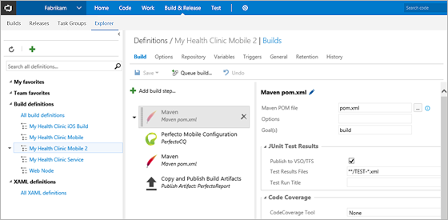
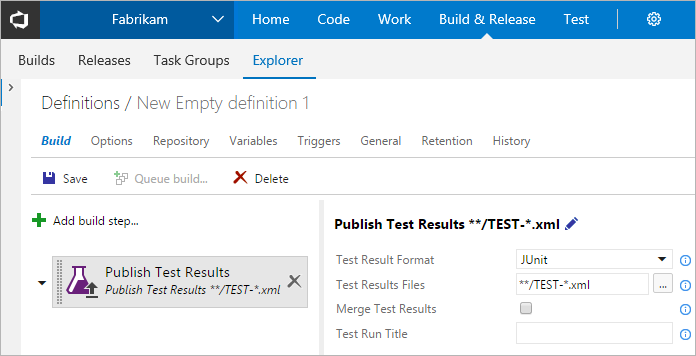
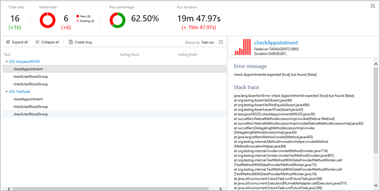
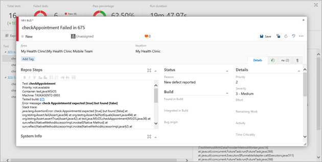
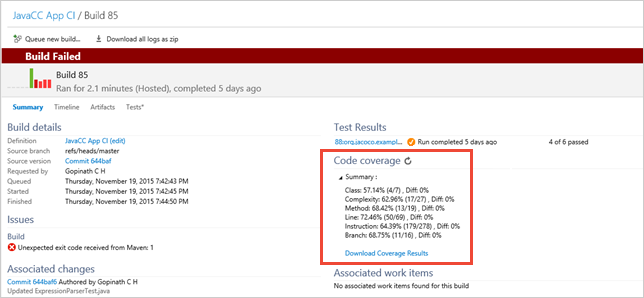

# Testing Java applications with VSTS

[!INCLUDE [version-header-vs-vsts-tfs](_shared/version-header-vs-vsts-tfs.md)]

Visual Studio Team Services (VSTS) and Team Foundation Server (TFS) include build tasks to
make it easy to integrate your build and testing 
efforts into your release pipelines with rich 
reporting highlighting build-on-build changes, 
easy-to-create actionable bugs for regressions and 
the ability to create and display code coverage 
with a simple checkbox. 

[See this topic on Channel9 video](https://channel9.msdn.com/Series/Test-Tools-in-Visual-Studio/Testing-Java-Applications-with-Visual-Studio-Team-Services)

## Build integration

VSTS build tasks make it 
easy to build to build Java applications. These 
same tasks also make it easy to test your Java 
applications. The example below uses Maven to build
a Java application, runs JUnit tests, and uses Maven and 
to test the application.

The output of these tests and other testing 
frameworks is made available in the standard 
test reports by using the **Publish Test Results**
task. Note that, in the image below the task defaults to 
importing the test results from JUnit.

## Build-on-build summary results

VSTS automatically adds 
build-on-build changes in the summary view to give 
a clear indication if your quality is improving.
In the example below you can see 16 new tests were 
added, but 6 of these tests are now failing and the 
build time is now much longer. 

## Test details view

While Summary View gives build-on-build changes,
Details View lets you identify the problems
and easily action them. In this view, all the 
failed test information is displayed.
Selecting a failed test displays all the data 
you need to take action for this issue, such as
the error message, duration, failing agent, and 
stack trace.

## Easily create actionable bugs

After an issue has been identified, Test Details
view makes it easy to create actionable bugs that 
include all the data from Details 
View, as well as automatically linking the build, 
test run, and a generated title.

## Code coverage results

By checking an option in the test build task, code 
coverage is automatically collected during the 
tests. Summary View shows a roll-up of the data and
a detailed coverage results report that enables you
to drill into your application and identify 
coverage in different areas.

## See also

[VSTS Java website](http://java.visualstudio.com/)

[!INCLUDE [help-and-support-footer](_shared/help-and-support-footer.md)] 
 
