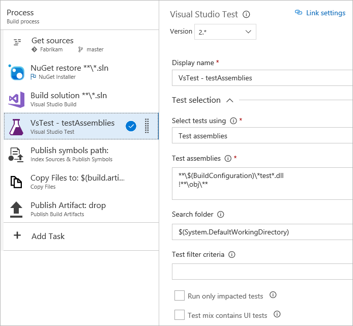
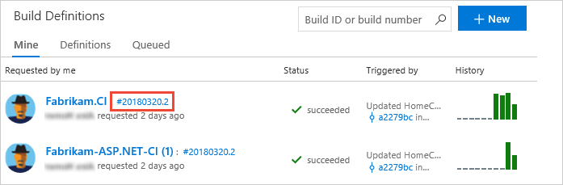

# Run tests with your builds

[!INCLUDE [version-header-vs-vsts-tfs](_shared/version-header-vs-vsts-tfs.md)]

Make sure that your app still works after every 
check-in and build using Visual Studio Team Services (VSTS) or Team Foundation Server (TFS). 
Find problems earlier by running tests 
automatically with each build. When your build is 
done, review your test results to start resolving 
the problems that you find.

This quickstart shows how to run unit tests with your build
for .NET and ASP.NET apps. It uses the
[Visual Studio Test](test-with-unified-agent-and-phases.md) task. 

## Before you start

* [Check in your solution](../../git/overview.md) 
  to VSTS. Include your test projects.

## Create a build definition

Your build definition must include a test task that runs unit tests. 
For example, if you're building a Visual Studio solution in VSTS,
your build definition should include a **Visual Studio Test** task. After your 
build starts, this task automatically runs all the unit tests in your 
solution - on the same build machine. 

1. If your build definition does not contain a test task, add one to it.

   

1. Edit the Visual Studio Test task. You can add filter criteria to run specific tests, enable code coverage, 
   run tests from [other unit test frameworks](reference-qa.md), and so on.

   

   For information about the option settings of the Visual Studio Test task, see:
   
   * [Visual Studio Test version 1](https://github.com/Microsoft/vsts-tasks/blob/releases/m109/Tasks/VsTest/README.md)
   * [Visual Studio Test version 2](https://github.com/Microsoft/vsts-tasks/blob/master/Tasks/VsTest/README.md)

   > The Visual Studio Test task version 2 supports Test Impact Analysis (TIA). See [Speed up testing with Test Impact Analysis](test-impact-analysis.md).

1. When you're done, save your build definition.

   

## Start the build

1. Start the build by adding it to the build queue.

    

1. After the build finishes, you can review the test results to resolve any problems that happened. Go to the build to open the build summary.

   

## Review the results

1. Open the test run results summary and compare your test results
   between this build and the last build. Here you'll find changes in new, failed, and passed tests, 
   how long these tests took to run, how long these tests have been failing, and more.
   Organize your test results and open bugs directly for failed tests.

   

1. To start debugging a failed test, open the test and review the resulting error and stack trace.

   
 

## Next step

> [!div class="nextstepaction"]
> [Review your test results](review-continuous-test-results-after-build.md) 
