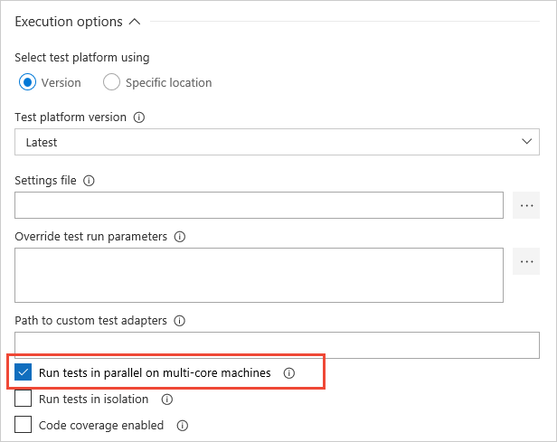

# Run tests in parallel

**Visual Studio 2017.1 and later | VSTS**

The Visual Studio Test Platform (VSTest) supports running tests in parallel.
Parallel test execution is available:

* To all frameworks and within the IDE, the command line (CLI), and in VSTS.
* Within the IDE from all launch points (Test Explorer, CodeLens, various **Run** commands, and more).

Parallel test execution:

* Composes with [test adapters](https://visualstudiogallery.msdn.microsoft.com/site/search?query=%22Test%20Adapter%22&f%5B0%5D.Value=%22Test%20Adapter%22&f%5B0%5D.Type=SearchText&ac=4) and frameworks that already support parallel execution such as MSTest, NUnit, and xUnit.net.
* Is easy to implement, it requires no changes to existing test code and does not break existing test runs.
* Works with the test code where it already resides.
* Is OFF by default, users must explicitly opt in.
* Is supported at [assembly level](https://blogs.msdn.microsoft.com/devops/2018/01/30/mstest-v2-in-assembly-parallel-test-execution/).

Not all existing test code might be parallel-safe; for example, tests may assume exclusive use of global resources.
In general, use the following iterative approach to leverage the feature:

Partition tests in terms of a taxonomy as follows:

1. Pure unit tests (typically these can run in parallel).
1. Functional tests that can run in parallel with some modifications (for example, two tests that create or delete the same folder can be adapted to use unique folders).
1. Functional tests that cannot be modified to run in parallel (for example, two Coded UI tests performing mouse actions on the desktop, or two functional tests writing to the Bluetooth or IR port).

Gradually evolve the partitioning as follows:

1. Run the tests in parallel, see which tests fail, and classify them as above.
1. Fix tests in category 2 so that they can run in parallel.
1. Move tests in category 3 into a separate test run where parallel is OFF by default.

Parallel Test Execution is **not** supported in the following cases:

* If the test run is configured using a **.testsettings** file.
* For test code targeting Phone, Store, UWP app platforms.

## Enable parallel tests in Visual Studio 2017 Update 1 and VS Test task v1.x

Configure a [.runsettings file](https://docs.microsoft.com/en-us/visualstudio/test/configure-unit-tests-by-using-a-dot-runsettings-file)
in the app source repository for Visual Studio IDE or the CLI, and in VSTS when using
version 1.x of the  [Visual Studio Test](https://github.com/Microsoft/vsts-tasks/blob/master/Tasks/VsTest/README.md)
task.

In the **.runsettings** file add entry for **MaxCpuCount**, and specify or associate the file with the test run.
The value for **MaxCpuCount** has the following semantics:

* **n** where 1 <= n <= number of cores: up to **n** processes will be launched.
* **n** of any other value: The number of processes launched will be as many as the available cores on the machine.
* A value of 0 (zero) indicates that up to all the available free cores may be used.

[!INCLUDE [paralleltest-runsettingsmerge](_shared/paralleltest-runsettingsmerge.md)] 

[More information about test processes for parallel execution](https://blogs.msdn.microsoft.com/devops/2016/10/10/parallel-test-execution/).

## Enable parallel tests in Visual Studio 2017 Update 2 and later

Enable parallel test execution by using the button on the Test Explorer toolbar.
This is an ON/OFF toggle setting. 

For the CLI, **vstest.console.exe** supports a **/Parallel** command line switch. Set this to enable parallel test execution.

[!INCLUDE [paralleltest-maxcpucount](_shared/paralleltest-maxcpucount.md)] 

[!INCLUDE [paralleltest-runsettingsmerge](_shared/paralleltest-runsettingsmerge.md)] 

## Enable parallel tests in VSTS with VS Test task v2.x

Enable parallel test execution by setting the **Run Tests in Parallel...** checkbox
in the settings for the [Visual Studio Test](https://github.com/Microsoft/vsts-tasks/blob/master/Tasks/VsTest/README.md) task.

[!INCLUDE [paralleltest-maxcpucount](_shared/paralleltest-maxcpucount.md)] 

[!INCLUDE [paralleltest-runsettingsmerge](_shared/paralleltest-runsettingsmerge.md)] 

## See Also

* [MSTest V2 in-assembly parallel test execution](https://blogs.msdn.microsoft.com/devops/2018/01/30/mstest-v2-in-assembly-parallel-test-execution/)
* [Parallel Test Execution](https://blogs.msdn.microsoft.com/devops/2016/10/10/parallel-test-execution/)
* [Set up continuous testing for your builds](set-up-continuous-testing-builds.md)
* [Run automated tests from test plans in the Test hub](run-automated-tests-from-test-hub.md)

[!INCLUDE [help-and-support-footer](_shared/help-and-support-footer.md)] 
