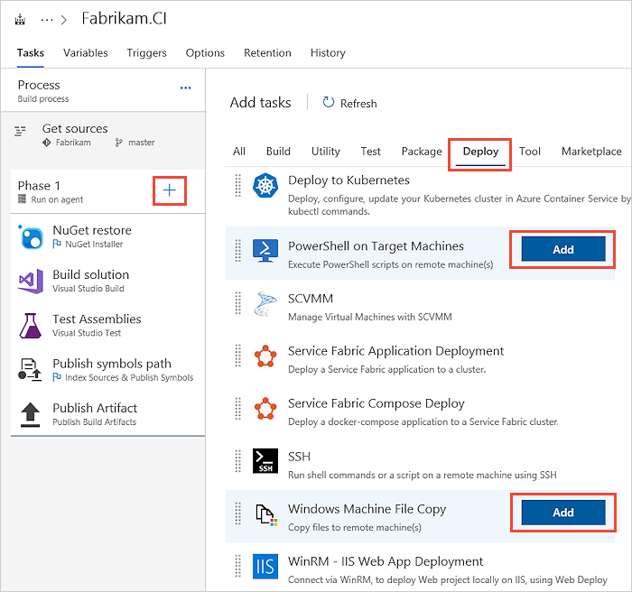
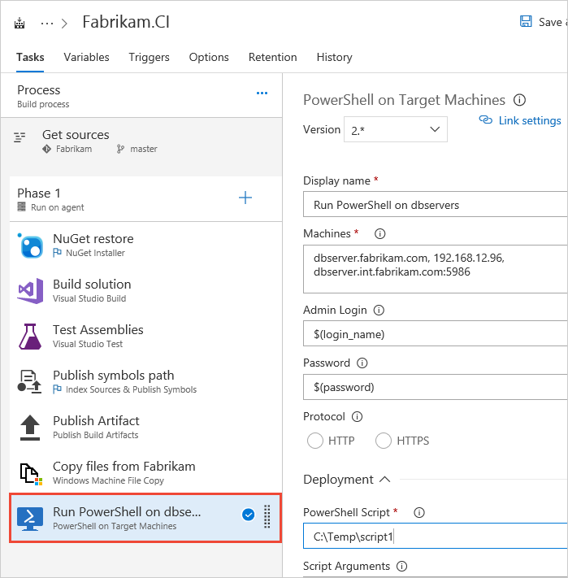
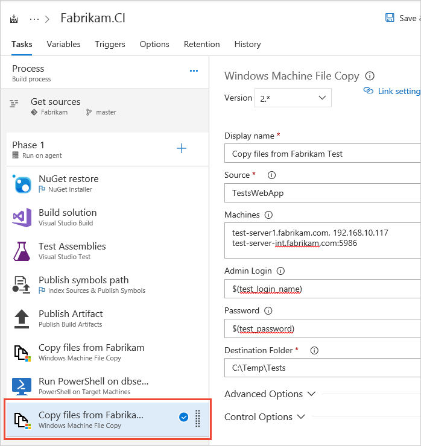
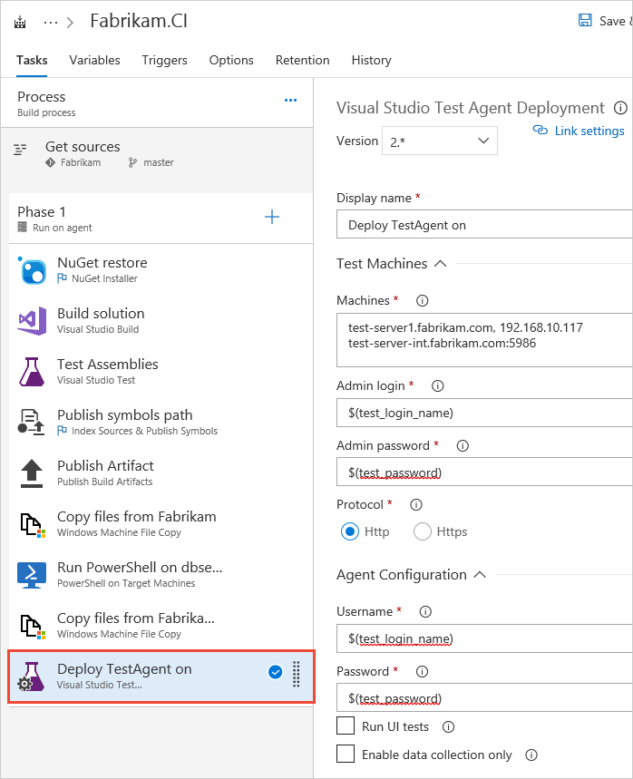
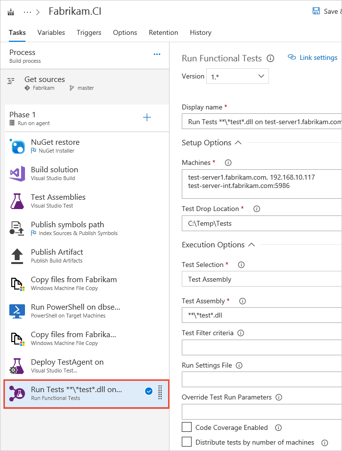

# Set up continuous testing for your builds

[!INCLUDE [version-header-ts-tfs](_shared/version-header-ts-tfs.md)]

Find problems early after changes are checked in and built by running continuous tests using Visual Studio Team Services (VSTS) or Team Foundation Server (TFS).

## Before you start

* [Create a build definition](../../build-release/overview.md) that builds your solution after each check-in, using continuous integration.

* [Set up environments](set-up-continuous-test-environments-builds.md) to run your app and tests remotely in a distributed environment after each build.

## Set up app deployment for your build

1. In VSTS or TFS, go to your team project.

1. Go to your build definition. Add steps to deploy your app for testing. For example, if you're testing a Visual Studio solution:

   

   

   

1. Add the details to copy your app from its drop location to its test environment:

   * Source folder for your app

   * List of machines where you want to deploy your app

   * Credentials to connect to the target machines  

   * Target folder where to put your app

   

   > If you use the list of machines in more than one task, consider defining
   a variable that contains the list of machines. For example, a
   [build or release definition variable](../../build-release/concepts/definitions/release/variables.md)
   or a variable defined within a project-wide 
   [variable group](../../build-release/concepts/library/variable-groups.md).
   Using a variable means that you can change the list of machines in one place
   and have the change apply to all the tasks that use the variable.

1. Add the details to deploy your app using PowerShell:

   * List of machines where you want to deploy your app

   * Credentials to connect to the target machines  

   * Path to the PowerShell script used to deploy your app

   

1. Save your build definition.

   

## Set up test deployment for your build

1. In your build definition, add a step with these details to deploy your tests:

   * Source folder for your tests

   * List of machines where you want to run your tests

   * Credentials to connect to the target machines  

   * Target folder where to put your tests

   

1. Add a step with these details to deploy the test agent for running your tests:

   * List of machines where you want to deploy the test agent

   * Credentials to connect to the target machines  

   * Credentials for the deployment agents, so the test agent can run in your test environment

   

1. Save your build definition.

   

## Set up your tests to run with your build

1. In your build definition, add a step with these details to run your tests with the test agent:

   * List of machines where you want to run your tests

   * Folder where you put your tests

   

1. Save your build definition and queue a build to check your test run.

   

1. After your build is done, [review your test results](review-continuous-test-results-after-build.md).

## See also

* [Set up environments for continuous testing with your builds](set-up-continuous-test-environments-builds.md)
* [Review continuous test results after a build](review-continuous-test-results-after-build.md)
* [Run tests with your builds](getting-started-with-continuous-testing.md)
* [End-to-end example of continuous testing](example-continuous-testing.md)
* [Speed up testing with Test Impact Analysis](test-impact-analysis.md)
* [Run tests in parallel](run-tests-in-parallel.md)

[!INCLUDE [help-and-support-footer](_shared/help-and-support-footer.md)] 
