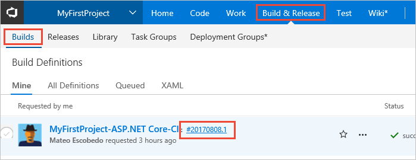
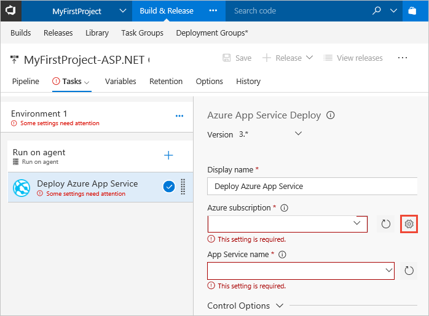
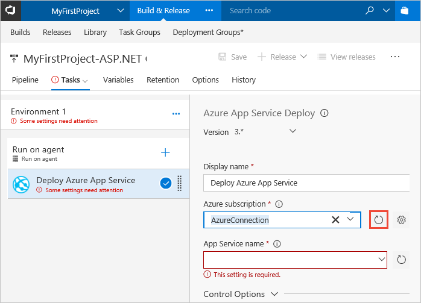
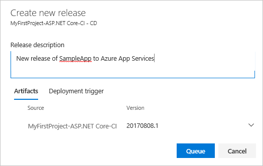
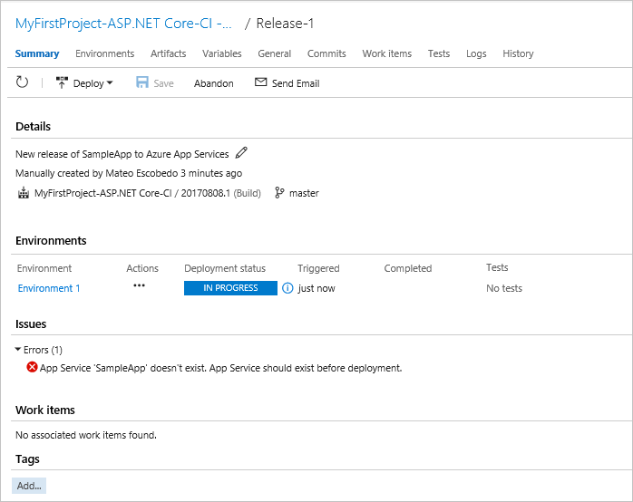
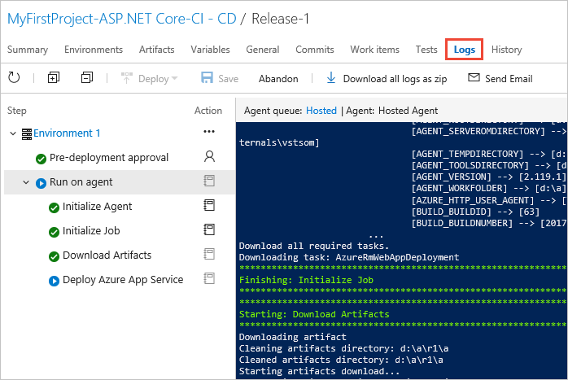

# Define your continuous deployment (CD) process

Visual Studio Team Services (VSTS) and Team Foundation Server (TFS) provide
a highly customizable continuous deployment service for managing the release
of your applications. Your release definition is where you specify the artifacts
to deploy, where and how they are deployed, the additional tasks you want to run
during the deployment, and other factors that influence the release process.

In this tutorial, you learn about:

> [!div class="checklist"]
> * Creating a release definition using a template
> * Configuring the tasks in your release definition
> * How triggers are used in a release definition
> * Creating a release from your release definition
> * Monitoring and reviewing the deployment of your release

<!--

[What's the difference between a release definition and a release?](../concepts/releases/index.md)

[!INCLUDE [build-prerequisites](_shared/build-prerequisites.md)]

This tutorial requires you to have already created a set of build artifacts from
a build definition. If you don't already have a build definition that creates a set of artifacts for your app,
work through the tutorial [Define your continuous integration (CI) build process](define-ci-build-process.md) first.

[!INCLUDE [create-azure-web-app-portal](../../deploy-azure/_shared/create-azure-web-app-portal.md)]

## Create a new release definition

1. Open the build summary from the **Builds** tab of the **Build &amp; Release** hub by choosing the build number.

   
 
1. Choose the **Release** icon to start creating a new release definition for the artifacts created by this build.

   

   [What other ways can I create a release definition?](../actions/work-with-release-definitions.md)

1.  Select the **Azure App Service Deployment** template and choose **Apply**

   

   If you don't see this template near the top of the list, use the **Search** box to find it.
 
1. In **Pipeline** tab, choose the **Continuous deployment trigger** icon (as shown below) to open the Continuous Delivery panel.
   Ensure that Continuous delivery is turned on so that a new release will be created when the source artifacts updated; for example, from a new build of the app.

   

   If you create a new release definition directly from the **Releases** page, instead of from a build summary, the Continuous deployment trigger will not be turned on automatically. 

5. Choose the pre-deployment conditions icon for the environment (as shown below) to open Pre-deployment conditions panel.
   Check that the trigger for deployments to this environment is set to **Release** so that deployment starts when a new
   release is created from this definition.

   

   Notice that you can configure a release to occur manually (when a user requests this) instead of automatically.
   You can also set up a schedule for creating deployments automatically on specific days and times, perhaps when the website is least busy.

   [Where can I learn more about release and environment triggers?](../concepts/definitions/release/triggers.md)

## Configure the tasks in the release definition

1. Open the **Tasks** tab of the release definition and select the **Deploy Azure App Service** task. 

1. In the settings panel for the task, select your Azure subscription in the drop-down list. If the list
   is empty, you must create a new connection. Start by choosing the "gear" icon next to the **Azure subscription** setting.

   

1. In the **Services** page that opens, select **Azure Resource Manager** from the **New Service Endpoint** list.
   Type a name for the connection and select your Visual Studio subscription from the list.

   

   If you have problems creating a connection, see [How to: Troubleshoot Azure Resource Manager service endpoints](../actions/azure-rm-endpoint.md).

1. Back in the release definition, choose the "refresh" icon next to the the **Azure subscription** setting.
   Wait a miinute or two for the list to be refreshed and then choose your new service connection. 

   

1. Wait for a minute or so while the list of App Services in your subscription is populated, then select 
   your App Services website in the **App Service name** list.

   

   Use the "refresh" icon if you don't see your website in the list.

1. Save the release definition.

   

   [Where can I learn more about adding tasks to a release definition?](../actions/work-with-release-definitions.md#define-processes)

## Create a release

1. Choose the **Release** icon and then choose **Create release**.

   

1. Enter a description for the release, check that the correct build artifacts version is selected, and choose **Queue**.

   

   If you have multiple builds of the artifacts, you can choose which version to deploy.  

1. Choose the release definition name in the information bar release message.

   
   
1. This opens the release summary page; you can see that the release in "in progress" to Environment 1.

   

   [What other ways can I create a release?](../actions/create-deploy-releases.md)

## Monitor and review the deployment

1. In the release summary page, open **Logs** tab and watch deployment of the release.

   

   You'll see a "waiting" message until an agent is available, then the live output from the agent, followed by display of the full log file. 

1. Open the **Summary** tab to see a summary view of the results for the release.
   The summary includes a list of environments in the release, and a list of work items that are associated with the current process.

1. Explore the other tab pages for the release, which show the commits, work items, and tests
   related to the release, and the history of this release. For more details, see
   [How to: View and manage releases](../actions/view-manage-releases.md).

   

-->
