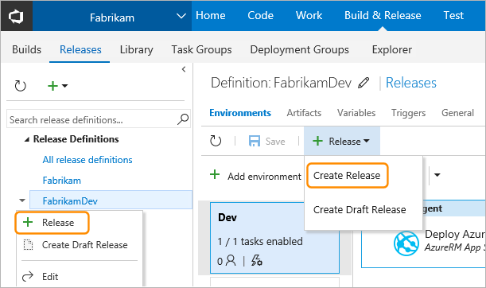
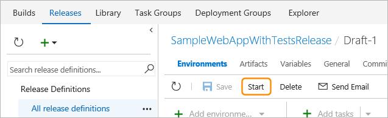
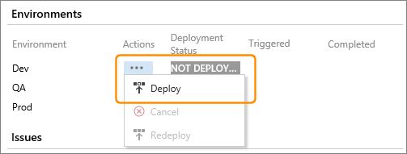

# How to: Create and deploy a release

[!INCLUDE [version-rm-dev14](../_shared/version-rm-dev14.md)]

You can create a [release](../concepts/releases/index.md) from the
[Releases](#create-from-release) tab, the [Builds](#create-from-build) tab, and as part of a 
[continuous deployment](../concepts/definitions/release/triggers.md) scenario.
You can also create a [draft](#create-draft) release. After you create a release,
you may need to [deploy](#deploy-command) (and redeploy) it manually.

<h2 id="create-from-release">Create a release from the Releases tab</h2>

1. In the list of releases for a definition, choose **Create Release**
   from the **Release** drop-down list. Or select the release definition in the left
   column list of release definitions, open the shortcut menu, and choose **Release**.   

   

   Alternatively, open the definition for editing. Then choose **Create Release**
   from the **Release** drop-down list, or open the shortcut menu for a release
   definition in the left column and choose **Release**.   

   

1. In the **Create new release for...** dialog, optionally enter a description
   for this release. Then select the version of the linked build artifacts
   you want to include in this release. If the version you want to use is not
   shown in the list, type the version number.

   

   For artifact sources of type Build, you must enter the **BuildId** value,
   not the **BuildNumber**. See [Artifact variables](../concepts/definitions/release/variables.md#artifact-variables).  

1. Specify the **Automated deployment** setting for each environment.
   The **Manual deployments** section lists the environments for which users
   will need to manually initiate deployment.

   

>Specifying manual deployment for an environment is one way to prevent a deployment
happening until you are sure it is ready to go. However, you can also use
approvals at intermediate stages to pause a release and allow
it to be cancelled before it reaches the target or final environment.
For more details, see [Approvals](../concepts/definitions/release/environments.md#approvals).

<h2 id="create-from-build">Create a release from the Builds tab</h2>

If you have not set the [continuous deployment trigger](../concepts/definitions/release/triggers.md),
or you have not defined a fully orchestrated pipeline for deploying the artifacts
specified in your releases, you will need to manually initiate the deployment
for some environments.

1. Open the **Builds** tab of the **Build & Release** hub and select a build result
   (not the build definition name).

   

1. In the build summary page, choose **Release**.

   

   Alternatively, if the build has not yet been deployed,
   choose the **Create release** link in the **Deployments** section.

   

1. In the **Create new release** dialog select the release definition to use
   be used with this build (one that is linked to this build definition),
   and the version of the build artifacts to deploy. Then specify the **Automated deployment** setting for each environment.

<h2 id="create-draft">Create a draft release</h2>

If you're editing a release definition and you want to test some
changes that are not yet ready for production, you can create a
draft release.

Make the changes you need (they don't affect the original
definition), save the draft definition, and start it.

<h2 id="deploy-command">Deploy a release</h2>

When you create a from a release definition, you can see the current
status of that release in the **Summary** view. In most cases, deployment
of the release to all environments may occur automatically through
[environment deployment triggers](../concepts/definitions/release/triggers.md#env-triggers).
However, where this is not the case (as described in [Releases](../concepts/releases/index.md)),
you must initiate deployment to environments manually. 

Start the deployment to any environments that have not been deployed
by opening the shortcut menu from the ellipses (**...**) in the **Actions**
column and choosing **Deploy**.

Alternatively, choose the environment you want to deploy to from the **Deploy**
drop-down list in the toolbar.  

>By selecting an environment that is not the final one, you can test the initial steps
and tasks in a release safe in the knowledge that it will stop before, for example,
deployment to a live production environment. You can also insert a _server phase_
into a release definition, and use it to enable manual intervention in a release pipeline.
For more details, see [Task phases](../concepts/process/phases.md).

## See also

* [Releases](../concepts/releases/index.md)

* [Work with release definitions](work-with-release-definitions.md)

* [View and manage releases](view-manage-releases.md)

* [Monitor releases and debug deployment issues](debug-deployment-issues.md)

## Q&A

<!-- BEGINSECTION class="md-qanda" -->

### How do I programmatically create a release definition?

[Release Management REST API](../../../integrate/api/rm/overview.md)

[!INCLUDE [qa-versions](../_shared/qa-versions.md)]

<!-- ENDSECTION -->

[!INCLUDE [rm-help-support-shared](../_shared/rm-help-support-shared.md)]
