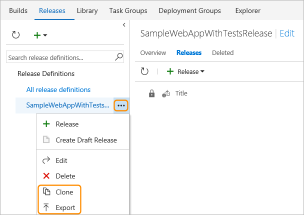
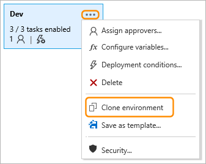
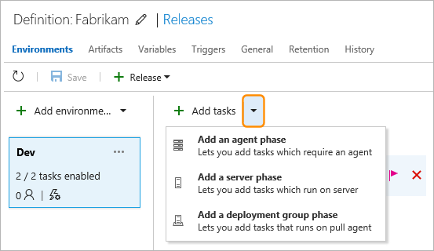

# How to: Work with release definitions

[!INCLUDE [version-rm-dev14](../_shared/version-rm-dev14.md)]

This topic shows you how to:

* **[Create a new release definition](#create-release-def)**
  - [from a template](#create-template)
  - [as an empty definition](#create-empty)
  - [add artifacts and triggers](#create-addartifacts)
  - [replicate a definition](#replicate-def)

* **[Create and use environment templates](#use-template)**
  - [add more environments](#add-envir)
  - [clone environments](#clone-environment)

* **[Define processes in an environment](#define-processes)**
  - [add tasks to an environment](#add-tasks)
  - [use task groups](#task-groups)

<h2 id="create-release-def">Create a new release definition</h2>

1. Open the **Build &amp; Release** hub and choose **Releases**.

1. Choose the **+** icon and select **Create release definition**.

   

### Select a template

If a template is relevant to your scenario, select it to
automatically add some tasks and apply typical settings.
For example, if you select the **Azure App Service Deployment**
template, you automatically get a task to deploy your app
to Azure App Services.

### Start with an empty definition

If there's no template for your scenario, select **Empty** and
then [add the tasks you need](#add-tasks).

### Specify the artifacts, deployment trigger, and queue

1. Choose the type of source for your [artifacts](../concepts/definitions/release/artifacts.md#sources),
   if appropriate, and specify the details such as the project and build definition.

1. If you want the release to start when a new build of the artifacts
   is available, set (tick) the **Continuous deployment...** checkbox.

1. Choose an [agent queue](../concepts/agents/pools-queues.md) if you don't want to use the **Hosted** queue.

### Replicate a definition

If your definition has a pattern that you want to replicate in other
definitions, clone it or export it.

When you clone a definition, the copy appears in your list of releases.
You can save it with a new name.

When you export a definition, you can import it afterwards. Then, if required, modify it and save it with a new name.

### Create and use a template

Create a template for a definition from an environment within the definition.

After you create a template, it appears in the **Custom** tab of the
**Create release definition** wizard. Your team members can use it to
follow the pattern in new definitions.
For more details, see [Environment templates in Release Management](../concepts/definitions/release/env-templates.md).

### Use the REST API

Create release definitions using the [Release Management REST API](../../../integrate/api/rm/overview.md).

### Add more environments

A release definition, by default, contains a single [environment](../concepts/definitions/release/environments.md).
Configure additional environments in a release definition to represent the
target server(s) or locations where you will deploy your app.

1. Open the **+ Add environment** list and choose **Create new environment**.

   

1. In the **Add new environment** dialog select a template for the new environment to automatically add
   appropriate tasks, or create an empty environment with no default tasks.  

1. Select the [pre-deployment approval](../concepts/definitions/release/environments.md#approvals),
   [trigger](../concepts/definitions/release/triggers.md#env-triggers), and
   [queue](../concepts/agents/pools-queues.md) settings for the new environment.
   You can quickly select users or groups as pre-deployment approvers
   by typing part of the name.

1. Choose **Create** and then edit the new environment name as required.

After you have created and configured your environments,
[add tasks to them](#add-tasks).

>You can add environments using the [Release Management REST API](../../../integrate/api/rm/overview.md).

<h3 id="clone-environment">Clone an environment</h3>

A release definition often contains several environments such as
development, testing, QA, and production. Typically, all of these
environments are fundamentally similar - and the techniques used to set up
and deploy to each one are the same with the exception of minor
differences in configuration for each environment and task (such as
target URLs, service paths, and server names).   

After you have added an environment to a release definition and configured
it by adding tasks and setting the properties for each one, clone
it to create another environment within the same definition.

Alternatively, select the environment you want to clone in
the environments column, open the **+ Add environment** list,
and choose **Clone selected environment**.

The cloned environment has the same tasks, task properties, and
configuration settings as the original.

The **Add new environment** dialog that opens lets you change the
[pre-deployment approval](../concepts/definitions/release/environments.md#approvals),
[trigger](../concepts/definitions/release/triggers.md#env-triggers), and
[queue](../concepts/agents/pools-queues.md) settings for the cloned environment.

<h2 id="define-processes">Define processes in an environment</h2>

The deployment steps in an [environment](../concepts/definitions/release/environments.md)
are described using [tasks](../concepts/process/tasks.md).

<h3 id="add-tasks">Add tasks</h3>

Select an environment in the definition and choose **+ Add tasks**. By default,
the task selector shows tasks generally used in a release definition.
More tasks are available in the other tabs of the **Task catalog** dialog.
A link at the bottom of the list takes you to
[Visual Studio Marketplace](https://marketplace.visualstudio.com/VSTS)
where you can download and install additional tasks.

You can add tasks specifically for execution on the release agent,
on the server, or on a deployment group.

For more details, see [Environments](../concepts/definitions/release/environments.md)
and [Phases in Build and Release Management](../concepts/process/phases.md).

>You can add tasks to an environment using the
[Release Management REST API](../../../integrate/api/rm/overview.md).

<h3 id="task-groups">Use task groups</h3>

A *task group* lets you to encapsulate a sequence of tasks already defined
in a build or a release definition into a single reusable task that can be
added to a build or release definition just like any other task. You can
choose to extract the parameters from the encapsulated tasks as configuration
variables, and abstract the rest of the task information.

For more details, see [Task groups](../concepts/library/task-groups.md).

## Next

* [Releases](../concepts/releases/index.md)

* [Create and deploy a release from a release definition](create-deploy-releases.md)

* [View and manage releases](view-manage-releases.md)

* [Monitor releases and debug deployment issues](debug-deployment-issues.md)

* [Configure your release pipelines for safe deployments](https://blogs.msdn.microsoft.com/visualstudioalm/2017/04/24/configuring-your-release-pipelines-for-safe-deployments/)

<h2 id="concepts">Release definition concepts</h2>

A [release definition](../concepts/definitions/release/index.md)
contains all the tasks and settings used to create a release and
deployment to your target machines. To learn more about release
definition settings, see:

* [General settings](../concepts/definitions/release/index.md)

* [Phases](../concepts/process/phases.md)

* [Tasks](../concepts/process/tasks.md)

* [Triggers](../concepts/definitions/release/triggers.md)

* [Approvals](../concepts/definitions/release/environments.md#approvals)

* [Variables](../concepts/definitions/release/variables.md)

* [Retention](../concepts/policies/retention.md)

* [Releases](../concepts/releases/index.md)

## Q&A

<!-- BEGINSECTION class="md-qanda" -->

### Where can I learn step-by-step how to build and release my app?

[Examples](../apps/index.md)

### How do I programmatically create a release definition?

[Release Management REST API](../../../integrate/api/rm/overview.md)

[!INCLUDE [qa-agents](../_shared/qa-agents.md)]

[!INCLUDE [qa-versions](../_shared/qa-versions.md)]

<!-- ENDSECTION -->

[!INCLUDE [rm-help-support-shared](../_shared/rm-help-support-shared.md)]
