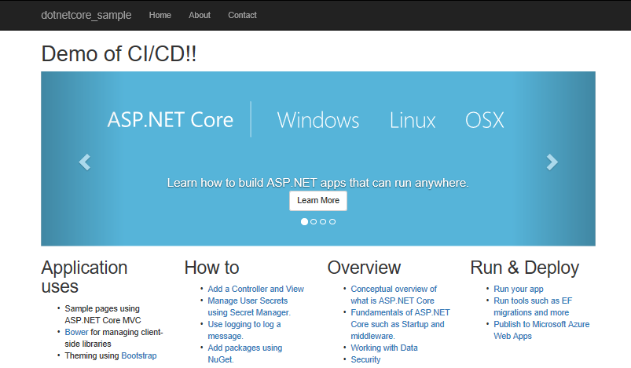
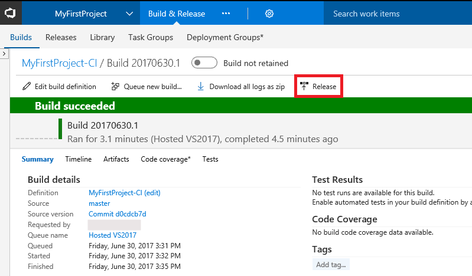

# Implement CI/CD to build and deploy your ASP.NET Core app to an Azure Windows VM

Visual Studio Team Services (VSTS) provides a highly customizable continuous integration (CI) and continuous deployment (CD) pipeline for your ASP.NET Core apps. This quickstart shows how to set up CI and CD to deploy an ASP.NET Core application to a Windows virtual machine (VM) in Azure. You'll create a VM using Azure Powershell, and then you'll set up CI/CD in VSTS. In the CI process, you'll build the app using MSBuild and run tests using VSTest.

_TODO: work with artist to adapt diagram to this scenario_


With your CI/CD processes in place, you'll push a change into your team's git repo and the results will automatically show up on your site.



[!INCLUDE [include](_shared/prerequisites.md)]
* On your dev machine, you need Azure PowerShell module version 4.0 or newer. See [Install and configure Azure PowerShell](https://docs.microsoft.com/en-us/powershell/azure/install-azurerm-ps?view=azurermps-4.2.0).

[!INCLUDE [temp](_shared/create-azure-windows-vm.md)]

## Install the .NET Core Windows Server Hosting bundle

Running an ASP.NET Core app on Windows requires some dependencies.

On your Windows VM, install the [.NET Core Windows Server Hosting](https://go.microsoft.com/fwlink/?linkid=848766) bundle. The bundle will install the .NET Core Runtime, .NET Core Library, and the [ASP.NET Core Module](https://docs.microsoft.com/en-us/powershell/azure/install-azurerm-ps). The module creates the reverse-proxy between IIS and the Kestrel server.

To effect a change to the system PATH, run the following commands.

```cmd
net stop was /y
```

```
net start w3svc
```

[!INCLUDE [temp](_shared/create-deployment-group.md)]

[!INCLUDE [temp](_shared/import-code-aspnet-core.md)]

[!INCLUDE [temp](_shared/set-up-ci-1.md)]

In the right panel, select **ASP.NET Core**, and then click **Apply**.


[!INCLUDE [temp](_shared/set-up-ci-2.md)]

[!INCLUDE [temp](_shared/set-up-ci-3.md)]

[!INCLUDE [temp](_shared/set-up-cd-1.md)]



In the dialog that prompts to **Create release definition**, select **Yes**.

In the **Create release definition** wizard, select the **IIS Website and SQL Database deployment** template, and click **Apply**.


Click **Tasks**, and then select the **SQL Deployment** phase. Click 'X' to delete this phase. We won't be deploying a database in this quickstart.

Select **IIS Deployment** phase. For the **Deployment Group**, select the deployment group you created earlier, such as *myIIS*. In the **Machine tags** box, select **Add** and choose the *Web* tag.

Select the **IIS Web App Manage** task; click 'X' to delete this task. We will not create a new website for this quickstart. Instead, we will deploy to the **default web site**.

Select the **IIS Web App Deploy** task to configure your IIS instance settings as follows. For **Website Name**, enter *default web site*. Leave all the other default settings.


[!INCLUDE [temp](_shared/set-up-cd-3.md)]

## Update to redeploy the code

Navigate to the **Code** hub in the VSTS portal. Navigate to **Views/Home/Index.cshtml** file. Make the following simple change to that file by selecting the edit action.


Add the following line of text above the carousel display in the page:
```
<h1>Demo of ASP.NET Core CI/CD!!</h1>
```

Commit your changes in Git. This change triggers a CI build, and when the build completes, it triggers an automatic deployment to Azure web app.

## Browse to the app

Once deployment has completed, open the browser and test your web app.

```bash
http://<publicIpAddress>
```

**Congratulations!** You've deployed changes to your application using CI/CD.

## Clean up resources

After you're done with the VM, run the following command to remove the resource group, the VM, and all other related resources.

```ps
Remove-AzureRmResourceGroup -Name myResourceGroup
```