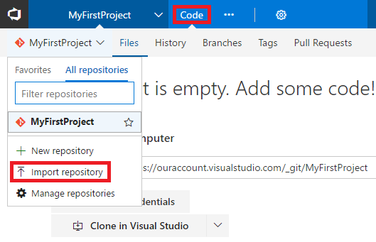
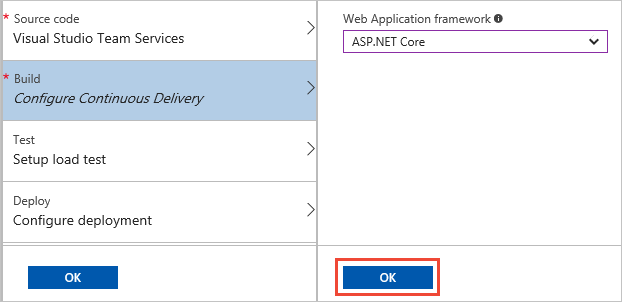
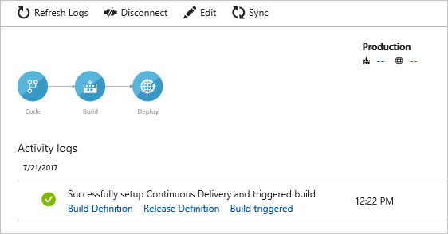
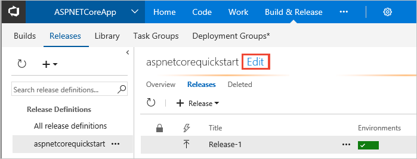
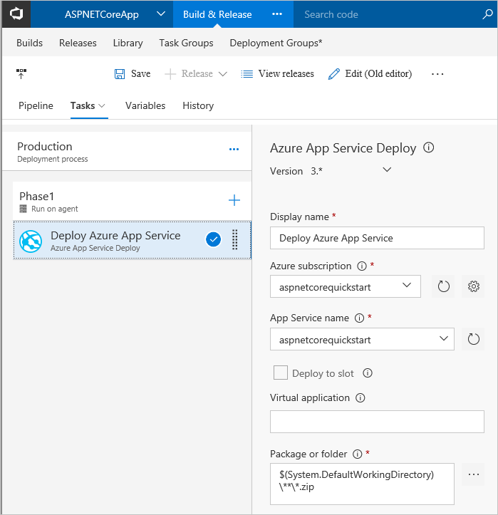
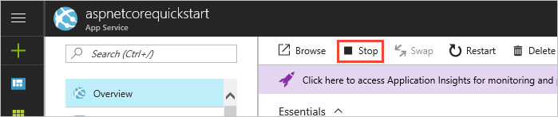
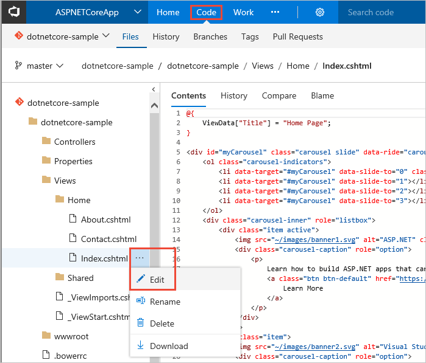
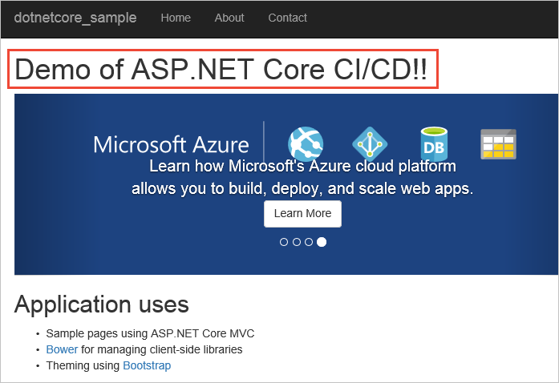

# CI/CD of ASP.NET Core app to Azure web app

Visual Studio Team Services (VSTS) provides a highly customizable continuous integration (CI) and continuous deployment (CD) pipeline for your
ASP.NET Core apps. This quickstart shows how to set up CI and CD to deploy an ASP.NET Core application to an Azure web app.
You will use the Azure portal to configure a basic CI/CD pipeline. You will then use the VSTS portal to view and extend the CI/CD pipeline.

_TODO: Architecture diagram_

## Prerequisites

Before you begin, make sure that you:

* Have an Azure subscription with a web app. If you don't have an Azure subscription, you can [create one for free](https://azure.microsoft.com/free/?WT.mc_id=A261C142F). If you are new to Azure or need to create a web app, see [Web Apps Documentation](https://docs.microsoft.com/azure/app-service-web/).

* Are an administrator of the VSTS account. If you don't have a VSTS account, you can [create one for free](https://go.microsoft.com/fwlink/?LinkId=307137). If you are new to VSTS or Git, see [Create a team project](https://www.visualstudio.com/docs/setup-admin/create-team-project) to create your first team project and learn about Git.

_TODO: in following shared section: Indicate that you can skip this section if you've already got a web app. Replace screenshots light theme._

[!INCLUDE [create-azure-web-app](_shared/create-azure-web-app.md)]

## Import sample code into VSTS

VSTS is a full-featured Git server for hosting your source code.

If you already have an ASP.NET Core application checked into your VSTS Git repository, you can use that for this quickstart, so long as your app does not depend on a database. To learn how to deploy your app with a database, see _TODO: link_.

If you need a simple app to try this quickstart, you can import our sample app into your VSTS repo:

1. Sign in to VSTS and navigate to the **Code** hub for your VSTS project. Select the option to **Import repository**.

 

1. In the **Import a Git repository** dialog, paste the following for **Clone URL**.

  ```
  https://github.com/adventworks/dotnetcore-sample
  ```

1. Choose **Import** to copy the sample app code into your Team Services Git repository.

## Configure continuous delivery

1. Log into the Azure portal and open the web app's blade. Choose **Continuous Delivery** and then choose **Configure**.

   

1. Select **Choose repository** and select **Visual Studio Team Services** for the code repository. Select the project, repository, and branch into which your imported the sample code. When you're done, choose **OK**.
 
   

1. Select **Configure Continuous Delivery** and choose **ASP.NET Core**. When you're done, choose **OK**.

   

1. Skip the other two steps - **Test** and **Deploy** - and choose **OK** to complete the configuration of continuous delivery.

   

1. When you choose **OK**, Azure Continuous Delivery configures and kicks off a build and deployment in VSTS.
   When the build completes, the deployment is automatically initiated. You can see this happening in the logs blade.  

   

1. After a while, the deployment is completed. Choose **Refresh Logs** to see this in the **Activity Log**.

   

1. Open the **Overview** blade and choose the URL link for the web app.

   

1. Browse your new web app.

   

## Review the pipeline in VSTS

1. In the "Successfully set up Continuous Delivery..." blade, choose the **Build Definition**
  link.

   

1. This opens the VSTS portal and takes you to the build definition summary. A **build definition** is a concept in VSTS that defines the CI process. The build definition summary shows recent builds that have been completed or that are in progress. Choose **Edit** to see how the CI process is defined.

   

1. A build definition consists of tasks that should be run as part of a build. When you configured the CI/CD from Azure Continuous Delivery, a number of tasks have been added to the build definition. These tasks automate the compilation and testing of your ASP.NET Core application. You will also notice that the parameters for each of these tasks have been populated for you.

   

1. Back in the Azure portal, in the "Successfully set up Continuous Delivery..." blade, choose the **Release Definition** link.

  

1. This opens the VSTS portal again and takes you to the summary of releases. A **release definition** is a concept in VSTS that defines the CD process. The release definition summary shows recent releases that have been completed or that are in progress. Choose **Edit** to see how the CD process is defined.

   

1. A release definition consists of a pipeline of one or more environments, and each environment defines a set of tasks that automate deployment.
   When you configured the CI/CD from Azure Continuous Delivery, a simple release definition with a single environment named **Production** has been set up for you automatically.
   Choose this environment from the **Tasks** drop-down list.

   

1.  This environment consists of a single task for deploying the Azure web app.

   

1. You can modify the parameters or add additional tasks to both the build and release definition to meet the CI/CD needs of your application. You can also extend the release definition to include multiple stages. For more information about how to extend the CI/CD pipeline, see the tutorials on **Create a build definition** and **Create a release definition**.

## Update to redeploy the code

Now that you have a completely automated CI/CD pipeline, any changes you make to the application are automatically built and deployed by VSTS. To try this, make a change to the app and commit that change to the Git repository.

You can use Visual Studio to connect and push commits up to to your VSTS Git repo. (See [Share code with push](https://www.visualstudio.com/docs/git/tutorial/pushing).) However, VSTS also features a web-based editor to so that you can quickly commit small changes to source code directly in your browser.

1. In the **Overview** blade of your web app in the Azure portal, choose **Stop** to allow the files to be released for updating the app.

   

1. Navigate to the **Code** hub in the VSTS portal. Change the code in **Views/Home/Index.cshtml** file by selecting the **Edit** action.

   

1. Add the following line of text above the carousel display in the page:

   ```
   <h1>Demo of ASP.NET Core CI/CD!!</h1>
   ```

   

1. Commit your changes in Git. This change triggers a CI build, and when the build completes, it triggers an automatic deployment to Azure web app.

   

1. Wait a few minutes and then, in the **Overview** blade of your web app in the Azure portal, choose **Start**.

   

1. navigate to the web app URL in a browser to see the change deployed.

   
