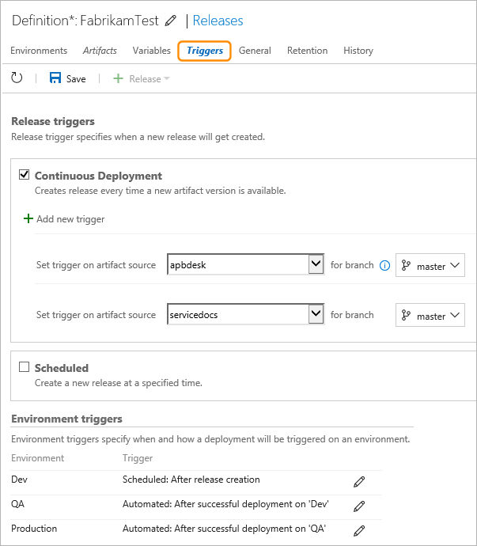

# Triggers in Release Management

[!INCLUDE [version-rm-dev14](../../../_shared/version-rm-dev14.md)]

You can configure when releases should be created, and when those releases should be deployed to environments. The former is configured through **release triggers**, and the latter through **environment triggers** - both in a release definition.

<h2 id="release-triggers">Release triggers</h2>

Release triggers are configured in the **Triggers** tab of the release definition.

You can choose to create releases for a release definition
manually. With this choice, you use the **Release** icon in a release
definition or from a build summary to create a new release.

However, if you specify [certain types](artifacts.md#sources) of
artifacts in a release definition, you can enable **Continuous deployment**.
This setting instructs Release Management to create
new releases automatically when it detects new artifacts
are available. At present this option is available only for Team Foundation Build artifacts
and Git-based sources such as Team Foundation Git, GitHub, and other Git repositories.

If you have linked multiple Team Foundation Build artifacts to a release definition,
you can configure continuous deployment for each of them.
In other words, you can choose to have a release created automatically when a new build
of any of those artifacts is produced. You can further choose to create the release only
when the build is produced by compiling code from certain **branches**
(only applicable when the code is in a Team Services or a TFS Git repository)
or when the build has certain **tags**.

You can also choose to have a release created automatically based on a **schedule**. When you select this option,
you can select the days of the week and the time of day that
Release Management will automatically create a new release. You can configure multiple schedules as required.

> With scheduled triggers, a new release is created even if a newer version of artifact is not available since the last release.

You can also combine the two automated settings and have releases created automatically either when a new build is available or according to a schedule.

> **TFS 2015**: The following features are _not_ available in TFS 2015 -
continuous deployment triggers for multiple artifact sources,
multiple scheduled triggers,
combining scheduled and continuous deployment triggers in the same definition,
continuous deployment based on the branch or tag of a build.

Even though a release is automatically created, it
**might not be deployed automatically** to an environment. The
[environment triggers](#env-triggers) govern when and if a release should be deployed to an environment.

<h2 id="env-triggers">Environment triggers</h2>

You configure the triggers for an environment on the
**Deployment conditions** tab of an environment.

Triggers are configured for each environment,
but the combination of these allows you to orchestrate
the overall deployment - such as the sequence in which automated
deployments occur across all the environments in a release
definition. For example, you can set up a linear pipeline where
a release is deployed first to the **Dev** environment,
then to the **QA** environment and finally, if the
deployment to **QA** succeeds, to the **Prod** environment.

Alternatively, you can set up a release process where a build is
deployed to a number of **QA** environments in parallel as
soon as it completes, but the release to the **Prod**
environment must always be deployed manually by
selecting a successful release and promoting it.

The **Trigger** settings are:

* **No automated deployment**: Releases are
  not automatically deployed to this environment. To
  deploy a release to this environment, you must manually
  select the **Deploy** action when a new release is created.
  This is the default setting.

* **After release creation**: The release will be deployed
  to this environment as soon as it is created, due either
  to a user action (such as manually starting a new release from the UI)
  or because a [continuous deployment trigger](#release-triggers)
  is configured for this release definition. For example,
  if you have checked the continuous deployment trigger option
  for a release definition and selected a specific build artifact,
  the deployment to this environment will start automatically
  when the output from a new build is available. If you want the
  release to be deployed only at a specific time on specific days,
  set the **Scheduled** option and select the appropriate
  values in the controls that appear. For example, you can specify
  that, after creation, a release will be deployed only on a weekday
  at 3:00 AM in a specific time zone.

* **After successful deployment**: Use this setting if you
  want the release to be first deployed and validated in
  another environment(s) before it is deployed to this environment.
  For example, you can set up a linear pipeline of
  deployment through **Dev**, **QA**, and **Prod**
  environments by setting the trigger on the **Dev**
  environment to **After release creation**, the trigger
  on the **QA** environment to **After successful
  deployment** to the **Dev** environment, and the trigger
  on the **Prod** environment to **After
  successful deployment** to the **QA** environment.
  You must have at least two environments configured in
  the release definition to enable this option, and - when
  you select it - a list of the other environments is shown
  where you can select the **Triggering environment**.

  As with the **After release creation** option,
  you can set the **Scheduled** checkbox and specify a specific
  time on specific days when the release will be deployed.

In addition, when you define a trigger, you can specify whether
the deployment to this environment should occur
even if the deployment to the previous environment(s) is partially
successful. A set of tasks running in the environment may
not all succeed, resulting in a "Partially succeeded" deployment
and - by default - the subsequent deployment will not be triggered.
Set the **Also trigger for partially succeeded deployment(s)**
checkbox if you want deployment to be triggered for this
environment. Note that a "Failed" deployment to the previous environment
will not trigger a deployment, even if this option is set.   

Release Management also supports the use of artifact filters for
each environment. This means you can specify the releases that will
be deployed to each environment when the deployment trigger conditions
(such as a build succeeding and creating a new release) are met.
In the **Trigger** section of the environment **Deployment conditions**
dialog, select the artifact conditions such as the source branch and
tags for builds that will trigger a new deployment to that environment.

### Parallel forked and joined deployments

The **Triggering environment** list lets you select
more than one environment. This allows you to
configure parallel (_forked_ and _joined_) deployment
pipelines where the deployment to an environment occurs
only when deployment to **all** the selected
environments succeeds.

For example, the following schematic shows a pipeline
where deployment occurs in parallel to the **QA** and
**Pre-prod** environments after deployment to the **Dev**
environment succeeds. However, deployment to the
**Production** environment occurs only after successful
deployment to both the **QA** and **Pre-prod** environments.

In combination with the ability to define
[pre- and post-deployment approvals](environments.md#approvals),
this capability enables the configuration of complex
and fully managed deployment pipelines to suit
almost any release scenario.  

>Note that you can always deploy a release directly to any of the
environments in your release definition by selecting the
**Deploy** action when you create a new release. In this case, the
environment triggers you configure, such as a trigger
on successful deployment to another environment, do not
apply. The deployment occurs irrespective of these settings.
This gives you the ability to override the release
process. Performing such direct deployments requires
the **Manage deployments** permission, which should
only be given to selected and approved users.

Users with permission to edit release definitions can also
configure environment deployment triggers in the
**Triggers** tab of a release definition.

> **TFS 2015**: The following environment trigger features are _not_ available in TFS 2015 - parallel fork and joined deployments,
and scheduling options within environment triggers.

[!INCLUDE [rm-help-support-shared](../../../_shared/rm-help-support-shared.md)]
