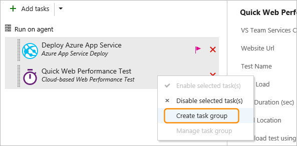
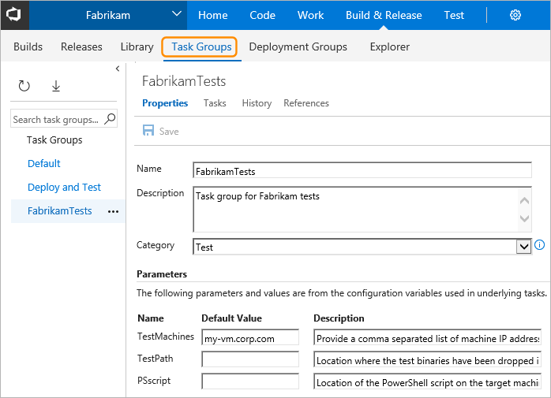

# Task Groups

**TFS 2017 | Team Services**

A *task group* lets you to encapsulate a sequence of tasks already defined
in a build or a release definition into a single reusable task that can be
added to a build or release definition, just like any other task. You can
choose to extract the parameters from the encapsulated tasks as configuration
variables, and abstract the rest of the task information.

The new task group is automatically added to the task catalogue, ready to add
to other release and build definitions. Task groups are stored at project level,
and are not accessible outside the project scope.

Task groups are a way to standardize and centrally manage deployment steps for all your applications. 
When you include a task group in your definitions, and then make a change centrally to the task group,
the change is automatically reflected in all the definitions that use the task group. There is no need
to change each one individually.

Create a task group by selecting a sequence of tasks in a build or release definition, 
and saving that sequence as a task group. 

However, before you do that, consider the following
pointers to help you achieve the desired behavior:

* Ensure that all of the tasks you want to include in a task group have
  their parameters defined as variables,
  such as **$(MyVariable)**, where you want to be able to configure these parameters
  when you use the task group. Variables used in the tasks are automatically extracted and converted into parameters for the task group.
  Values of these configuration variables will be converted into default values for the task group.

* If you specify a value (instead of a variable) for a parameter, that
  value becomes a fixed parameter value and cannot be exposed as a parameter to the task group.
  
* Parameters of the encapsulated tasks for which
  you specified a value (instead of a variable), or you didn't provide
  a value for, are not configurable in the task group when added to a build
  or release definition.

* When you save the task group, you can provide a name and a description for the
  new task group, and select a category where you want it to appear in the
  **Task catalog** dialog. You can also change the default values for each of the parameters.

* When you queue a build or a deployment, the encapsulated tasks
  are extracted and the values you entered for the task group parameters are applied to the tasks.

All the task groups you create in the current project are listed in
the **Task groups** tab of the **Build & Release** hub.

* In the **Properties** page you can edit details of the task group, and change
  the default values and descriptions for the parameters.

* In the **Tasks** page you can edit the tasks that make up the task group.
  For each encapsulated task you can change the parameter values for the
  non-variable parameters, edit the existing parameter variables,
  or convert parameter values to and from variables.

* In the **History** tab you can see the history of changes to the group.

>The changes you make are reflected in every instance of the task group.

## Related topics

* [Tasks](../process/tasks.md)
* [Task phases](../process/phases.md)

[!INCLUDE [rm-help-support-shared](../../_shared/rm-help-support-shared.md)]
