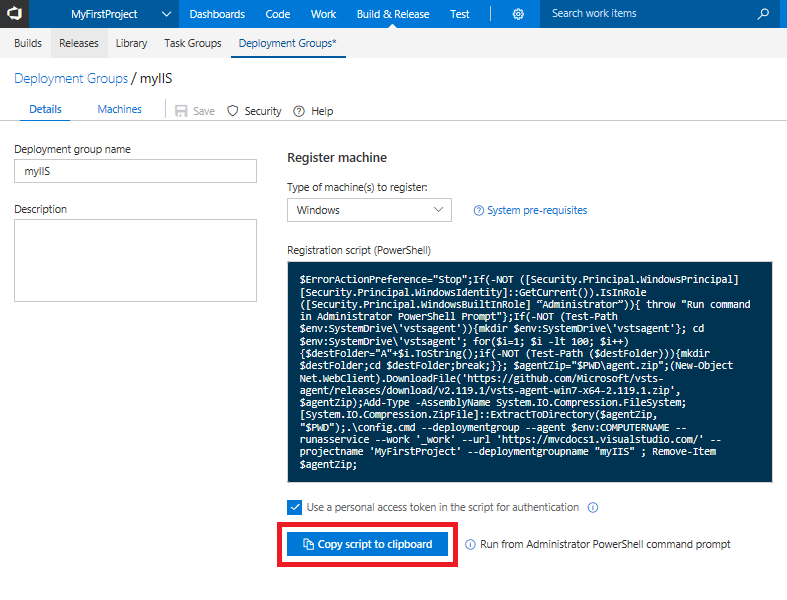

## Create deployment group

To publish the web deploy package to the IIS server, you define a deployment group in Team Services. This group allows you to specify which servers are the target of new builds as you commit code to Team Services and builds are completed.

In the Team Services **Build & Release** hub click **Deployment groups**. Click **Add Deployment group**. Enter a name for the group, such as *myIIS*, then select **Create**.

In the **Register machine** section, make sure *Windows* is selected, then check the box to **Use a personal access token in the script for authentication**. Click **Copy script to clipboard**.

Team Services generates a script that downloads and configures an agent on the VM that receives new web deploy packages then applies it to IIS.

Back in the **Administrator PowerShell** session on your VM, paste and run the script copied from Team Services. When prompted to configure tags for the agent, choose *Y* and enter *web*. When prompted for the user account, press *Return* to accept the defaults.

Wait for the script to finish with a message *Service vstsagent.account.computername started successfully*.

In the **Deployment groups** page of the **Build & Release** menu, open the *myIIS* deployment group. On the **Machines** tab, verify that your VM is listed.

