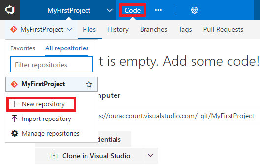

## Import sample code into your Team Services Git repo

In the VSTS portal, navigate to the **Code** hub for your new VSTS project. Click the default repository and then click **Import repository**.

On the **Import a Git repository** dialog box, paste the following for **Clone URL**.
