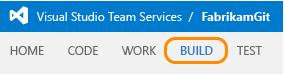
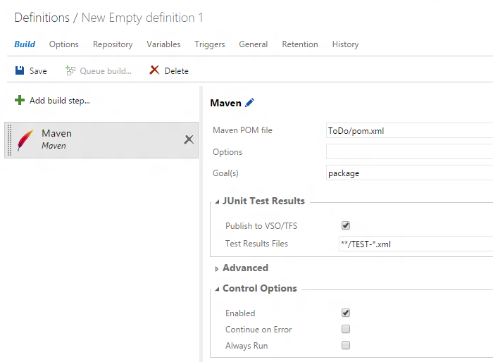
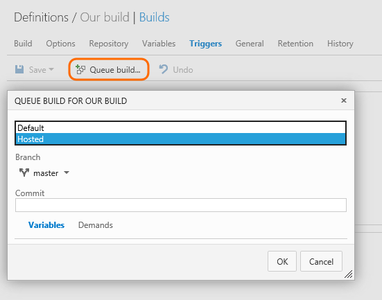

# Build your Java app with Maven

[!INCLUDE [temp](../_shared/version.md)]

After you've deployed an [agent](../concepts/agents/agents.md), you are ready to define a CI build that compiles your Java app with Maven whenever your team checks in code.

## Upload your code

If you haven't already, upload your code to [GIT](../../git/share-your-code-in-git-eclipse.md) or [TFVC](../../tfvc/share-your-code-in-tfvc-eclipse.md).

[!INCLUDE [temp](../apps/_shared/java-web-app-sample-link.md)]

## Create the definition

0. Create the build definition.

 

 

0. Specify the code you want to build and select the continuous integration (CI) trigger.

 

0. If your project builds with Maven, add the Maven build step. Otherwise add the build step your team uses.

 

 

0. Provide the path to your Maven POM file.

 

0. Select the continuous integration (CI) trigger and specify the code you want to build.

 

0. Save the definition.

 

 

0. Queue your new definition to make sure it works.

 

 

Your team now has a CI build to validate every change checked into your codebase!

## Q&A

<!-- BEGINSECTION class="md-qanda" -->

[!INCLUDE [temp](../apps/_shared/java-web-app-sample-qa.md)]

### Can I deploy my app to Azure?

[Deploy Java to Azure](../apps/java/maven-to-azure.md)

[!INCLUDE [temp](../_shared/qa-definition-common-all-platforms.md)]

[!INCLUDE [temp](../_shared/qa-agents.md)]

[!INCLUDE [temp](../_shared/qa-versions.md)]

<!-- ENDSECTION -->
