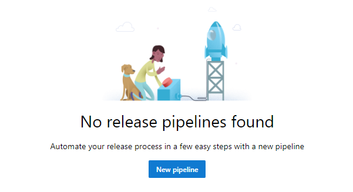
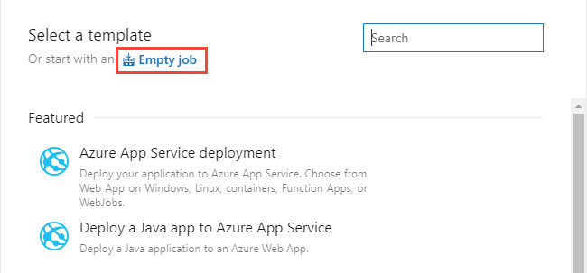
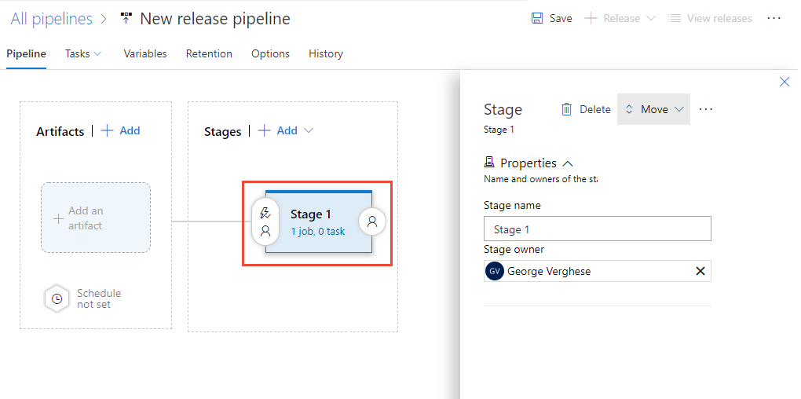
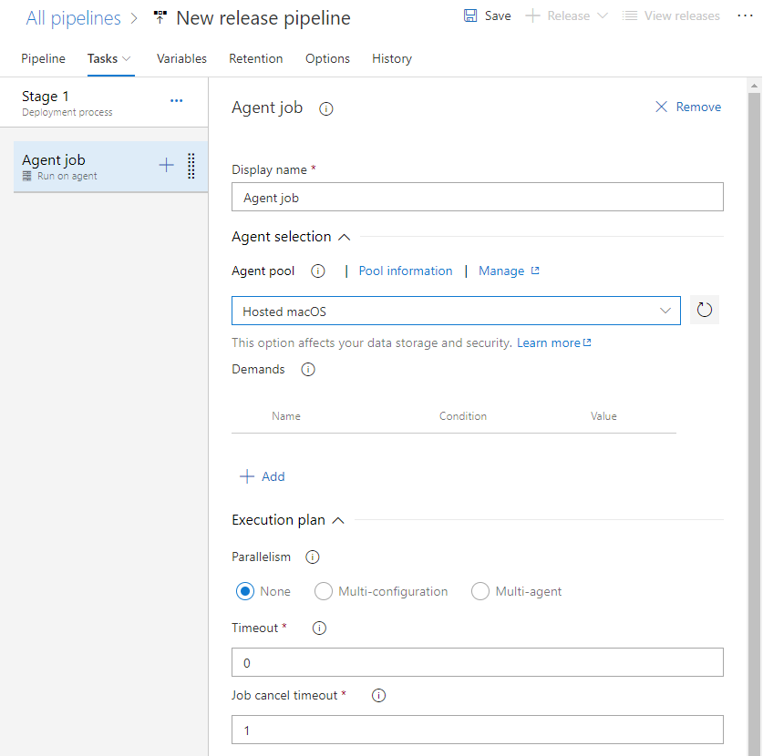
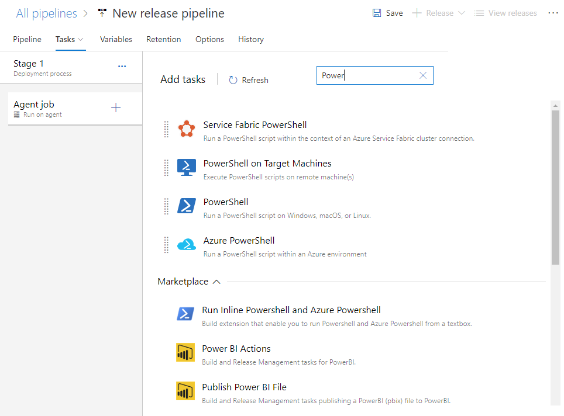
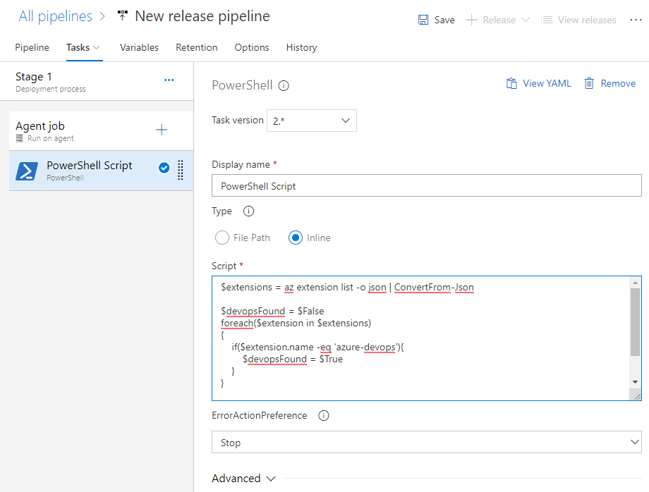

# Azure DevOps CLI in a release pipeline

<!--- QUESTION: Are there any prerequisites or Features that need to be enabled for this flow to be valid? --> 

To use the Azure DevOps CLI in a hosted agent using a Release Pipeline, execute the following steps:

1. Create a release pipeline.

	> [!div class="mx-imgBorder"]  
	> 

2. Choose **Empty job**.

	> [!div class="mx-imgBorder"]  
	> 

3. Choose Stage 1 to configure the stage.

	> [!div class="mx-imgBorder"]  
	> 

4. Choose the **Tasks** page, and configure the job to use Hosted Mac OS in Agent Pools.

	> [!div class="mx-imgBorder"]  
	> 

5. Choose the  plus icon to add another task and configure it as a PowerShell task. Enter *Power* into the search box to filter the list.

	> [!div class="mx-imgBorder"]  
	> 

6. Add the script, either via file or inline. For the example, the script has been included inline.

	> [!div class="mx-imgBorder"]  
	> 

For reference, here is the inline script:

> [!div class="tabbedCodeSnippets"]
```powershell
$extensions = az extension list -o json | ConvertFrom-Json

$devopsFound = $False
foreach($extension in $extensions)
{
    if($extension.name -eq 'azure-devops'){
        $devopsFound = $True
    }
}

if ($devopsFound -eq $False){
    az extension add -n azure-devops
}
```

