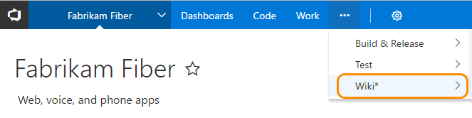
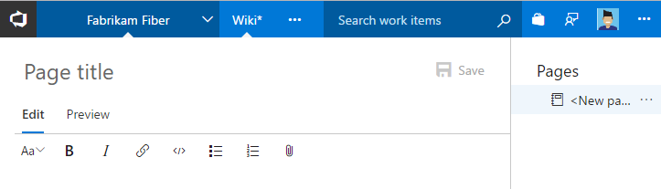
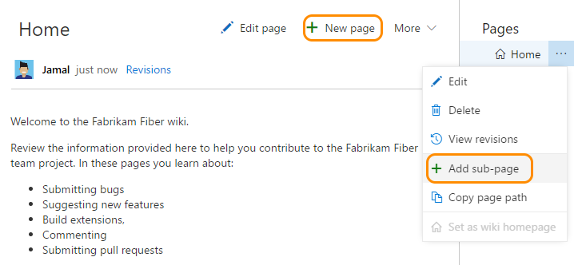
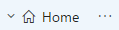
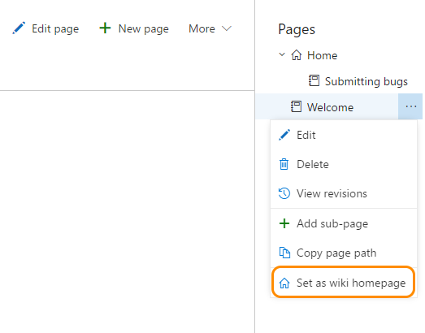
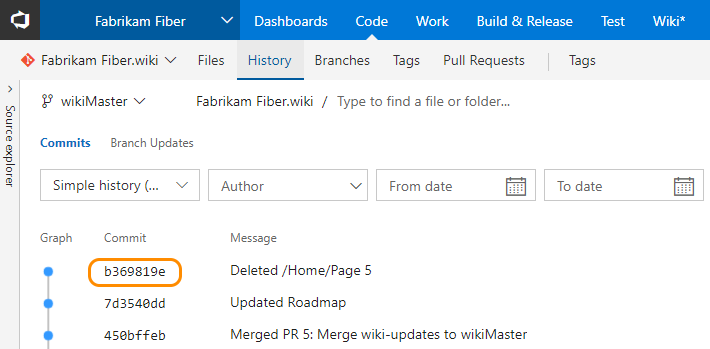

# Add and edit pages in your team project wiki 

**VSTS | TFS 2018**

>[!NOTE]  
><b>Feature availability: </b>The built-in wiki is in Preview and available for VSTS at this time. You enable this feature for a team project from the [Preview features option from your profile menu](preview-features.md#account-level).   
>
>If you were using the Wiki Marketplace extension, you can [migrate your existing pages to the new team project wiki](migrate-extension-wiki-pages.md).  

Each team project has a wiki associated with it. Use it to share information with your team members and stakeholders to understand, use, and contribute to your project. 

Learn how to: 

<!--- [!div class="checklist"] -->

 Create your first wiki page  
 Add, edit, delete, and reorder pages    
 Recover deleted pages   
 Change the page referenced as the wiki home page  
 Review a wiki page revision history     
 Filter wiki pages   
 Edit wiki pages offline   

## Create your wiki and first wiki page    

1. Enable the Wiki by clicking your profile menu and choosing **Preview Features**. Select the team project and then turn on the Wiki feature.

	 
 
2.  To create your first wiki, open your web portal and click **Wiki** in the top row (click ... if it doesn't show). You need to be a member of the Contributors group to add and edit the wiki.  

	  

3.	Click **Create Wiki** to provision a new git repository that will store all your wiki pages and related artifacts. The repository is automatically labeled *TeamProjectName.wiki*.

	  

	>[!NOTE]  
	>The *TeamProjectName.wiki* doesn't appear in the dropdown menu of repositories in the **Code** hub, nor in the list provided in the team project administration context, **Version Control** page.  
	> 
	> However, you can navigate to it from the URL `https://<AccountName>.visualstudio.com/DefaultCollection/_git/<TeamProjectName>.wiki`. 

4.	A new page opens in which you can specify a title and add content. You author pages using [markdown format](../collaborate/markdown-guidance.md). Also, you can use the format pane for rich-text formatting and to insert images, attachments, and links as well as add rich formatted text.  

	 

5.	To validate your changes, click **Preview**.  When you're finished with your edits, click  **Save**. 

## Add, edit, delete, and reorder wiki pages

To add another page, click **New page**, or you can add a subpage by opening the context menu of an existing page and clicking **Add sub-page**.

You must specify a unique title of 235 characters or less. Page titles are case sensitive. For other title restrictions, see [Page title naming restrictions](#page-title-names). 

> [!NOTE]  
> Each new page you add is added to the root of your current hierarchy context. Each sub-page you add is added within the folder labeled the same as the parent topic.   

 

 
 
### Edit and delete wiki pages

To edit an existing Wiki page, open the page and click **Edit page**, or open it's context menu and click **Edit**. 

To delete a page, open it's context menu from the tree view of pages and click **Delete**.  Confirm the delete in the dialog box that opens. 

### Reorder a wiki page 
You can reorder pages within the wiki tree view to have pages appear in the order and hierarchy you want. You can drag-and-drop a page title in the tree view to perform these operations: 
- Change the parent-child relationship of a page
- Change the order of the page within the hierarchy

> [!NOTE]  
> Moving a page in the hierarchy may break links to it from other pages. You can always fix the links manually after you move. Reordering a page within a hierarchy has no impact on page links.

<!---
### Change parent child relationship of a page
1. Select a page that needs to be re-parented. e.g. _Release Process_ page in the example below
2. Identify the parent page. e.g. _Roadmap_ page 
3. In order to make _Release Process_ page a child of _Roadmap_ page click and drag _Release Process_ on _Roadmap_

### Change page order 

Subsequently let's say you want to reorder _Release Process_ page and move it under _Development Process_ page within the same hierarchy. In order to accomplish this:
1. Click on _Release Process_ page
2. Drag it between _Development Process_ page and Iteration Plans_ page 
3. You will see a lack line as a drop target between the 2 pages
4. When you release the file, it will re-order within the same hierarchy
-->

### Make a page the wiki home page 
By default, the first page you added when you created the wiki is set as the wiki home page. You can change this if a new page becomes more relevant. The home page opens whenever someone clicks **Wiki** within the web portal or clicks the  home icon.    

To reset the home page, open the context menu of the page and click **Set as wiki homepage**. 

 

### View wiki page revision history  

To view the revision history of a page, click the **Revisions** link provided on each page.  
 
 
 
Revisions catalog who made the change along with the revision message, date, and version or commit ID. To view details of a revision, click the message or version (commit) link. 

 

Similar to any git file revision, the revision details page provides a **side-by-side diff view** or the **inline diff view**. You can also click **Preview** to view the content of the page as of the specific revision.

To return to the wiki, click **Wiki** from the top row of your web portal. 
 

### Recover a deleted wiki page 
To recover a deleted page, [revert the commit](../git/tutorial/undo.md#revert-changes-in-shared-commits) associated with the deleted file. To find the commit, open the **Code>History** page for the *TeamProjectName.wiki* repository.  

 

 
## Filter wiki pages

The filter feature allows you to quickly find a wiki page after the number of pages has grown to the hundreds or thousands. 

To find a page, enter a title or keyword into the **Filter pages** box.   
 
 

## Related notes

- [Syntax guidance for Markdown files, widgets, wikis, and pull request comments](../collaborate/markdown-guidance.md)  
- [Get Started with Git](../git/gitquickstart.md)
- [Git repository permissions](../security/permissions.md#git-repository)

### Wiki page title naming restrictions

Each wiki page corresponds to a file within the wiki git repo. Names you assign to a wiki page title must conform to the following restrictions.

|Restriction type| Restriction|
|---------------|-----------|
| File name     | The fully qualified page path should not exceed 235 characters.  |
| Uniqueness    | Page titles are case sensitive and must be unique within the wiki hierarchy.|
|Special characters| <ol><li>Must not contain any Unicode control characters or surrogate characters</li><li>Must not contain the following printable characters:     / : < > \ * ? \ &#124; - #</li><li>Must not start or end with a period (.)</li><li>Titles of pages added offline titles must not contain a blank space.</li></ol>|
| File size     | Must not exceed the maximum of 15 MB |
| Attachment file size |  Must not exceed the maximum of 10 MB  |

### Clone your wiki repo and edit wiki pages offline  

To update your wiki pages offline, clone your wiki repository and add or edit pages much the same way you develop code in a git repo. You can then push your changes to your working branch and merge them with the master branch of the wiki repository.
- The wiki repo corresponds to *ProjectName.wiki*
- The master branch corresponds to *WikiMaster*. 

The wiki repository contains the following files and folders: 
- A file for each page entered at the root level
- A folder for each page that contains subpages  
- A root *.order* file which specifies the sequence of pages defined at the root level
- A *.order* file within each folder; this file maintains the order of subpages added to the parent page
 
Each *.order* file defines the sequence of folders and pages contained within the folder.   

When you add pages offline, you must update the .order file with the titles of the added pages. 

1. To get the URL to clone your wiki, open the **More** menu and click **Clone Wiki**. 

	

2. From the **Clone repo** dialog, click **Copy clone url to clipboard**.   

	  
 
3. Add or edit files, keeping in mind these guidelines or requirements: 
	-  Add the file name to the .order file for any pages you add to the root folder or subfolder.  
	-  To create a page hierarchy with parent and child pages, create a folder with the same name as the pareent page. For example, add a folder labeled "Home-Page" to support the parent page labeled "Home-Page.md", and then add all child pages within that folder.  
	-  Add an entry in the root .order file to support any child pages within the hierarchy.  

4.  When done, [push the files to the git repository](../git/tutorial/pushing.md). 

 
  
