# Collaborate in a team room  

<b>TFS 2017 | TFS 2015 | TFS 2013</b> 

> [!NOTE]  
> **Feature availability:** Team Rooms are deprecated for Visual Studio Team Services (VSTS) and Team Foundation Server (TFS) 2018 and later versions as described in this blog post,  [Deprecation of the Team Rooms in VSTS and TFS](https://blogs.msdn.microsoft.com/devops/2017/01/04/deprecation-of-the-team-rooms-in-team-services-and-tfs/).  
> 
> Several good solutions are available that integrate well with VSTS and TFS that support notifications and chat, such as [Microsoft Teams](../service-hooks/services/teams.md) and [Slack](../service-hooks/services/slack.md). Microsoft Teams also provides support for a [developer platform](https://docs.microsoft.com/en-us/microsoftteams/platform/).

Team rooms, like chat rooms, provide teams with a space to discuss work in progress, ask questions, share status, and clarify issues that arise. By fostering and capturing communication among team members, both near and far, team rooms can help increase your team's productivity.    

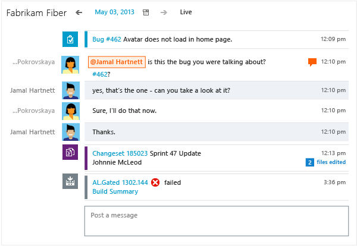

By using the team room instead of email threads, you automatically receive an audit trail of conversations and decisions. By reviewing the archive, you can quickly catch up with the team when you've been away or in a different time zone.

A team room is created for [each team that gets created](../work/scale/multiple-teams.md). Team administrators can create additional rooms and manage their team rooms.  

Members of the Project Administrators groups can create and administer team rooms that they have created. And, members of the Project Collection Administrators groups can create and administer all team rooms.  

## Join the conversation
1. From your team's home page, open the room.  

	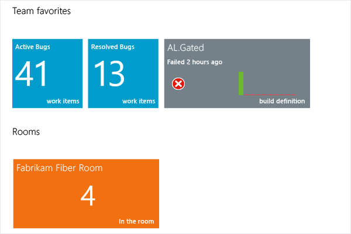 
	
	If you don't see the room tile, [(VSTS) ask your account administrator to grant you a Basic license](../accounts/add-account-users-assign-access-levels.md) or [(on-premises TFS) request Basic access from your TFS administrator](../security/change-access-levels.md).  

	If you can't enter the room, get added as a member: [(VSTS) Add team members](../accounts/add-team-members-vs.md) or [(on-premises TFS) Add team members](../work/scale/multiple-teams.md#add-team-members).

2. To switch to another team room, open it from the **Rooms** list. 

	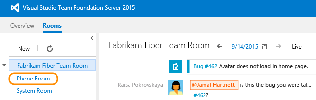 

	You'll see all rooms that you have permission to enter.

## Ways you can interact in the room
* Target a message to a team member: type `@`*UserName*.

* Include a hyperlink to a work item: type `#`*Id*. For example: `@Jamal, can you take a look at bugs #564, #588, and #592?`

* Open a linked object, such as a work item, changeset, build definition, and more. 

* Add an emoticon: choose: . 

* Review a previous day's message: select the day from the calendar. 

	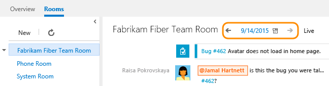 

 
## Add members
You can invite others who have access to the account or team project to participate in your team room. 

1. If you're not a team administrator, [get added as one](../work/scale/add-team-administrator.md). 

2. Open **Manage Members**.
	
	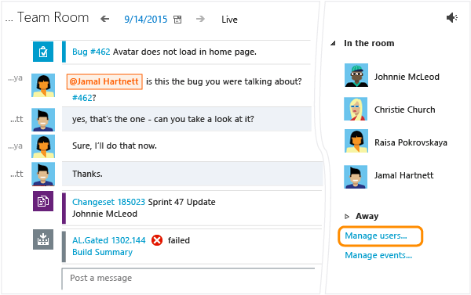 
	
	Only team administrators can see the links for manage users and manage events.

3. Add a user account or group.
	
	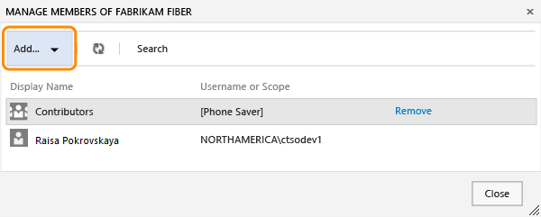 

 
## Add events
Adding events lets your team know when builds finish, source code is checked in, work items are updated, and requests for code reviews occur. 

1. Open **Configure Events**.
	
	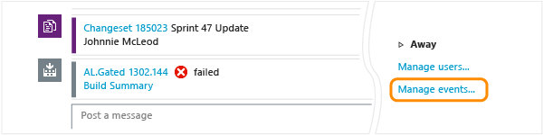 
	
	If you don't see the **Manage events** link, [get added as a team administrator](../work/scale/add-team-administrator.md).

2. Add events. 
	
	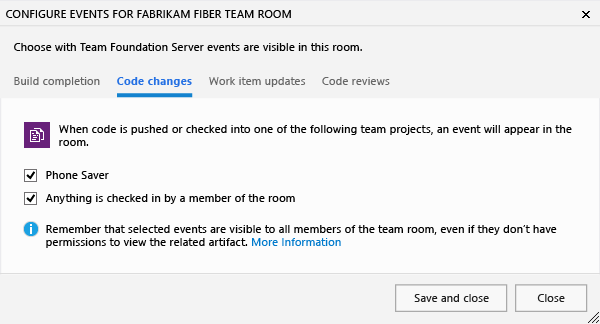 

	Any change in status or assignment triggers an event to appear in the room.

	You can enable the following events and choose if the event triggers only when initiated by a team room member or by anyone.  
	
| Event category | Event  |  
| ---- | ------ |  
| Build completions | Anytime a build completes for a specified build definition    |  
| Code changes | Anytime code is pushed or checked in from a specified repo or branch   |  
| Work item updates | Anytime a work item is added or modified in or under a specified area path   |  
| Code reviews| Anytime a code review is created in or under a specified area area path  |  
| Pull requests | Anytime a pull request is created for a specified repo or branch   |  
  

## Add another room
Adding other rooms provides areas for ad hoc discussions, cross-team interactions, virtual teams, or social discussions. 

1. Add a room. If the **New** link is not active, [get added as a team administrator](../work/scale/add-team-administrator.md).
	
	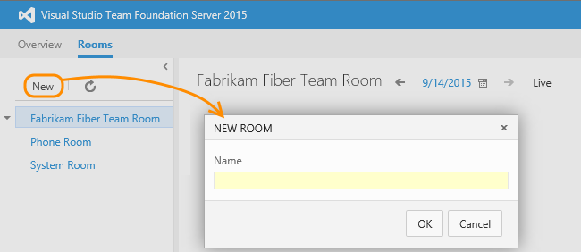

2. Add members to the room as described earlier in this topic.

##Related articles
A team room is automatically created when you [add a team](../work/scale/multiple-teams.md) and is populated with your team members. To learn more about other Agile tools available to teams, see [Manage team assets](../work/scale/manage-team-assets.md).  

- To completely exit a team room, close all browser instances where you've logged into the team room  
- To mute the sound, click the  audio icon to turn the sound off or on  
- For other uses of the `@mention`, see [Use @mentions to further discussion](../notifications/at-mentions.md)   
- To change your profile image, see [Account preferences](../accounts/account-preferences.md).  

### Administer team room permissions

You can grant permissions to users to administer a team room.  

1. From the context menu, open permissions for the team room.  

	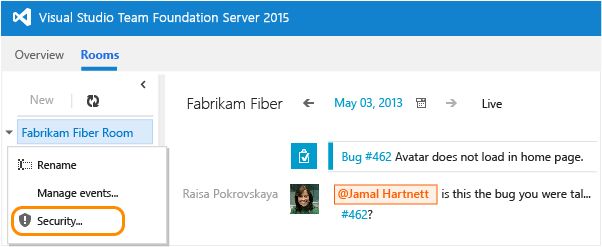  

2. Add an account, set the permissions for Administer to **Allow**, and save the changes.   

	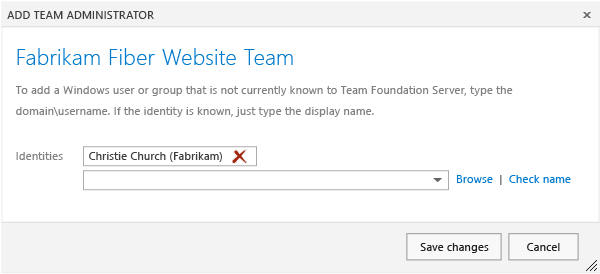 

### Permissions to open team room events
               
Permissions on team room events are managed by their associated operational area. It is possible for a team member to have permissions to collaborate within a team room, yet not be allowed to view work items, build definitions, or source code that have alerts enabled in the team room. 

### Ways other teams use team rooms 
Many teams use team rooms to support these scenarios:  

* *Daily standup*: Capture the review of what happened the previous day and discuss any issues or blocking items based on real history. 

* *Remote team members*: Geographically-dispersed team members can keep up with members in different time zones. This can be especially useful when there are different levels of language proficiency among team members.

* *Memory stream*: Configuring all events gives you an archive where you can review changesets, work item updates, and build progress all in one place. 

### Additional collaboration tools  

Check out the [Marketplace extensions tagged for collaboration](https://marketplace.visualstudio.com/vsts/Collaborate?sortBy=Downloads).  
