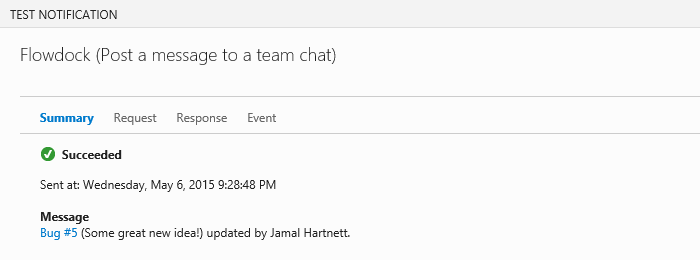

# Team Services notifications on Flowdock

Visual Studio Team Services can post messages to your flow in Flowdock
so everyone will know when code has been pushed or checked in, 
a build has finished, or a work item has been created or updated.

## Set up a flow

1. If you don't have a Flowdock account, get one [here](https://flowdock.com/signup).

1. In Flowdock, add a flow.

   

1. Create the flow. 

   

1. Configure the flow.

   

1. Go to the flow's administration page.

   

1. Get the API token.

   

## Use a service hook to push messages

1. In Visual Studio Team Services, open your team project's administration page.

1. Add a service hook.

   

1. Choose Flowdock

   

1. Configure the Visual Studio Team Services event that will push a message to Flowdock. 

   

1. Tell Flowdock what action to take.

   

1. Test the service hook subscription and finish the wizard.

   

Now messages will be posted to your flow in Flowdock.

## Q & A

<!-- BEGINSECTOIN class="m-qanda" -->

####Q: Can I programmatically create subscriptions?

A: Yes, see details [here](https://www.visualstudio.com/docs/integrate/get-started/service-hooks/create-subscription).

####Q: Where can I get more information about Flowdock?

A: At [flowdock.com](https://www.flowdock.com/).

<!-- ENDSECTION -->