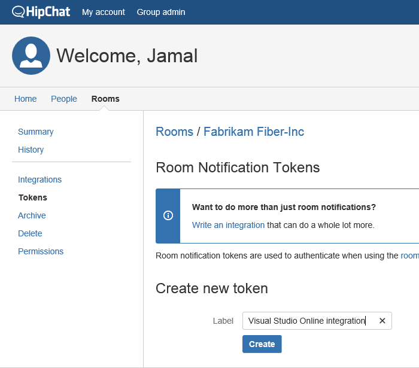
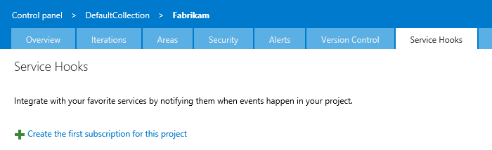

# Team Services notifications on HipChat

Post messages to a room in HipChat in response to events from Visual Studio Team Services.
For example, when code is pushed, or a build occurs.

Get a HipChat authorization token

1. If you don't have a HipChat account, get one [here](https://hipchat.com/).

2. In HipChat, get a room token. 

   

3. Copy the token.

   

## Post a message to a room

1. Open the admin page for the team project in Visual Studio Team Services.

2. On the Service Hooks tab, create a subscription.

   

3. Choose HipChat.

   

3. Configure the Visual Studio Team Services event that you want to post a message in HipChat.

   

4. Tell HipChat what to do when the event occurs.

   

5. Test the service hook subscription and finish the wizard.

   

Now the messages are setup. Go to HipChat and see the messages appear. 

## Q & A

<!-- BEGINSECTION class="m-qanda" -->

####Q: Can I programmatically create subscriptions?

A: Yes, see details [here](https://www.visualstudio.com/en-us/docs/integrate/get-started/service-hooks/create-subscription).

####Q: Where can I get more information about HipChat?

A: At [hipchat.com](https://www.hipchat.com/).

<!-- ENDSECTION -->

