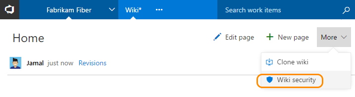
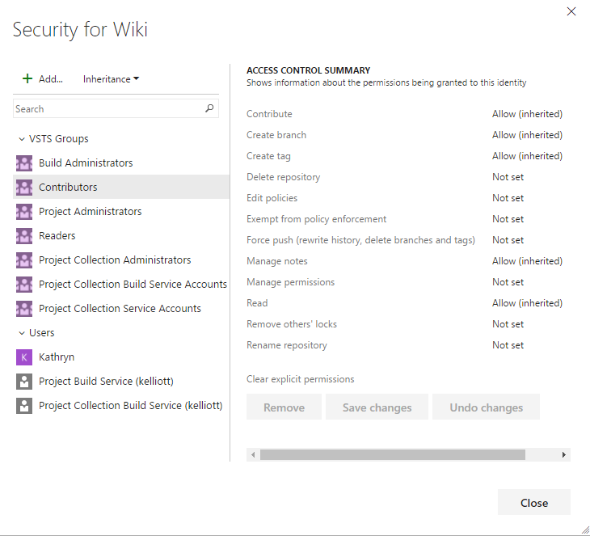
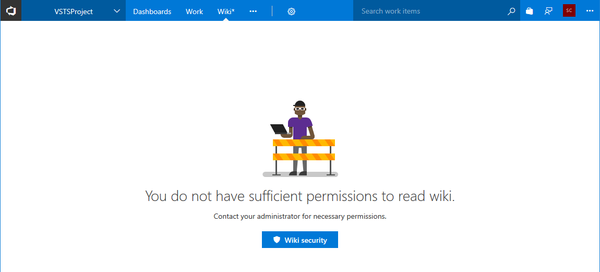
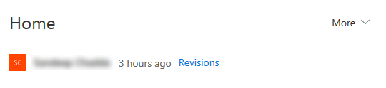

---
title: Manage permissions for READMEs and wiki pages
titleSuffix: VSTS & TFS 
description: Set permissions to grant or secure access to readme files and you team project built-in wiki in Visual Studio Team Services & Team Foundation Server   
ms.technology: devops-collab
ms.custom: wiki
ms.prod: devops
ms.topic: conceptual
ms.assetid: 
ms.manager: douge
ms.author: kaelli
author: KathrynEE
ms.reviewer: sancha
ms.date: 10/18/2017
monikerRange: '>= tfs-2017'
--- 

# Manage README and Wiki permissions 

**VSTS | TFS 2018 | TFS 2017**

By default, all members of the Contributors group can edit README files and Wiki pages. 

> [!NOTE]  
> **Feature availability**: The built-in wiki is available with VSTS and TFS 2018 and later versions. To download TFS 2018, see the [TFS 2018 Release Notes](https://www.visualstudio.com/en-us/news/releasenotes/tfs2018-relnotes).    

## Manage README permissions

You manage the permissions for README files by [setting permissions on the repository](../security/set-git-tfvc-repository-permissions.md). 

::: moniker range=">= tfs-2018"

## Manage wiki permissions   
By default, all project contributors have read and edit access of the wiki repository. You can grant or restrict access to who can read and edit wiki pages by managing the wiki repository permissions.  

To open the Security dialog, click **More>Security** on the wiki home page. 
 

For definitions of each repository permission, see [Git repository permissions](../security/permissions.md#git-repository).

>[!NOTE]  
>Users with [Stakeholder access](../security/get-started-stakeholder.md) have read-only permissions to wiki pages. These permissions can't be changed. 

## Don't have access to create a page?  

If you don't have access to create a wiki page, you need to contact an administrator to grant you adequate permission on the underlying Git repository of the wiki. Even if you don't have access to a wiki page, you can see the security and identify an administrative member who can provision access to the wiki.

## Stakeholder wiki access

Stakeholders in a project can read wiki pages and view revisions, however they can't perform any edit operations. For example, stakeholders can't create, edit, reorder, or revert changes to pages. 

> [!NOTE]    
> Users with [Stakeholder access](../security/get-started-stakeholder.md) have read-only permissions to wiki pages. These permissions can't be changed.  

## Q & A

###Q:  Is it possible to grant permissions on a per-page basis?

**A:** No, permissions to access the wiki are made for all pages and not individual pages. 

::: moniker-end

## Related articles

- [Default Git repository and branch permissions](../security/default-git-permissions.md) 
- [Get Started with Git](../git/gitquickstart.md)
- [Manage README and Wiki permissions](manage-readme-wiki-permissions.md)