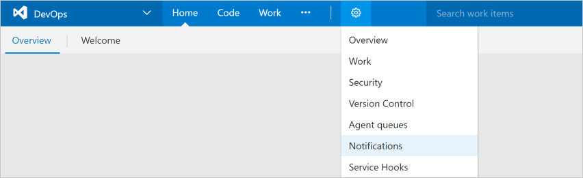
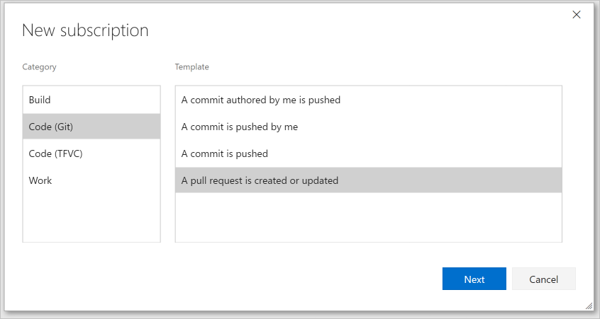
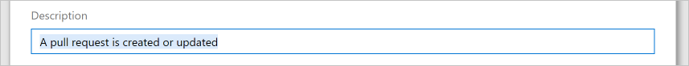
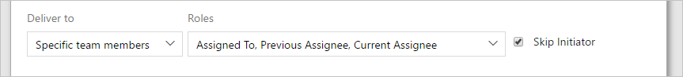
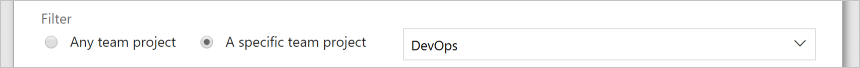
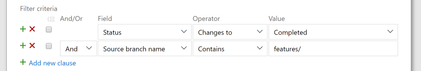

# Manage notifications for a team

<b>Team Services | TFS 2017.1 | [Previous versions](../work/track/alerts-and-notifications.md)</b> 

>[!NOTE]  
>This topic applies to Team Services and to TFS 2017.1 and later versions. If you work from an on-premises TFS 2017 or ealier versions, see [Set alerts, get notified when changes occur](../work/track/alerts-and-notifications.md). For on-premises TFS, [you must configure an SMTP sever](../setup-admin/tfs/admin/setup-customize-alerts.md) in order for team members to see the Notifications option from their account menu and to  receive notifications. 
 
As changes occur to work items, code reviews, pull requests, source control files, and builds, your team can be notified via email. For example, when a high priority work item is assigned to your team's area path, an email can be sent to the team.

In addition, if your team uses an external service to collaborate, you can configure notifications to be sent to these services. These services are supported out of the box:

* [Campfire](./campfire.md)
* [Flowdock](./flowdock.md)
* [HipChat](./hipchat.md)
* [Microsoft Teams](https://marketplace.visualstudio.com/items?itemName=ms-vsts.vss-services-teams)
* [Slack](./slack.md)

You can also use a third-party service like Zapier to send notifications to hundreds of other services. Learn more about [Zapier and Team Services integration](https://www.visualstudio.com/docs/integrate/get-started/service-hooks/services/zapier).

## Create a custom email subscription

A subscription lets you control what your team should be notified about and how the team will receive those notifications.

1. Open the Notifications hub under team settings.
	
	

2. Click **New**. If you're not a team administrator, [get added as one](../work/scale/manage-team-assets.md#add-team-admin). You need to be a team, project, or project collection administrator to create team alerts.
	
3. Select the type of activity you want your team to be notified about.
	
	

4. Provide a description to help you identify the subscription later.

	

5. Choose which team members should receive a notification:

	

   You can choose one of three delivery options:
   * **Specific team members**: only certain team members associated with the event are notified. For example, for work item changes, you might only want the current assignee of the work item to receive a notification.
   * **Team email address**: send an email to a specified email address.
   * **All team members**: send an individual email to each member of the team.

   For certain activities and when **Specific team members** is selected, you can choose to have the user that initiated the activity receive a notification. This is controlled by the **Skip initiator** checkbox. By default, this box is checked meaning the user that initiates the change will not be notified about it.

6. Choose whether you want to receive notifications about activity in all projects or only a specific project.

	

7. Optionally configure additional filter criteria.

	

7. Click **Finish** to save the new subscription.

## Related topics

- [Manage personal notification settings](./manage-personal-notifications.md)  

