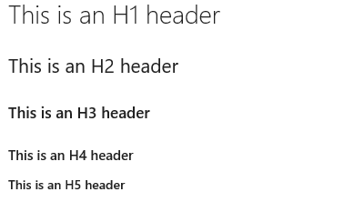
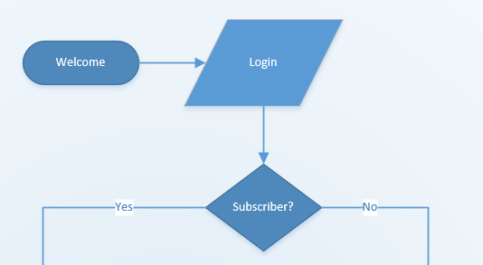
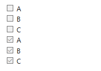
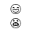
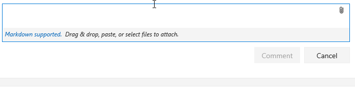
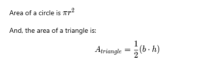

# Syntax guidance for Markdown files, widgets, wikis, and pull request comments  

<b>VSTS | TFS 2018 | TFS 2017 | TFS 2015</b> 

Having the right guidance at the right time is critical to success. To support your team or contributors to your project, use [markdown](https://en.wikipedia.org/wiki/Markdown) to add rich formatting, tables, and images to your project pages, readme files, dashboards, and pull request comments.   

You can provide guidance to your team in these places using markdown:   
  
- [Project vision page or Welcome pages](project-vision-status.md)  
- [Team project wiki](add-edit-wiki.md)    
- [Readme files](../git/create-a-readme.md) 
- [Pull request comments](../git/pull-requests.md) 
- [Add Markdown to a dashboard](../report/dashboards/add-markdown-to-dashboard.md)    

In this topic you'll find some basic Markdown syntax guidance. You can use both common [Markdown conventions](http://daringfireball.net/projects/markdown/syntax) and [GitHub-flavored extensions](https://help.github.com/articles/github-flavored-markdown/).

## Headers

Structure your comments using headers. Headers segment longer comments, making them easier to read.

Start a line with a hash character `#` to set a heading. Organize your remarks with subheadings by starting a line with additional hash characters, for example `####`. Up to six levels of headings are supported.

**Example:**   
```
# This is an H1 header
## This is an H2 header
### This is an H3 header
#### This is an H4 header
##### This is an H5 header
```

**Result:**      

  

## Paragraphs and line breaks

Make your text easier to read by breaking it up with paragraphs or line breaks.  

In pull request comments, press Enter to insert a line break and begin text on a new line. 

In a Markdown file or widget, enter two spaces prior to the line break to begin a new paragraph, or enter two line breaks consecutively to begin a new paragraph.   

**Example - pull request comment:**

<pre>
Add lines between your text with the Enter key.
This spaces your text better and makes it easier to read.
</pre>

**Result:**   
Add lines between your text with the return key      
This spaces your text better and makes it easier to read.


**Example - markdown file or widget:**

<pre>
Add two spaces prior to the end of the line.(space, space)     
This adds space in between paragraphs.
</pre>

**Result:**  
Add two spaces prior to the end of the line.   

This adds space in between paragraphs.

 
## Quotes

Quote previous comments or text to set context for your comment or text.

Quote single lines of text be putting a `>` before the text. Use multiple `>` characters to nest quoted text.
Quote blocks of lines of text by using the same level of `>` across multiple lines.

**Example:**

<pre>
> Single line quote
>> Nested    
>> multiple line
>> quote
</pre>

**Result:**  


## Horizontal rules

Add a horizontal rule by adding a new line that's just a series of dashes `---`. There must be a blank line above the line containing the `---`.

**Example:**

<div id="do_not_render">
<pre>
above
&nbsp;
&#45;&#45;&#45;&#45;
below
</pre>
</div>
    
**Result:**  

above    

-----    

below    


## Lists

Organize related items with lists. You can add ordered lists with numbers, or unordered lists with just bullets.

Ordered lists start with a number followed by a period for each list item. Unordered lists start with a `-`. Begin each list item on a new line.  

**Example:**  
```
0. First item.
0. Second item.
0. Third item.
```

**Result:**  
1. First item.
2. Second item.
3. Third item.

**Example:**  
<pre>
- Item 1
- Item 2
- Item 3
</pre>

**Result:**  
- Item 1
- Item 2
- Item 3


## Links

In pull request comments and wiki, HTTP and HTTPS URLs are automatically formatted as links. Also, within pull requests, you can link to work items by typing the # key and a work item ID, and then choosing the work item from the list.

In markdown files and widgets, you can set text hyperlinks for your URL using the standard markdown link syntax:

```
[Link Text](Link URL)
```
When linking to another Markdown page in the same Git or TFVC repository, the link target can be a relative path or an absolute path in the repository.  

**Supported links for Welcome pages:**  
<ul>
<li>Relative path: ```[text to display](./target.md)```  </li>
<li>Absolute path in Git: ```[text to display](/folder/target.md)``` </li>
<li>Absolute path in TFVC: ```[text to display]($/project/folder/target.md)```</li>
<li>URL: ```[text to display](http://address.com)```  </li>
</ul>
<p>**Supported links for [Markdown widget](../report/dashboards/widget-catalog.md#markdown-widget):**</p>
<ul>
<li>URL: ```[text to display](http://address.com)```  </li>
</ul>
**Supported links for Wiki:**  
<ul>
<li>Absolute path of Wiki pages: ```[text to display](/parent-page/child-page)``` </li>
<li>URL: ```[text to display](http://address.com)```  </li>
</ul>


>[!NOTE]  
>Links to documents on file shares using `file://` are not supported on VSTS or TFS 2017.1 and later versions. This restriction has been implemented for security purposes.
>
>For information on how to specify relative links from a Welcome page or Markdown widget, see [Source control relative links](#relative-links). 


**Example:**  
<pre>
&#91;C# language reference](https://msdn.microsoft.com/en-us/library/618ayhy6.aspx)
</pre>

**Result:**   

[C# language reference](https://msdn.microsoft.com/en-us/library/618ayhy6.aspx)

<a id="link-work-items">  </a>
## Link to work items from a Wiki page
 
>[!NOTE]  
>**Feature availability**: You can use the **#ID** control to link to a work item from within a Wiki page from your VSTS account or TFS 2018.   

Simply enter the pound sign (`#`) and enter a work item ID. 

<a id="relative-links">  </a>
### Source control relative links

Links to source control files are interpreted differently depending on whether you specify them in a Welcome page or a Markdown widget. The system interprets relative links as follows:   
- **Welcome page:** relative to the root of the source control repository in which the welcome page exists
- **Markdown widget:**  relative to the team project collection URL base.

For example: 

| Welcome page  | Markdown widget equivalent  |  
|--------------------|-----------------------------------|  
| /BuildTemplates/AzureContinuousDeploy.11.xaml |/DefaultCollection/Fabrikam Fiber/_versionControl#path=$/Tfvc Welcome/BuildTemplates/AzureContinuousDeploy.11.xaml|  
| ./page-2.md |/DefaultCollection/Fabrikam Fiber/_versionControl#path=$/Tfvc Welcome/page-2.md |  


### Anchor links

Within Markdown files, anchor IDs are assigned to all headings when rendered as HTML. The ID is the heading text, with the spaces replaced by dashes (-) and all lower case. 

**Example:**

<pre>
###Link to a heading in the page
</pre>

<br/>
**Result:** 

The syntax for an anchor link to a section...

<pre>
[Link to a heading in the page](#link-to-a-heading-in-the-page)
</pre> 
<br/>
The ID is all lower case, and the link is case sensitive, so be sure to use lower case, even though the heading itself uses upper case.

You can also reference headings within another Markdown file:

<pre>
[text to display](./target.md#heading id)  
</pre>


<br/>
In wiki, you can also reference heading in another page:

<Pre>
[text to display](/page-name#section-name)
</pre>

<a name="images"> </a>
## Images 

Add images and animated GIFs to your pull request comments, markdown files, or wiki pages to highlight issues or just to liven the discussion. 

Use the following syntax to add an image: <div id="do_not_render"><pre>&#33;&#91;Text](URL)</pre></div> The text in the brackets describes the image being linked and the URL points to the image location.

**Example:**

<pre>
!&#91;Let's use this flow for the login experience](http://dev.fabrikam.net/images/uxflow.png)
</pre>

<br/>
**Result:** 



The path to the image file can be a relative path or the absolute path in Git or TVFC, just like the path to another Markdown file in a link.  
<ul>
<li>Relative path:<br/> `````` </li>
<li>Absolute path in Git:<br/> `````` </li>
<li>Absolute path in TFVC:<br/> ``````  </li>
<li>Resize image:<br/> ``````  </li>
</ul>

> [!NOTE]   
> **Feature availability**: The syntax to support image resizing is only supported in pull requests and the Wiki.    

## Tables

Organize structured data with tables. Tables are especially useful for describing function parameters, object methods, and other data that has 
a clear name to description mapping.

- Place each table row on its own line 
- Separate table cells using the pipe character `|` 
- The first two lines of a table set the column headers and the alignment of elements in the table
- Use colons (`:`) when dividing the header and body of tables to specify column alignment (left, center, right) 
- To start a new line, use the HTML break tag (`<br/>`)
- Make sure to end each row with a CR or LF. 

**Example:**

<pre>
| Heading 1 | Heading 2 | Heading 3 |  
|-----------|:-----------:|-----------:|  
| Cell A1 | Cell A2 | Cell A3 |  
| Cell B1 | Cell B2 | Cell B3 |  
</pre> 

<br/>
**Result:**  

| Heading 1 | Heading 2 | Heading 3 |  
|-----------|:-----------:|-----------:|  
| Cell A1 | Cell A2 | Cell A3 |  
| Cell B1 | Cell B2 | Cell B3 |  


## Checklist or task list 
Use `[ ]` or `[x]` to support checklists. You need to precede the checklist with either `-<space>` or `1.<space>` (any numeral).

**Example:**

<pre>
- [ ] A  
- [ ] B  
- [ ] C  
- [x] A  
- [x] B  
- [x] C  

</pre> 

<br/>
**Result:**  
 
 


 
## Emphasis (bold, italics, strikethrough)  

You can emphasize text by applying bold, italics, or strikethrough to characters: 
- To apply italics: surround the text with an asterisk `*` or underscore `_`   
- To apply bold: surround the text with double asterisks `**`.    
- To apply strikethrough: surround the text with double tilde characters `~~`.   

Combine these elements to apply multiple emphasis to text.    

**Example:**

<pre>
Use _emphasis_ in comments to express **strong** opinions and point out ~~corrections~~ 
**_Bold, italizied text_**  
**~~Bold, strike-through text~~**
</pre>

<br/>
**Result:**  
Use _emphasis_ in comments to express **strong** opinions and point out <s>corrections</s>   
**_Bold, italizied text_**   
**~~Bold, strike-through text~~**  


## Code highlighting

Highlight suggested code segments using code highlight blocks. 
To indicate a span of code, wrap it with three backtick quotes (<code> &#96;&#96;&#96;</code>) on a new line at both the start and end of the block.   

**Example:**

<pre>&#96;&#96;&#96;
$ sudo npm install vsoagent-installer -g  
&#96;&#96;&#96;
</pre>  
 
<br/>
**Result:**
```
$ sudo npm install vsoagent-installer -g
```
<br/>
Within a markdown file, text with four spaces at the beginning of the line automatically converts to a code block.  

Set a language identifier for the code block to enable syntax highlighting for any of the [supported languages](http://highlightjs.readthedocs.io/en/latest/css-classes-reference.html#language-names-and-aliases). 


<pre>
``` language
code
```
</pre>


<br/>
**Additional examples:**

<pre>
``` js
const count = records.length;
```
</pre>


``` js
const count = records.length;
```


<br/>
<pre>
``` csharp
Console.WriteLine("Hello, World!");
```
</pre>


``` csharp
Console.WriteLine("Hello, World!");
```

## Emoji

In pull request comments and wiki pages, you can use emojis to add character and react to comments in the request. Type in what you're feeling surrounded by `:` characters to get a matching emoji in your text. The [full set of emojis](http://www.webpagefx.com/tools/emoji-cheat-sheet/) are supported.

**Example:**

<pre>
:smile:
:angry:
</pre>
<br/>
**Result:**  



To escape emojis, enclose them using the \` character.

**Example:**

<pre>`:smile:` `:)` `:angry:`</pre>

**Result:**

 `:smile:` `:)` `:angry:`


## Special characters 

<table width="650px">
<tbody valign="top">
<tr>
<th width="300px">Syntax</th>
<th width="350px">Example/notes</th>
</tr>


<tr>
<td>
<p>To insert one of the following characters, prefix with a backslash:</p>

<p style="margin-bottom:2px;">```\   backslash ``` </p>
<p style="margin-bottom:2px;"><code>\`</code>   `backtick`</p>
<p style="margin-bottom:2px;">```_   underscore  ```</p>
<p style="margin-bottom:2px;">```{}  curly braces  ``` </p>
<p style="margin-bottom:2px;">```[]  square brackets ```</p>
<p style="margin-bottom:2px;">```()  parentheses  ```</p>
<p style="margin-bottom:2px;">```#   hash mark  ``` </p>
<p style="margin-bottom:2px;">```+   plus sign  ```</p>
<p style="margin-bottom:2px;">```-   minus sign (hyphen) ```</p>
<p style="margin-bottom:2px;">```.   dot  ``` </p>
<p style="margin-bottom:2px;">```!   exclamation mark  ```</p>


</td>
<td>Some examples on inserting special characters
<p>Enter ```\\``` to get \\ </p>
<p>Enter ```\_``` to get _ </p>
<p>Enter ```\#``` to get \# </p>
<p>Enter ```\(``` to get \( </p>
<p>Enter ```\.``` to get \. </p>
<p>Enter ```\!``` to get \! </p>
</td>
</tr>

</tbody>
</table>


<a name="attach"></a>
## Attachments

In pull request comments and wiki pages, you can attach files to illustrate your point or to give more detailed reasoning behind your suggestions. To attach a file, drag and drop it into the comment field or wiki page edit experience. You can also select the paper-clip icon in the upper-right of the comment box or the format pane in wiki page. 

  

If you have an image in your clipboard, you can paste it from the clipboard into the comment box or wiki page and it will render directly into your comment or wiki page.

Attachments support the following file formats:

- Images: PNG (.png), GIF (.gif), JPEG (both .jpeg and .jpg)
- Documents:  Word (.docx), Excel (.xlsx and .csv), and Powerpoint (.pptx), text files (.txt), and PDFs (.pdf)
- Compressed files: ZIP (.zip) and GZIP (.gz)
- Video files: MOV (.mov), MP4 (.mp4)

Attaching non-image files creates a link to the file in your comment. Update the description text between the brackets to change the text displayed in the link.
Attached image files render directly into your comment or wiki pages. 

Once you save or update a comment or wiki page with an attachment, you can see the attached image(s) and can select links to download attached files.

<a name="html"></a>
## HTML Tags

In wiki pages, you can also create rich content using HTML tags. 

**Example - Embedded video**

```HTML
<video src="<path of the video file>" width=400 controls>
</video>
```

</br>
**Result:**
</br>
<video src="_img/markdown-guidance/vstswiki_mid.mp4" width="600" controls>
</video>


**Example - Rich text format**

```HTML
<p>This text needs to <del>strikethrough</del> <ins>since it is redundant</ins>!</p>
<p><tt>This text is teletype text.</tt></p>
<font color="blue">Colored text</font>
<center>This text will be center-aligned.</center>
<p>This text contains <sup>superscript</sup> text.</p> 
<p>This text contains <sub>subscript</sub> text.</p>
<p>The project status is <span style="color:green;font-weight:bold">GREEN</span> even though the bug count / developer may be in <span style="color:red;font-weight:bold">red.</span> - Capability of span
<p><small>Disclaimer: Wiki also supports showing small text</small></p>
<p><big>Bigger text</big></p> 
```

**Result:**
<p>This text needs to <del>strikethrough</del> <ins>since it is redundant</ins>!</p>
<p><tt>This text is teletype text.</tt></p>
<font color="blue">Colored text</font>
<center>This text will be center-aligned.</center>
<p>This text contains <sup>superscript</sup> text.</p> 
<p>This text contains <sub>subscript</sub> text.</p>
<p>The project status is <span style="color:green;font-weight:bold">GREEN</span> even though the bug count / developer may be in <span style="color:red;font-weight:bold">red.</span> - Capability of span
<p><small>Disclaimer: Wiki also supports showing small text</small></p>
<p><big>Bigger text</big></p> 


<a id="mathematical-notation">  </a>
## Mathematical notation and characters 

> [!NOTE]   
> **Feature availability**: This feature is currently supported within Wiki pages and pull requests for VSTS accounts.   
 
Both inline and block [KaTeX](https://khan.github.io/KaTeX/function-support.html) notation is supported in wiki pages and pull requests.  This includes inserting symbols, Greek letters, mathematical operators, powers and indices, fractions and binomials, and other KaTeX supported elements.   

To include mathematical notation, surround the mathematical notation with a `$` sign, for inline, and `$$` for block,  as shown in the following examples: 

###Example: Greek characters
```KaTeX
$
\alpha, \beta, \gamma, \delta, \epsilon, \zeta, \eta, \theta, \kappa, \lambda, \mu, \nu, \omicron, \pi, \rho, \sigma, \tau, \upsilon, \phi, ...   
$  


$\Gamma,  \Delta,  \Theta, \Lambda, \Xi, \Pi, \Sigma, \Upsilon, \Phi, \Psi, \Omega$ 
```

**Result:**
> [!div class="mx-imgBorder"]


###Example: Algebraic notation 
```KaTeX
Area of a circle is $\pi r^2$
 
And, the area of a triangle is: 

$$
A_{triangle}=\frac{1}{2}({b}\cdot{h}) 
$$

```

**Result:**
> [!div class="mx-imgBorder"]



###Example: Sums and Integrals 
```KaTeX
$$
\sum_{i=1}^{10} t_i
$$


$$
\int_0^\infty \mathrm{e}^{-x}\,\mathrm{d}x
$$     
```

**Result:**
> [!div class="mx-imgBorder"]


## Related notes  

- [Project vision page or Welcome pages](project-vision-status.md) 
- [Readme files](../git/create-a-readme.md) 
- [Pull requests](../git/pull-requests.md) 
- [Markdown widget](../report/dashboards/add-markdown-to-dashboard.md)  
- [Dashboards](../report/dashboards/dashboards.md)
- [Widget catalog](../report/dashboards/widget-catalog.md) 
- [Wiki](add-edit-wiki.md)
  
[!INCLUDE [temp](../_shared/help-support-shared.md)] 