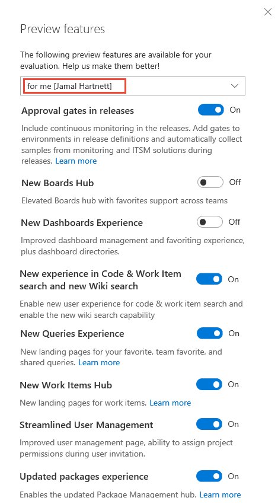
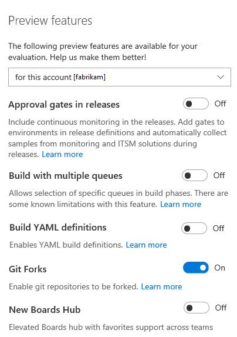
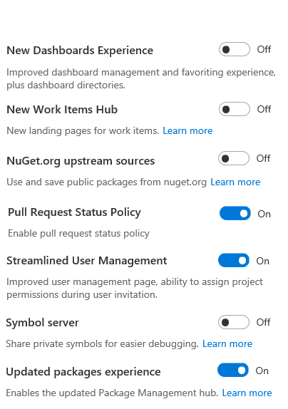
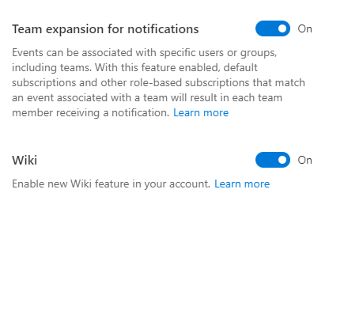
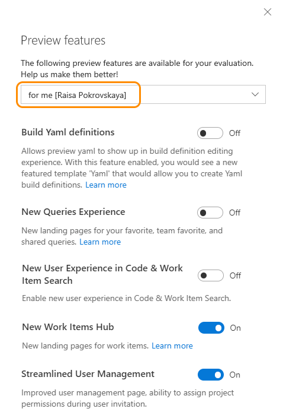

# Enable preview features 

<b> VSTS | TFS 2018 | TFS 2017.1</b>

As new features are introduced, you can turn them on or off. That way, you can try them out, provide feedback, and work with those features that meet your requirements.  

Some features provide a new user interface and functionality, which can be managed per user or team member. Others support a default experience for the account and are managed by an account administrator. 
 
> [!NOTE]   
> **Feature availability**:  You can turn on or off select features for VSTS (cloud service) or from the web portal of TFS. Preview features become available first on VSTS and then subsequently are made available with an update to TFS. At some point, the preview feature will be moved out of preview status and become a regular feature of the web portal.  
>  
> The features you can enable on TFS will differ on your version. Visit the [Visual Studio Downloads page](https://www.visualstudio.com/downloads/download-visual-studio-vs) to get the latest TFS update. Additional resources may be required as noted. To determine your TFS version, see [Provide product and content feedback](../user-guide/provide-feedback.md#platform-version).

> [!div class="mx-tdBreakAll"] 
> |[Preview features per user](#user-level) |[Preview features per account](#account-level) |
> |-------------|----------|
> |- [Approval gates in releases](../build-release/concepts/definitions/release/approvals/index.md) - [Build Yaml Definitions](../build-release/actions/build-yaml-get-started.md) - New Boards Hub - New Dashboards Experience - [New experience in Code & Work Item search and new wiki search](https://docs.microsoft.com/vsts/release-notes/2017/oct-06-vsts#code) - [New Queries Experience](../work/track/view-run-query.md) - [New Work Items Hub](../work/work-items/view-add-work-items.md) - [Streamlined User Management](../accounts/add-account-users-assign-access-levels.md) - [Updated package experience](../package/index.md) |- [Build with multiple queues](https://github.com/Microsoft/vsts-agent/blob/master/docs/preview/yamlgettingstarted.md) -- [Git Forks](../git/concepts/forks.md) - [New Work Items Hub](../work/work-items/view-add-work-items.md) - [NuGet.org upstream sources](../package/nuget/upstream-sources.md) - [Pull Request Status Policy](../git/how-to/pr-status-policy.md) -  [Streamlined User Management](../accounts/add-account-users-assign-access-levels.md) - [Symbol server](../build-release/symbols/index.md)|

**Features now enabled for all VSTS accounts:**
- [Combine email recipients](manage-team-notifications.md)  
- [New Account Landing page](../user-guide/account-home-pages.md)
- [New Release Definition Editor](../build-release/archive/preview/release-definition-editor.md) 
- [Team expansion for notifications](#team-expansion-notifications) 
- [Wiki](#wiki)

## Enable features for your use  

From time to time, a new feature is introduced in Preview mode, which allows you to turn it on or off. 

0. To access the Preview features options, open your user account menu, and select **Preview features**. 

	  

0. To enable or disable a feature, click the slider. 

	

## Enable features at the account level (for all users)  

When you enable a feature at the account level, you essentially turn it on for all users of your account. Each user can then disable the feature if they so choose.

>[!TIP]  
>If you don't see the user/account menu option, then you aren't an account administrator. To get added as one, see [Add administrators, set permissions at the team project or collection level](../security/set-project-collection-level-permissions.md).  

 

<!---
     
-->

##&nbsp;&nbsp;&nbsp;Wiki 

>[!NOTE]  
><b>Feature availability: </b>The built-in wiki is available for VSTS and TFS 2018 and later versions. If you were using the Wiki Marketplace extension, you can [migrate your existing pages to the new team project wiki](migrate-extension-wiki-pages.md). 
>
You can enable a built-in Wiki for your team project or for an account. This feature is in preview and when enabled adds a **Wiki** hub from which you can [view and edit wiki pages](add-edit-wiki.md). 

## On-premises TFS features 

##&nbsp;&nbsp;&nbsp;New Account Landing Page  

>[!NOTE]    
>For TFS 2017.1 and later versions, the account hub is automatically enabled for all users and cannot be disabled.
    
Here, we enable the New Account Landing page. This hub is associated with the account collection and not any one team project or team. To learn more about this feature, see [Work effectively from your account hub](../user-guide/account-home-pages.md). When you enable the New Account Landing page, you also enable the project page where you can [share your project vision with your team](project-vision-status.md).

  

If you have administrative privileges, you'll see a menu from which to choose whether the feature is for you, or for all users who work within the account. 

   

##&nbsp;&nbsp;&nbsp;Out of the box notifications 

>[!NOTE]  
>**Feature availability**: You can enable/disable Out of the box notifications from TFS 2017 accounts and for TFS 2017.1 and later versions. 

With out-of-the-box notifications, users automatically receive notifications for events such as:

* The user is assigned a work item  
* The user is added or removed as a reviewer to a pull request  
* The user has a pull request that is updated  
* The user has a build that completes  

These subscriptions appear in the new user notifications experience, and users can easily choose to opt out of any of them. To learn more, see [Manage personal notifications](../notifications/manage-personal-notifications.md). 

<!---

### Task tool installers

We're adding some tool installer tasks to enable your build or release process to lazily install tool sets. So now you can install dependencies on hosted agents and test and validate your app on multiple versions of a tool set. See [Tool installers](../build-release/concepts/process/tasks.md#tool-installers).

-->

##&nbsp;&nbsp;&nbsp;Team expansion for notifications 

>[!NOTE]  
>**Feature availability**: You can enable/disable Team expansion for notifications for TFS 2017.1. 

Enable this feature for your account when you want notifications to be sent by default for all team-associated events. Such events include when pull requests are created or updated. Team admins can choose to opt-out of these notifications. See [Manage team notifications](manage-team-notifications.md).  
 

